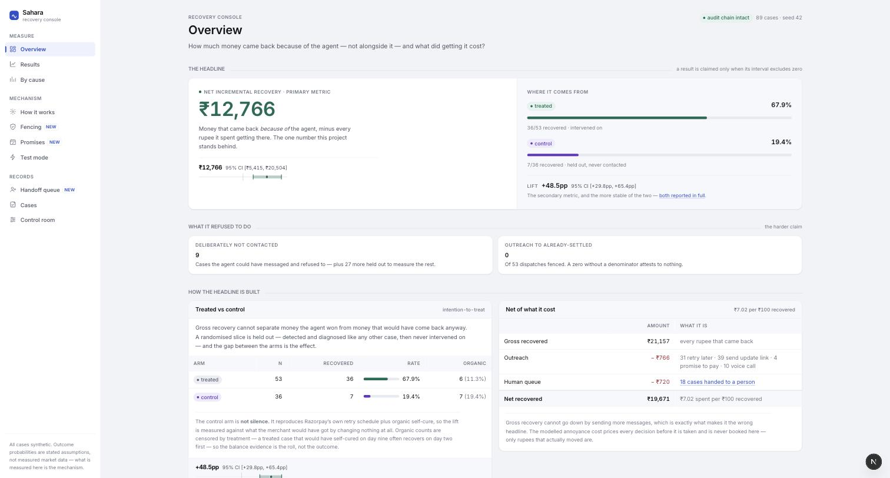
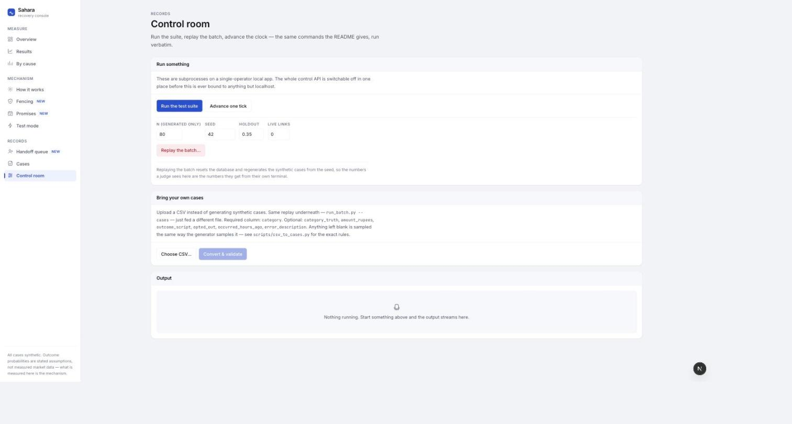
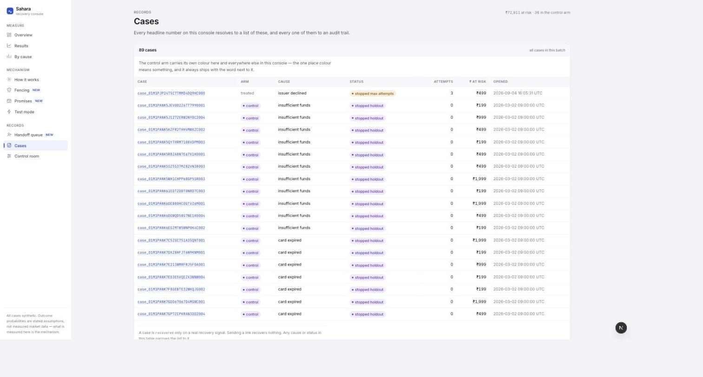
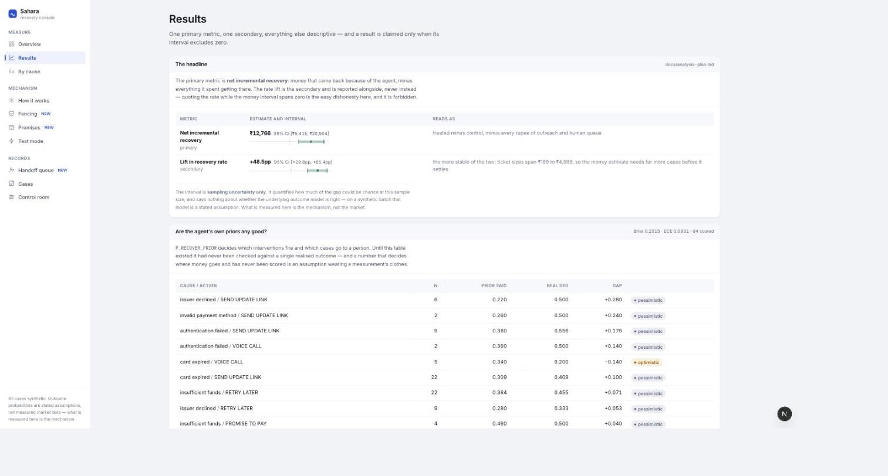
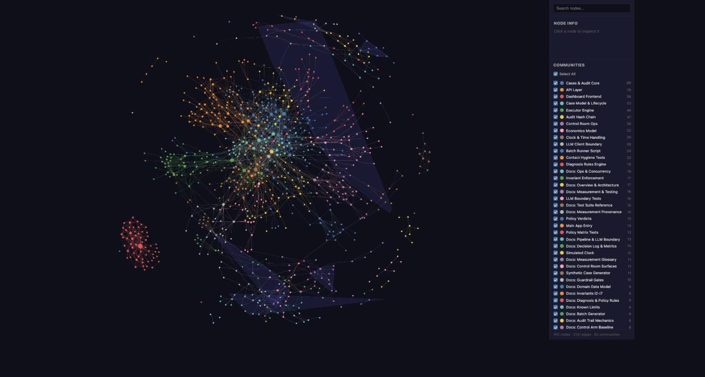

<p align="center"></p>

# Sahara
*Failed Subscription Recovery Agent — Razorpay AI Buildathon, Track 03: AI Revenue Recovery*

## The problem

A recurring subscription charge fails. Razorpay retries on its own schedule, the
subscription halts, and the merchant discovers the churn weeks later. The recoverable
window — the first hours and days after failure — is exactly when nothing happens.

## What it does

Detects a failed Razorpay Subscription charge via webhook, diagnoses why it failed
(6 fixed categories), picks ONE intervention from a deterministic policy table
(retry later / update-payment link / promise-to-pay / stop-and-handoff), prices it
before taking it, executes it against Razorpay test-mode APIs, and stops when hard
rules say stop. Every step is audited into a hash-chained trail; every reported rupee
traces to case IDs, is measured against a randomised control arm, and is reported net
of what it cost to recover.

```
webhook ─▶ DETECT ─▶ DIAGNOSE ─▶ [STOP GATE] ─▶ DECIDE ─▶ [STOP GATE] ─▶ EXECUTE ─▶ OUTCOME
           verify     rules R1–R7   I1–I7        static     I1–I7         test-mode   recovery
           dedupe     else model    pre-decision  policy    pre-execution  API +       signal or
           route      → 6-value     gate          table      gate          simulated   next failure
                        enum                     + E1 EV                   notification
                                                   gate
```

## Results (88 synthetic cases, seed 42)

The headline is **incremental, net of cost** — not gross. A randomised control arm is
detected and diagnosed like every other case and then never intervened on, so the agent
is credited only with recovery that would not have happened anyway; every rupee it spent
getting there is then subtracted.

<!-- BEGIN RESULTS — verified by scripts/verify_numbers.py; editing a digit here turns CI red -->

| Metric | Value |
|---|---|
| ₹ at risk | ₹72,412 across 88 cases |
| **Net incremental recovery** | **₹12,921** — 95% CI [₹5,640, ₹20,822] ✅ excludes zero |
| **Lift, treated vs control** | **+49.8 pp**, 95% CI **[+31.0, +66.9] pp** ✅ excludes zero |
| Recovery rate by arm | **69.2% (36/52)** treated · **19.4% (7/36)** control |
| Incremental recovery, gross | ₹14,330 of the ₹21,157 gross recovered in the treated arm |
| Total cost | ₹1,409 = ₹729 outreach (51 contacts) + ₹680 human queue (17 cases) |
| Gross ₹ recovered | ₹21,157 (43 of 88 cases, 48.9%) |
| Cost per ₹100 recovered | ₹6.66 |
| **Cases deliberately not contacted** | **9** — plus 27 held out to measure the rest |
| **Outreach to already-settled customers** | **0 of 51 dispatches fenced** |
| Escalation ladder | 30 silent retries · 38 links · 4 promises · **9 voice calls** |
| Dated promises the customer named | 4 — 2 kept, 2 broken |
| Prior calibration | Brier **0.2581**, ECE **0.1064**, 81 of 81 executions scored |
| Audit chain | intact — 545 entries, 0 unchained (`GET /api/audit/verify`) |
| Classification accuracy vs ground truth | 100% (84/84) rules path · 25% (1/4) model path, **with no model configured** |
| Acceptance checks | 20 of 20 pass · 241 tests green |

<!-- END RESULTS -->

Two more results, from runs of their own:

| Claim | Value |
|---|---|
| **What the voice rung is worth** (n=2,010) | **+7.4 pp**, 95% CI **[+2.2, +12.5] pp** ✅ excludes zero |
| The same rung, in rupees | ₹+49,519, 95% CI [−₹66,790, +₹168,596] ❌ **includes zero** |
| **Model vs keyword rules** at reading a Hinglish promise | **90.0% vs 60.0%** on policy facts, McNemar **p = 0.0117** |

> **The rate lift is a result. The rupee figure is not one yet**, and quoting the first
> while the second spans zero is forbidden by [the analysis plan](docs/analysis-plan.md).
> Ticket sizes span ₹199 to ₹4,999, so a per-case money estimate needs far more cases
> before it settles.

Reproduce, with no accounts, no API keys and no model download:

```bash
python scripts/generate_synthetic.py --n 80 --seed 42 --out synthetic_cases.json
LLM_PROVIDER=none python scripts/run_batch.py --cases synthetic_cases.json --db recovery.db \
    --seed 42 --holdout 0.35
```

**Then check that this table has not drifted from the code:**

```bash
python scripts/verify_numbers.py --check
```

That re-runs the batch from the seed in a throwaway database, extracts all 118 published
values, and byte-compares them against `docs/verified-numbers.json`. Editing a digit in
the table above makes it — and CI — exit non-zero. See [VERIFY.md](VERIFY.md) for every
claim mapped to the artifact that proves it, and [THREAT-MODEL.md](THREAT-MODEL.md) for
what this system structurally cannot do.

Trace any number: `GET /api/metrics/trace/recovered` returns the exact case IDs behind
it, and each of those IDs drills down to an `outcome` entry in its audit trail. Verify
the trail has not been edited since: `GET /api/audit/verify`.

### Where every case ended

| Terminal state | n |
|---|---|
| recovered | 43 |
| stopped_holdout (control arm, observed for the full window) | 27 |
| stopped_handoff (policy stop, lapsed promise, or a broken promise-to-pay) | 9 |
| stopped_unknown (I4 — the cause could not be diagnosed and the agent does not guess) | 8 |
| stopped_opt_out | 1 |
| stopped_max_attempts · stopped_cooldown_expired · stopped_suppressed · stopped_uneconomic · stopped_already_settled · stopped_unverified_recipient | 0 each |
| still open | 0 |

Reading the table honestly:

- **The lift is the claim; the money interval is not.** The rate lift excludes zero by
  a wide margin. The *rupee* interval does not, because ticket sizes span ₹199 to
  ₹4,999 and 88 cases is too few for a per-case-money estimate to settle. Both are
  reported. Quoting only the first would be the easy dishonesty here.
- **The 4 model-path cases are cases the rules could not reach.** The frozen run above
  used `LLM_PROVIDER=none`, so all four collapsed to `unknown` and stopped. One of them
  genuinely *was* unknown, hence 1/4. With a model configured, those are the cases it
  earns its place on; without one, they stop instead of being guessed. Both behaviours
  are correct, which is the whole argument.
- **`stopped_max_attempts` is 0 because the policy table makes attempt 3 terminal in
  every row.** Invariant I1 is a backstop against a wrong policy table, not a path the
  table takes; `tests/test_invariants.py` drives a case to the cap directly and asserts
  I1 fires. `SYNTH-E-03` is the batch's version of the same story: exactly 3 attempts,
  then a stop, and a fourth attempt is impossible.
- **`stopped_uneconomic` is 0, and it is a different 0 than it used to be.** The EV
  gate now prices each action against **what the case would do instead** rather than
  against zero — at the final rung that is the ₹40 human queue, not abandonment. A
  refusal there therefore closes as `stopped_handoff`, because taking the ₹40 out of
  the comparison *after* using it to win the comparison would quietly abandon a case
  the arithmetic said was worth a person. Before that fix the gate refused every voice
  call ever proposed. `tests/test_economics.py` drives a case the gate does stop.
- **The 17 cases in the human queue are a deliverable, not a failure.** Each has a
  complete case file at `GET /api/cases/{id}` — that response *is* the handoff artifact,
  and `/queue` in the Next.js console is the screen for it — and each is charged ₹40 of
  human queue time in the cost table above, so handing a hard case to a person is never
  free. 8 of those 17 are `stopped_unknown`: the agent refused to guess a cause it could
  not diagnose, which is both the correct behaviour and exactly the case a person is
  better at than a rule table.
- **Voice fired 9 times and never dialled anybody.** Every call is composed, priced,
  gated by I1–I8 and recorded as `simulated`. The mode that would mean a real
  transmission, `plivo_trial_verified`, reads 0 in every run because it is 0 — and a
  synthetic customer has no phone number anywhere in this system, so I8 cannot be
  satisfied by one. See [THREAT-MODEL.md](THREAT-MODEL.md).
- **Outcome probabilities are modelling assumptions, not measured industry data**
  (`scripts/run_batch.py`, `SUCCESS_PROBABILITY` and `BASELINE_RECOVERY_PROBABILITY`).
  So are the costs and the agent's own priors (`app/config.py`). The measured thing
  here is the *mechanism*: synthetic cases traverse the identical code path as live
  webhooks, entering only through `intake()` and advancing only through `tick()`.

## Screenshots

The Next.js console (`cd web && npm run dev`), pointed at a populated `recovery.db`.

| Overview — the headline, net of cost | Control room — reproduce and replay |
|---|---|
|  |  |

| Cases — every headline number resolves to this list | Results — one primary metric, one secondary |
|---|---|
|  |  |

### Codebase graph

Generated from this repo's own source — 916 nodes, 2,131 edges, 62 detected
communities, from the executor and audit-chain core out through the docs and the
Next.js console:



## The one live case

Case `case_01M0STYHMCZK8CNBR5E2DBJ000` is real: a `payment.failed` body signed with the
real `RAZORPAY_WEBHOOK_SECRET` (HMAC-SHA256 over the raw body, Razorpay's own scheme),
POSTed to a running receiver on a live `rzp_test_*` account. It verified, deduped,
diagnosed and decided:

```
detect ─▶ diagnose  method="rule"  matched_rule="R2"  confidence=1.0  llm_model=null
       ─▶ [I1–I4 gate] ─▶ decide  RETRY_LATER  delay 24 h  attempt 1
```

`llm_model=null` on a real delivery is the boundary claim holding in the wild, not just
in tests: an unambiguous failure never reaches the model.

Four probes against the same endpoint, all behaving as specified:

| Probe | Result | HTTP |
|---|---|---|
| Valid signature, first delivery | `processed`, one case created | 200 |
| Byte-identical replay | `duplicate`, no second case | 200 |
| One byte flipped (`49900`→`99900`), original signature | `rejected: invalid signature` | 400 |
| No `X-Razorpay-Signature` header | `rejected: invalid signature` | 400 |

A real test-mode Payment Link was also created through `executor._create_payment_link()`
— `plink_TTbOzWvlCm2ufM`, `notify {email,sms,whatsapp} = false`, `reminder_enable=false`.
That is the executor's actual money-moving call, against Razorpay, contacting nobody.

**What is not proven, stated plainly:** the delivery was signed and sent locally rather
than emitted by Razorpay's dispatcher. Subscriptions is not provisioned on the test
account — `/v1/plans` and `/v1/subscriptions` return `401 Unauthorized` while `payments`,
`orders`, `customers`, `items` and `payment_links` all return `200`, reproduced through
curl, through Razorpay's own CLI, and through the dashboard UI (which shows "Something
went wrong" on both read and write). With no plan there is no subscription, hence no
"Charge this now", hence no Razorpay-originated webhook. Everything from signature
verification inward is the production path; the unproven span is the tunnel, not the
logic. Resolution is a Razorpay support request to enable Subscriptions in test mode,
not a code change.

## Where the LLM is — and is not

The LLM does exactly two things: (1) classifies ambiguous failure reasons into a fixed
6-value enum, validated client-side by a Pydantic schema — anything uncertain,
malformed, or unavailable collapses to `unknown`, and `unknown` always stops;
(2) drafts notification copy that a deterministic validator checks (amounts, links,
disclosures) with a static-template fallback. It never chooses interventions, never
sets retry timing, never touches stopping rules, and has no API credentials or tool
access. Retry timing, the policy table, the four stop invariants, and all money-moving
calls are deterministic code with hardcoded bounds.

| Capability | Owner |
|---|---|
| Failure classification, clear cases | Rule table R1–R7 on Razorpay error fields |
| Failure classification, ambiguous cases | **LLM**, output forced into the enum; `< 0.8` confidence → `unknown` |
| Intervention choice | Static `(category, attempt) → action` table |
| Retry timing | Hardcoded delays per policy row |
| Stopping rules I1–I7 | Independent module, run before every decision *and* every execution |
| Whether an intervention is worth its cost | Deterministic EV arithmetic over stated priors (gate E1) |
| Message copy | **LLM** drafts; deterministic validator; static template on rejection |
| Money-moving execution | Deterministic executor calling Razorpay test-mode APIs |

The bounds, in one line: **at most 3 attempts per case, at least 24 h between customer
contacts, nothing between 21:00 and 09:00 IST, at most 2 contacts per customer per day,
one opt-out silences every subscription that person holds, an unknown cause is never
acted on, and no message is sent whose expected value is negative.**

Checkable claims, not assertions:

```bash
grep -rlE '^\s*(from|import)\s+openai' app/     # -> app/llm.py, and nothing else
grep -rn 'UPDATE audit_log|DELETE FROM audit_log' app/   # -> no matches, ever
pytest tests/test_llm_boundary.py               # asserts both of the above
```

(`app/config.py` contains the *string* `openai_compat` as a provider name, so a bare
`grep -rl openai app/` also matches that file. The import grep above is the real check,
and `tests/test_llm_boundary.py::test_only_llm_py_imports_the_model_client` enforces it.)

Worst-case hallucination = a wrong-but-valid enum value, still capped at 3 bounded
attempts and fully audited — or an invalid output, which stops the case. Proof: the
frozen batch above ran with `LLM_PROVIDER=none` and every case still completed,
audited and bounded.

## What the agent refuses to do

Seven invariants and one economics gate. They are split into three kinds on purpose,
because "the agent stopped" means something different in each, and a panel that shows
them as one undifferentiated list is hiding that.

| | Rule | On violation |
|---|---|---|
| **Safety** — non-negotiable | | |
| I1 | at most 3 executed attempts per case | stop |
| I2 | at least 24 h between two contacts on one case | defer |
| I3 | an opted-out customer is never contacted or charged | stop |
| I4 | an unknown failure cause is never acted on | stop |
| **Contact hygiene** — the person, not the case | | |
| I5 | nothing sent between 21:00 and 09:00 IST | defer to 09:00 IST |
| I6 | a suppressed customer is silent on *every* subscription they hold | stop |
| I7 | ≤ 2 contacts per customer per IST day; ≤ ₹5,000/day outreach system-wide | defer |
| **Economics** — a judgement, not a rule | | |
| E1 | an intervention whose expected value is negative is never executed | stop |

I5–I7 exist because I1–I4 bound the agent **per case**, and a customer is not a case.
One person with two failing subscriptions has two cases, two attempt budgets and two
independent 24 h cooldowns — and nothing in the original four would have stopped both
of them messaging at 2am on the same night. I6 is the same gap for consent: an opt-out
recorded on one subscription now silences the others, including cases that do not exist
yet, and it gates the *silent* mandate re-charge too. Someone who asked to be left alone
was not asking to be left alone noisily.

When several timing gates apply to one contact, the verdict is the **latest** of their
targets, not whichever ran first. Returning on the first deferral would schedule a
contact for a moment a later gate also forbids, and that bug only shows up at 3am.

### Pricing an intervention

Gross recovery is the number every dunning tool reports, and the one number that cannot
go down by sending more messages. That is exactly what makes it the wrong headline: a
system optimising it concludes the marginal message is free. So every decision is priced
before it is taken —

```
EV = p_recover × amount_at_risk  −  direct_cost  −  annoyance_cost
                                                    (hazard(attempt) × 12 months × amount)
```

— and `ev_paise` plus the full breakdown is written onto **every** decision, including
the ones that went ahead. The stop is the backstop; the record is the point. A reader
can audit the arithmetic behind an action the agent took, not only one it declined, and
disagree with the priors, because the priors are in `app/config.py` where they can be
read and argued with.

| Assumption | Value | Why |
|---|---|---|
| Contact cost | ₹12 | ₹0.25 to send, plus ~4% chance of an inbound support contact at ~₹300 |
| Retry cost | ₹0 | a silent mandate re-charge contacts nobody |
| Handoff cost | ₹40 | a case in a human queue is not free, and a system that could make hard cases vanish at zero cost would be measuring the wrong thing |
| Contact churn hazard | 0.4% / 1.0% / 2.0% by attempt | each successive unsolicited payment message raises the chance of an outright cancellation |
| LTV horizon | 12 months | deliberately modest; a longer one inflates the annoyance term and makes the agent look more restrained than the evidence supports |

Every one of those is an assumption with a stated rationale and no measurement behind
it, exactly like the batch's outcome model — and it is written down here rather than
buried, because a cost model presented as fact is worse than no cost model.

**The annoyance term prices decisions but is never booked as a cost.** It is a modelled
risk; no rupee leaves the account for it. `metrics.costs()` counts only money that
actually moved, so the net ledger is made of rupees rather than opinions.

**The agent's priors are deliberately not the simulator's outcome model.**
`config.P_RECOVER_PRIOR` is what the agent believes before acting;
`run_batch.SUCCESS_PROBABILITY` is what actually happens in the simulated world. If they
were the same table the agent would be scoring its own decisions with the answer key,
every EV would be correct by construction, and the measurement would be circular.
`tests/test_economics.py` asserts the two tables differ *and* that nothing in `app/`
imports the simulator — a value test can be satisfied by nudging a number; an import
grep cannot.

### The audit trail is tamper-evident, not just append-only

Append-only is a promise about the code, enforced by a grep. The chain is a property of
the data: every entry carries
`sha256(prev_hash ‖ canonical_json(case_id, seq, stage, actor, summary, detail, created_at, synthetic))`,
so editing one word of one summary — or deleting one row — invalidates every hash after
it. `GET /api/audit/verify` recomputes the whole chain and names the first break.

The chain spans the **whole log** in insertion order rather than running per case. A
per-case chain catches an edit inside a trail and misses the deletion of an entire
trail, which is the more attractive thing to delete: it removes the inconvenient number
from the metrics as well as its explanation. `head` is a one-line fingerprint of one database: copy it before handing the file to
someone, and you can tell afterwards whether anything in it moved. It is deliberately
**not** a reproducibility check — case ids carry a random ULID tail, so two clean-room
runs of the same seed produce identical *numbers* and different *hashes*. The seeded
metrics are what reproduce; the hash is what detects tampering.

`tests/test_audit_chain.py` covers the interesting attack, not only the naive one:
someone who reads `audit.py` and recomputes the hash of the row they edited still fails
verification, because every later row was hashed against the old value.


## Architecture

One FastAPI process serves the webhook receiver, the JSON API and the static
dashboard. One SQLite file holds eight tables. There is no job queue: `RETRY_LATER`
decisions write a `scheduled_for` timestamp, and a `tick()` scan executes what is due —
every 30 s in live mode, and directly against a **simulated clock** in batch mode, so a
14-day recovery episode resolves in milliseconds through the same code path.

```
app/
  main.py        FastAPI app, webhook route, startup, background tick loop
  config.py      bounds, category/action enums, rule table, policy table, copy templates
  db.py          sqlite helpers, schema application, id generation
  clock.py       injectable clock (real vs simulated) — nothing calls datetime.now()
  cases.py       RecoveryCase aggregate + the status state machine
  webhooks.py    signature verify, dedupe, intake, case routing          (Detect)
  diagnosis.py   rule table, then the model                             (Diagnose)
  llm.py         the ONLY module importing the model client             (2 leaf calls)
  policy.py      static table lookup                                    (Decide)
  invariants.py  I1–I7, pre-decision and pre-execution gates            (Stop)
  economics.py   expected value of an intervention, and what it costs   (Gate E1)
  executor.py    Razorpay calls, simulated notifications, copy validate, tick()
  audit.py       append-only audit writer + SHA-256 hash chain
  metrics.py     every metric as (value, case_ids)
  api.py         dashboard JSON endpoints
schema.sql       eight tables, with CHECK constraints as the enum backstop
scripts/         generate_synthetic.py, run_batch.py, check_llm.py
dashboard/       static HTML + vanilla JS + one CSS file, no build step
tests/           98 tests: rules, policy matrix, invariants, copy validator, boundary, API
```

`cases.py` is a ninth module beyond the eight core loop modules; it exists only to
hold `transition()` without creating an import cycle between `db.py` and `audit.py`.

## Setup

Python 3.11+ is the nominal target. This build was written and
verified on Python 3.9.6; nothing in it needs a newer runtime.

```bash
python3 -m venv .venv && source .venv/bin/activate
pip install -r requirements.txt          # or: pip install fastapi "uvicorn[standard]" \
                                         #     pydantic razorpay openai python-dotenv pytest httpx
cp .env.example .env                     # edit only if you want the live or LLM paths
```

### Run the batch and the dashboard (no accounts needed)

```bash
python scripts/generate_synthetic.py --n 80 --seed 42 --out synthetic_cases.json
LLM_PROVIDER=none python scripts/run_batch.py --cases synthetic_cases.json --db recovery.db
LLM_PROVIDER=none uvicorn app.main:app --port 8000
# open http://localhost:8000/
pytest -q
```

### Or run all of it from the dashboard

Every command above is also a button in the console's **Control room**
(`http://localhost:8000/#/control`), which shells out to the *same* commands and streams
their real output — nothing on that page is a replay of a result produced elsewhere.

| Control | What it actually runs |
|---|---|
| Test suite | `python -m pytest tests -v`, with `LLM_PROVIDER=none` pinned so a run started from the browser is identical to one started from a terminal |
| Replay the batch | `generate_synthetic.py` then `run_batch.py --holdout …` into a fresh `recovery.db`, then re-opens the server's connection to the new file |
| Webhook storm | fires *n* simultaneous deliveries at the running server through `intake()` and checks the result: duplicate delivery must collapse to one case, a burst of distinct failures must still leave exactly one live decision |
| Inject one failure | pushes a single signed-shape `payment.failed` body through `intake()` and opens the case file it produced |
| Tick | runs one iteration of the loop instead of waiting out the 30s timer |

`CONTROL_API_ENABLED=false` removes the whole router. It is unauthenticated, like the
rest of this API, and belongs on localhost only.

**One clock per row.** The background loop skips synthetic rows
(`executor.tick(include_synthetic=False)`). A batch replay writes its cases against a
*simulated* clock; to the live loop, on the wall clock, every one of them looks weeks old
and therefore expired, so an unfiltered background tick would quietly close a finished
experiment and report a batch that recovered nothing. Synthetic rows advance only under
the clock that created them — the batch runner, or an operator pressing Tick.

### Environment variables

| Variable | Required for | Where it comes from |
|---|---|---|
| `RAZORPAY_KEY_ID` / `RAZORPAY_KEY_SECRET` | Real test-mode API calls (Payment Links) | Razorpay Dashboard in **test mode** → Account & Settings → API Keys → Generate Test Key. The secret is shown once. |
| `RAZORPAY_WEBHOOK_SECRET` | Webhook signature verification | A long random string you choose when creating the webhook — see "Live mode" below |
| `LLM_PROVIDER` | `openai_compat` (hosted free tier) / `ollama` (local) / `none` | See "The three LLM modes" below |
| `LLM_BASE_URL` / `LLM_MODEL` / `LLM_API_KEY` | Whichever provider you picked | Your provider's own API-keys and model-list pages |
| `DB_PATH` | Pointing at a scratch database | optional, defaults to `recovery.db` |
| `LLM_COPY_ENABLED` | Kill-switch forcing static templates | optional, defaults to `true` |
| `LIVE_LINKS_MAX` | Cap on real test-mode Payment Links | optional, defaults to `5` |
| `CONTROL_API_ENABLED` | Dashboard control room (tests / batch / storms) | optional, defaults to `true`; set `false` for anything not on localhost |
| `DAILY_OUTREACH_BUDGET_PAISE` | The I7 system-wide daily spend ceiling | optional, defaults to `500000` (₹5,000). At demo scale it does not bind; lower it to watch it defer |

Never put live-mode keys anywhere in this project. `.env` is gitignored;
`.env.example` holds placeholders only.

### The three LLM modes

All three are free and all three are reached through the same `openai` client — only
`LLM_BASE_URL` and `LLM_MODEL` change, because `app/llm.py` is the only module that
knows a model exists.

| `LLM_PROVIDER` | What runs | Needs | Cost |
|---|---|---|---|
| `openai_compat` | A hosted OpenAI-compatible free tier (Groq / OpenRouter / Google AI Studio) — **nothing runs on your machine** | free signup + key | ₹0 within free-tier limits |
| `ollama` | A local open-weights model (`ollama serve && ollama pull qwen2.5:7b-instruct`) | ~5 GB disk, 8 GB+ RAM | ₹0, offline, no rate limit |
| `none` | No model at all: ambiguous cases become `unknown` and stop, copy uses static templates | nothing | ₹0, no setup |

**On a laptop that cannot spare the RAM for a local model, use `openai_compat`** — that
is exactly what it is for. Copy `.env.example` to `.env`, uncomment your
provider, and paste a **current** model id from that provider's own model page: model
ids and free-tier limits change often, so do not take one from any documentation,
including these docs.

Then verify it before you trust a batch:

```bash
python scripts/check_llm.py
```

This matters because of how the boundary is built: if the provider is unreachable,
every classification collapses to `unknown`, every ambiguous case stops, and the batch
still exits 0 with all acceptance checks green. That is the correct behaviour — but it
is indistinguishable from a forgotten API key. `check_llm.py` tells the two apart, and
both `uvicorn` startup and `run_batch.py` warn if a hosted provider is half-configured
(e.g. `openai_compat` with `LLM_BASE_URL` still pointing at localhost).

There is no paid API anywhere in this project. `none` is not a degraded mode to hide —
it is the proof that the guardrails do not depend on model quality.

**Coding agents are not providers.** opencode, Claude Code, Cursor and Aider are
terminal/IDE agents that help you *write* this project; they are not inference
endpoints the app can call, they each still need a model provider behind them, and they
must never appear in `requirements.txt`.

### Live mode (Razorpay test mode + ngrok)

1. **Keys** — test-mode dashboard → Account & Settings → API Keys → Generate Test Key.
   Put `RAZORPAY_KEY_ID` and `RAZORPAY_KEY_SECRET` in `.env`.
2. **Plan and subscription** — Subscriptions → Plans → Create Plan (`demo-monthly-499`,
   monthly, ₹499 = `49900` paise; every amount in this project is a paise integer). Create
   a subscription on it, then authenticate it by paying its short URL with a success test
   card. Take card numbers from Razorpay's own
   [test-card page](https://razorpay.com/docs/payments/payments/test-card-details/) at the
   time you test — never from documentation, including this README.
3. **Webhook** — run `uvicorn app.main:app --port 8000`, then `ngrok http 8000`. Point a
   webhook at `https://<your-ngrok>.ngrok-free.app/webhooks/razorpay`, give it a long
   random secret (that is `RAZORPAY_WEBHOOK_SECRET`), and subscribe it to `payment.failed`,
   `subscription.pending`, `subscription.halted`, `subscription.charged` and
   `payment_link.paid`. The last two are the **recovery** signals the outcome handler needs.
   The free-tier ngrok URL changes on every restart — update the webhook each time, or keep
   one session alive.
4. **Force a failure** — open the active subscription and use test mode's "Charge this now"
   against a failure card, then watch it traverse the same loop the batch runs. Razorpay's
   failed-charge signal for subscriptions is the `subscription.pending` transition; there is
   no literal `subscription.charged.failed` event.

Signature verification uses `razorpay.Utility.verify_webhook_signature` over the **raw**
request body — HMAC-SHA256, never re-serialized JSON. Delivery is deduped on the event id,
because Razorpay retries on any non-2xx and may deliver duplicates.

Real Payment Links are created with SMS, email and WhatsApp notifications explicitly
disabled, and reminders off — Razorpay never contacts anyone in this project.

## Verifying the numbers

The README, the dashboard and raw SQL must agree to the paisa — all three below are
derived from the same rows, so any disagreement is a bug, not a rounding artifact:

```bash
curl -s localhost:8000/api/summary | python -m json.tool
sqlite3 recovery.db "SELECT status, COUNT(*), SUM(amount_at_risk_paise)
                     FROM recovery_case GROUP BY status;"
curl -s localhost:8000/api/metrics/trace/recovered
curl -s localhost:8000/api/audit/verify        # -> {"status":"intact", ...}
```

And the audit trail is checkable by someone who does not trust the code. Edit one word
of one entry with `sqlite3` and the chain reports the row it happened on:

```bash
sqlite3 recovery.db "UPDATE audit_log SET summary = 'nothing to see here'
                     WHERE id = (SELECT MIN(id) FROM audit_log);"
curl -s localhost:8000/api/audit/verify        # -> {"status":"broken","first_break":{...}}
```

Two consecutive clean-room runs on the same seed produce identical numbers; batch
ordering is by insertion (`rowid`), never by a random id tail.

### Adversarial cases (`tests/test_concurrency.py`)

Idempotency is easy to claim and hard to hold under a real race, so it is tested as one.
Every test below starts its workers on a barrier, because without it the threads stagger
by their own creation cost and the interleaving under test never happens:

| Test | The window it attacks |
|---|---|
| Ten identical webhooks | Razorpay retries on any non-2xx and can duplicate on its own. Ten simultaneous copies must produce one event, one case, one decision. |
| Ten distinct events, one subscription | Every event is stored, but they are one recovery episode — two open cases would mean two independent attempt budgets aimed at one customer. |
| Duplicate executor | The same scheduled decision picked up by ten workers. The conditional `UPDATE` that claims it is the only thing between this and ten Payment Links. |
| Twenty threads, three attempt slots | `reserve_attempt()` is I1's real enforcement point; it must hand out exactly three. |
| Crash between the side effect and its record | The intervention has already run against Razorpay and the process dies before the `ExecutionRecord` is written. The posture is deliberately **at-most-once**: on the next tick the decision is already claimed, so the crash costs an audit record — recoverable — instead of a second message to a customer, which is not. |
| Orphan detection | An at-most-once system has to be able to find what it lost: one query surfaces every decision marked executed with no execution under it. |
| Two clocks, one database | The background loop must not advance rows a batch replay wrote under a simulated clock. |

The first of these found a real bug: `intake()` checked for a duplicate event id and then
inserted, so two concurrent deliveries of one event both passed the check and the loser
raised `IntegrityError` — a 500, which makes Razorpay redeliver. The event row is now
written first, as the claim token, and a lost race is answered as a duplicate with a 200.

## Honest limits & out of scope (deliberate)

- **No webhook has arrived from Razorpay's own dispatcher.** A real test-mode account is
  wired in, a real Payment Link was created through it, and a correctly-signed
  `payment.failed` was verified, deduped and processed end to end — but that delivery was
  signed locally, because Subscriptions is not provisioned on the account (`/v1/plans` →
  `401`, reproduced three ways). No plan, so no subscription, so no "Charge this now".
  What is unverified is the tunnel, not the logic. See "The one live case".
- **No test card has been exercised.** The card matrix is reachable only through a
  subscription authentication flow, which the same `401` blocks: no plan, no subscription,
  nothing to authenticate a card against. Category breadth comes from the synthetic set, as
  designed.
- **A real model has now been called.** `scripts/check_llm.py` reached a hosted
  OpenAI-compatible provider and classified 4/4 rule-proof probes correctly. The frozen
  88-case batch above was still run with `LLM_PROVIDER=none`, so its `1/4` model-path
  figure stands as reported; the mocked-client tests (invented category, low confidence,
  prose instead of JSON, code-fenced JSON, provider timeout) remain the boundary's
  guarantee.
- `retry_charge` is always recorded as `simulated`: test mode exposes no stable API for
  forcing a subscription charge retry, and inventing a "live" record would be a lie in
  an audit-trail project.
- **Checkout abandonment, B2B receivables, real SMS/email delivery and learned retry
  timing are out of scope by choice** — one recovery thread done completely beats four done
  shallowly. Each is a new detector and policy table over the same
  Diagnose→Decide→Execute→Stop skeleton, which is what makes them credible future work
  rather than a redesign:
  - *Checkout abandonment* — a different detection surface (client-side events, no webhook
    of record) and a different consent posture (pre-purchase marketing contact vs
    post-purchase service contact). New detector and policy table; same executor,
    invariants and audit trail.
  - *B2B receivables* — a different cadence (invoices and dunning ladders over weeks) and an
    invoice data model. New `FailureEvent` source and longer-horizon policy rows; same
    stopping rules and metrics.
  - *Real outbound messaging* — the timing and consent half of the compliance surface is
    now enforced (I5 quiet hours, I6 suppression, I7 daily ceilings), and every contact
    in the batch above passed through it. What remains is the registration half — TRAI
    DLT template and header registration, DND scrubbing against the national registry,
    and consent artefacts — which is a project in itself. Swap the
    simulated-notification executor for a real provider behind the same
    `ExecutionRecord` interface.
  - *Learned retry timing* — a wrong learned policy moves money wrongly. The deterministic
    policy table is the baseline any learned policy would have to beat.
- Every simulated message carries the literal `[SYNTHETIC DEMO]` disclosure, and the
  copy validator rejects any draft without it. Nothing is ever transmitted anywhere.

## Deploying it

```bash
docker build -t sahara .
docker run -p 8000:8000 sahara
```

The image bakes the batch in **at build time** rather than replaying it at boot: a
container that simulates 88 cases on startup is one whose first request waits on a
simulation, and whose numbers drift from the README if anything in the environment does.
Running it during the build means the image either contains a batch whose acceptance
checks all passed, or **the build fails** — `run_batch.py` exits non-zero, and that
stops the build.

It boots as a **public demo**, which means two things:

1. **Every write route returns 404** — not 403. A 403 announces there is an endpoint
   here and you may not use it, which is an invitation to hunt for the misconfigured
   one. A 404 says there is nothing here, which in demo mode is true.
2. **Boot refuses if any provider credential is present.** `assert_demo_safe()` runs
   before the database is even opened and exits the process. A demo that can be handed
   a Razorpay key and start moving money by env var is not fail-closed; it is
   fail-closed-until-somebody-changes-their-mind.

That second rule is a code path rather than a Dockerfile line on purpose: a container is
a deployment detail, and the bounds of the agent are source code.

### The Next.js console

```bash
uvicorn app.main:app --reload      # the API on :8000
cd web && npm run dev              # the console on :3000
```

App Router, TypeScript, Tailwind. Every **read** path is a server component — the pages
that draw the batch send no JavaScript to do it. The client components are the ones that
genuinely need a browser: the navigation (it reads the current route, and owns the mobile
drawer), the control room (it polls a running job), and the three live-demo surfaces. The
API client is generated from the FastAPI OpenAPI schema, so a renamed route breaks the
build instead of a page.

Three screens exist here that the vanilla dashboard never had: `/queue` (the ₹40 handoff
queue), `/cases/[id]` (the voice-and-promise timeline) and `/fencing` (the compensation
log).

**The live demo** — one real Razorpay failure, watched against the running server rather
than replayed — is three routes:

| Route | Who it is for |
|---|---|
| `/demo` | **Test mode.** Start here. Links the two below, and injects any of the six causes directly for the rules test-mode checkout cannot reach |
| `/subscribe` | The customer. A plain subscribe-and-pay page — no stage names, no rule IDs, no rupee-at-risk |
| `/pipeline?demo_id=…` | The operator. The same case in stages and rule IDs, updating within a second of each webhook |

`/subscribe` and `/pipeline` deliberately render without the console rail: one is a
different product with a different name on it, the other is a companion window.

The vanilla dashboard at `/` still ships and still works — it is deleted only once every
one of its sections has an equivalent, and Test mode was the last gap.
See [`web/README.md`](web/README.md).

## Documentation

This README is the operator's guide — setup, the three LLM modes, live mode, and how to
verify every number are all above. Beyond it, the project documents itself in the places
that cannot drift away from the code:

- **`tests/`** — 241 tests are the executable specification. `test_policy_matrix.py`
  iterates all 6×3 cells of the decision table; `test_invariants.py` drives a case to the
  attempt cap and asserts I1 fires; `test_copy_validation.py` is the copy validator's
  contract, rule by rule; `test_llm_boundary.py` pins the model's blast radius;
  `test_contact_hygiene.py` sends a message at 21:30 IST and asserts it waits;
  `test_audit_chain.py` edits and deletes audit rows behind the writer's back and
  asserts `verify()` names them; `test_economics.py` asserts the agent's priors are
  *not* the simulator's outcome model.
- **`schema.sql`** — eight tables, with `CHECK` constraints as the enum backstop.
- **`app/config.py`** — the bounds, the rule table, the policy table and the copy
  templates, in one readable file.
- **`tests/fixtures/README.md`** — what each captured payload is, and the category it
  should diagnose as.

The design specification this implementation follows was written before the build and is
deliberately not published here: it records intent, and wherever intent and code disagree,
the code and its tests are the answer.

## License

MIT — see `LICENSE`.
