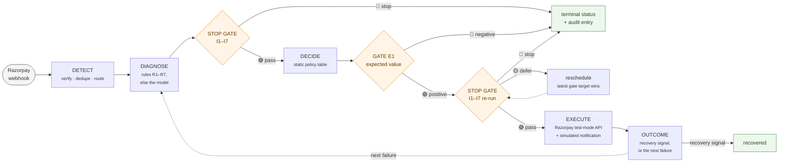
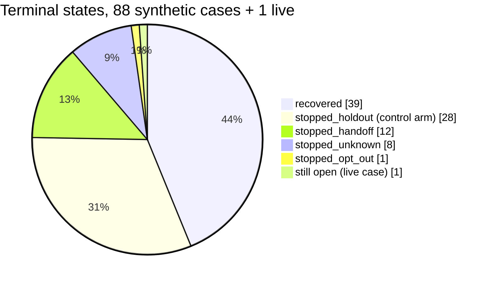
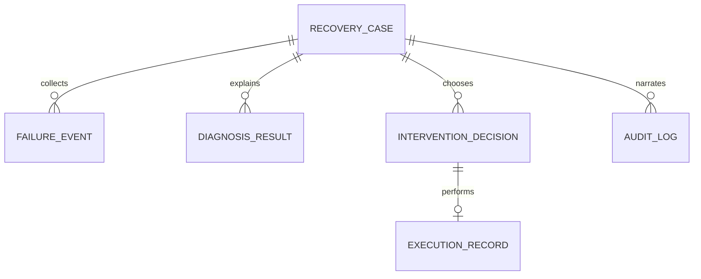

# 01 · Overview

## 1. The problem

A recurring subscription charge fails. Razorpay retries on its own fixed schedule, the
subscription eventually halts, and the merchant discovers the churn weeks later in a
revenue report. The **recoverable window** — the first hours and days after the
failure, while the customer still wants the service and the instrument can still be
fixed — is exactly the period in which nothing happens.

Three things make that window hard to work by hand:

1. **Volume.** Failures arrive as a webhook stream, not a queue someone reads.
2. **Diversity of cause.** An expired card, an empty account and a cancelled mandate
   need three different responses; retrying a dead instrument burns goodwill and gets
   nothing back.
3. **Restraint.** The naive fix — message everybody, repeatedly — measurably loses
   money, because every unsolicited payment message carries some chance the customer
   cancels outright rather than pays.

## 2. What this system is

An autonomous agent that works one failed subscription charge from detection to a
terminal outcome, under hard bounds it cannot cross, writing an auditable record of
every step.



In one sentence: **detect a failed charge, diagnose why, price the response, take at
most one bounded action, stop when a hard rule says stop, and log all of it so the
numbers can be traced back to individual cases.**

## 3. What makes it different from a dunning tool

| Ordinary dunning | This agent |
|---|---|
| Sends a fixed message ladder on a timer | Chooses one action per attempt from a table keyed on the *diagnosed cause* |
| Reports **gross** recovery | Reports **incremental** recovery, net of cost, against a randomised control arm ([11](11-measurement.md)) |
| Message cost treated as ~zero | Every intervention is priced before it is taken ([08](08-economics.md)) |
| "Stop" is a config value | Stopping is seven invariants in an independent module, run twice per action ([07](07-guardrails.md)) |
| The LLM writes and decides | The LLM classifies and drafts; it never chooses an action, sets timing, or touches money ([09](09-llm-boundary.md)) |
| Logs are append-only by convention | The log is hash-chained, so tampering is detectable by a stranger ([10](10-audit-trail.md)) |

## 4. Results (frozen batch: 88 synthetic, seed 42, `LLM_PROVIDER=none`)

The headline is **incremental, net of cost**. A randomised control arm is detected and
diagnosed like every other case and then never intervened on, so the agent is credited
only with recovery that would not have happened anyway; every rupee spent getting
there is then subtracted.

| Metric | Value |
|---|---|
| ₹ at risk | ₹72,412 across 88 synthetic cases |
| **Incremental recovery, net of cost** | **₹7,762** — 95% CI [−₹9,473, +₹20,460] |
| Incremental recovery, gross | ₹9,042 of ₹18,567 gross recovered in the treated arm |
| **Recovery rate, treated vs control** | **63.5% (33/52) vs 16.7% (6/36)** |
| **Lift** | **+46.8 pp**, 95% CI **[+28.8, +63.9] pp** — excludes zero |
| Total cost | ₹1,280 = ₹480 outreach (40 contacts) + ₹800 human queue (20 cases) |
| Cost per ₹100 recovered | ₹5.09 |
| Gross ₹ recovered | ₹25,161 across 39 of 88 cases |
| Avg time to recovery | 64.2 h (simulated clock) |
| Audit chain | intact — 511 entries, 0 unchained |
| Classification accuracy | 100% (84/84) rules path · 25% (1/4) model path, **with no model configured** |

**Reading these honestly** — the full caveats live in
[11 § Interpreting the result](11-measurement.md#7-interpreting-the-result) and
[18 Limits](18-limits-and-roadmap.md). In short: the *rate lift* is the claim, the
*rupee interval* is not (it spans zero, because ticket sizes range ₹199–₹4,999 and 88
cases is too few); outcome probabilities are modelling assumptions, so what is measured
is the **mechanism**, not the market.

Reproduce with no accounts, no keys, no model download:

```bash
python scripts/generate_synthetic.py --n 80 --seed 42 --out synthetic_cases.json
LLM_PROVIDER=none python scripts/run_batch.py --cases synthetic_cases.json \
    --db recovery.db --holdout 0.35
```

## 5. Where every case ended



`stopped_max_attempts`, `stopped_cooldown_expired`, `stopped_suppressed` and
`stopped_uneconomic` are **0 each** in this batch, and each zero is explained rather
than hidden — see [07 § Why some gates never fired](07-guardrails.md#8-why-some-gates-never-fired-in-the-batch).

## 6. The five nouns

Everything in the system is one of these. Full definitions in
[03 Data model](03-data-model.md); full vocabulary in the [glossary](glossary.md).



| Noun | One line |
|---|---|
| **RecoveryCase** | One recovery *episode* for one subscription — the aggregate root, and the only thing with a status |
| **FailureEvent** | One webhook delivery, stored immutably; its `razorpay_event_id` is what makes intake idempotent |
| **DiagnosisResult** | Why this charge failed: a category from a fixed six, plus how it was reached |
| **InterventionDecision** | What the agent chose to do next, when, from which policy cell, with what expected value |
| **ExecutionRecord** | What was actually done, in which mode, at what cost, with what copy |

## 7. The bounds, in one line

> At most **3 attempts** per case, at least **24 h** between customer contacts, nothing
> between **21:00 and 09:00 IST**, at most **2 contacts per customer per IST day**, one
> opt-out silences **every** subscription that person holds, an **unknown** cause is
> never acted on, and **no message is sent whose expected value is negative**.

Each of these is a numbered rule in [07 Guardrails](07-guardrails.md), enforced in
`app/invariants.py` / `app/economics.py` and pinned by tests.

## 8. Scale of the codebase

| Area | Files | Lines |
|---|---|---|
| `app/` — application | 15 modules | ~3,600 |
| `tests/` — 241 tests | 18 files | ~2,900 |
| `scripts/` — generator, runner, LLM probe | 3 | ~1,000 |
| `dashboard/` — no build step | 3 | ~2,200 |
| `schema.sql` | 1 | 178 |

## 9. Non-goals

Deliberately out of scope, with reasons in [18](18-limits-and-roadmap.md#3-out-of-scope-by-choice):
checkout abandonment, B2B receivables, real outbound SMS/email delivery, learned retry
timing, multi-tenant merchant isolation, and any form of authentication on the API
(this is a single-operator localhost demo).
