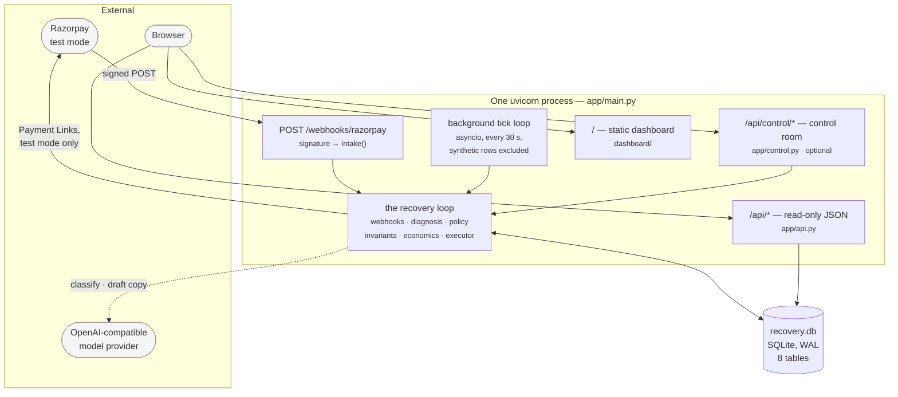
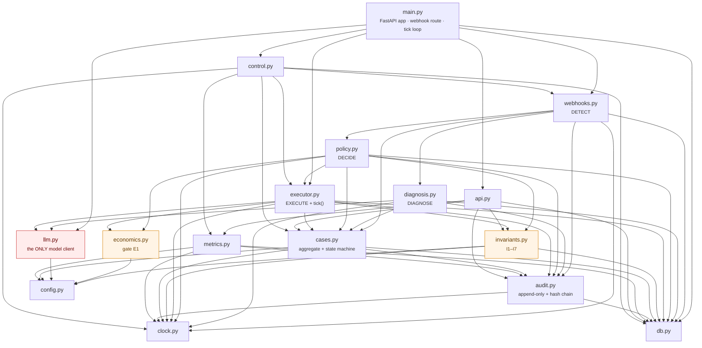
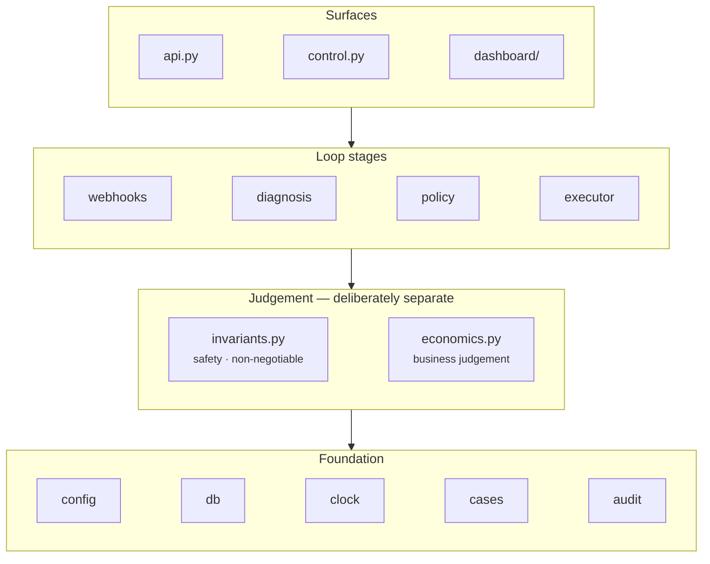
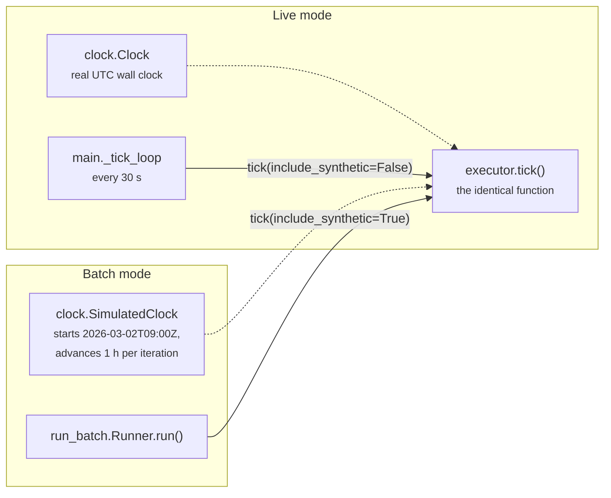
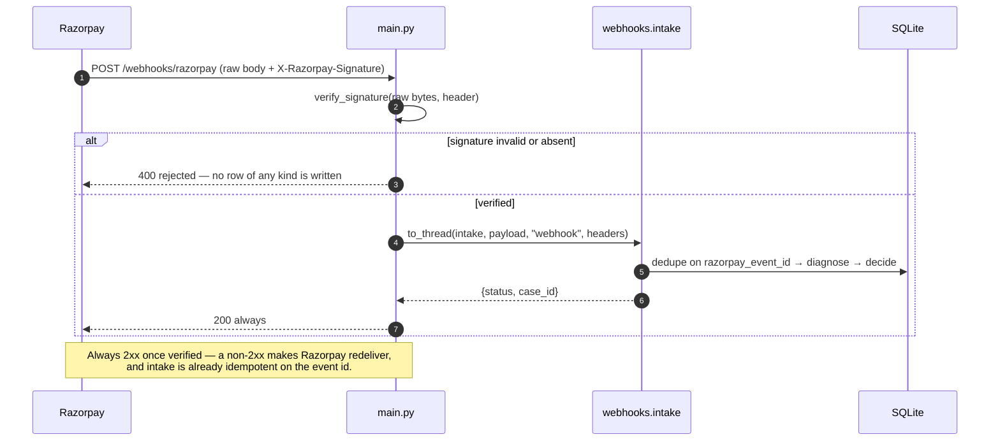
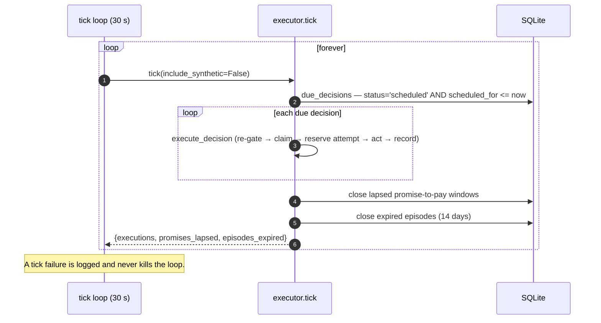

# 02 · Architecture

## 1. Deployment shape

One Python process. One SQLite file. No queue, no worker pool, no second service.



**Why one process.** The whole system is a state machine over ~100 rows whose steps are
separated by *hours*, not milliseconds. A queue would add an operational surface —
delivery semantics, a broker, dead letters — to buy throughput nobody needs, and would
put the strongest correctness claim (that a decision executes at most once) behind
someone else's at-least-once guarantee. Instead, `RETRY_LATER` writes a
`scheduled_for` timestamp and a `tick()` scan executes what is due. See
[19 · D-02](19-decision-log.md).

## 2. Modules and the dependency rule



### The two structural rules

**Rule 1 — `llm.py` is the only module that imports a model client.**
Enforced mechanically, not by convention:

```bash
grep -rlE '^\s*(from|import)\s+openai' app/    # → app/llm.py, and nothing else
```

`tests/test_llm_boundary.py::test_only_llm_py_imports_the_model_client` fails the build
if that ever returns a second file. See [09](09-llm-boundary.md).

**Rule 2 — `invariants.py` imports `db`, `clock` and `config`, and nothing else.**
It does *not* import `policy.py`, `llm.py` or `executor.py`. A bug in the policy table
therefore cannot route around a stopping rule, and no model output can reach one.
Pinned by `tests/test_llm_boundary.py::test_invariants_module_is_independent_of_policy_and_the_model`.

### Module inventory

| Module | Lines | Responsibility | Stage |
|---|---:|---|---|
| `main.py` | 110 | FastAPI app, webhook route, startup, background tick loop | — |
| `config.py` | 359 | Bounds, enums, rule table, policy table, copy templates, cost model | — |
| `db.py` | 195 | SQLite connection, schema application, additive migrations, ULID ids | — |
| `clock.py` | 151 | Injectable clock (real vs simulated), IST helpers | — |
| `cases.py` | 210 | `RecoveryCase` aggregate, status state machine, attempt reservation, suppression writes | — |
| `webhooks.py` | 293 | Signature verify, dedupe, extraction, `intake()`, case routing, recovery signals | **Detect** |
| `diagnosis.py` | 125 | Rule table application, then the model; persists `DiagnosisResult` | **Diagnose** |
| `llm.py` | 325 | The only model client. Two leaf calls: `classify()`, `draft_copy()` | *(boundary)* |
| `policy.py` | 177 | Static table lookup, control-arm handling, decision persistence | **Decide** |
| `invariants.py` | 256 | I1–I7, pre-decision and pre-execution gates, deferral arithmetic | **Stop** |
| `economics.py` | 113 | Expected-value arithmetic; gate E1 | **Price** |
| `executor.py` | 532 | Copy validation, Razorpay calls, simulated notifications, `tick()` | **Execute** |
| `audit.py` | 188 | Append-only writer + SHA-256 hash chain + `verify()` | — |
| `metrics.py` | 441 | Every metric as `(value, case_ids)`; costs, net, incremental | — |
| `api.py` | 346 | Dashboard JSON endpoints | — |
| `control.py` | 475 | Control room: run tests, replay the batch, storms, inject, tick | — |

`cases.py` is the ninth module beyond the eight core-loop modules; it exists only to
hold `transition()` without creating an import cycle between `db.py` and `audit.py`.

## 3. Layering



**Why safety and economics are separate layers-of-one.** Invariants encode consent, the
attempt cap and the refusal to guess; none is negotiable by a business that would prefer
a different answer. Gate E1 is a business judgement made of estimates. Keeping them in
different modules means a bad cost estimate can lose money and **cannot** cost someone
their consent. See [08 § 1](08-economics.md) and [19 · D-07](19-decision-log.md).

## 4. The two clocks

No module in `app/` calls `datetime.now()`. Everything reads `clock.now()`.



This is what lets a 14-day recovery episode resolve in milliseconds **through the same
code path** a live webhook takes. The batch numbers are therefore a claim about the
production pipeline, not about a parallel test harness.

### One clock per row — the subtle part

The background loop calls `executor.tick(include_synthetic=False)`. A batch replay
writes its cases against a *simulated* clock; to the live loop, running on the wall
clock, every one of those rows looks weeks old and therefore **expired**. An unfiltered
background tick would quietly close a finished experiment and report a batch that
recovered nothing.

Synthetic rows advance only under the clock that created them — the batch runner, or an
operator pressing **Tick**. Pinned by
`tests/test_concurrency.py::test_background_tick_leaves_batch_rows_alone`.

### IST is a fixed offset

Contact-time rules (I5) and daily ceilings (I7) are stated in Indian Standard Time,
because that is the timezone the customer is in and the one the compliance rules are
written against. IST is UTC+05:30 all year with **no daylight saving**, so
`timezone(timedelta(minutes=330))` is exactly right and a timezone database would add a
dependency without adding correctness.

`clock.ist_day_bounds()` returns the UTC half-open interval `[start, end)` covering one
IST calendar day *as the ISO strings stored in the database*, so a daily total is an
indexed range scan rather than a per-row timezone conversion in Python.

## 5. Time representation

| Concern | Choice | Why |
|---|---|---|
| Storage format | `YYYY-MM-DDTHH:MM:SSZ` — UTC, second precision | Fixed width and lexicographically sortable, so SQLite compares `scheduled_for <= :now` as a plain string |
| Money | **paise integers**, everywhere | No float ever touches a rupee; conversion to rupees happens only at the presentation edge (`cases.rupees()`) |
| Ordering | `rowid`, never `id` | ULIDs carry a random tail; ties on `scheduled_for` would order arbitrarily and break seeded reproducibility |

## 6. Concurrency model

Two genuinely concurrent paths exist in live mode — the webhook route and the tick loop,
both dispatched through `asyncio.to_thread`.

| Mechanism | Where | Protects |
|---|---|---|
| `webhooks._claim_lock` (RLock) | The dedupe → insert → case-lookup region of `intake()` | Two deliveries of the same event opening two cases |
| `failure_event.razorpay_event_id UNIQUE` | Schema | The same, across processes; a lost race raises `IntegrityError` and is answered as a duplicate with **200** |
| Conditional `UPDATE … WHERE status='scheduled'` | `executor.execute_decision` | A decision picked up by two workers creating two Payment Links |
| `cases.reserve_attempt()` — conditional `UPDATE … WHERE attempt_count < 3` | `executor.execute_decision` | I1 being bypassed by a lost update on `attempt_count` |
| `db._lock` held across read-head → allocate-seq → insert | `audit.audit()` | Two writers forking the hash chain |

Full treatment, including the crash-consistency posture, in
[17 Concurrency & failure](17-concurrency-and-failure.md).

## 7. Dependencies

Runtime, in order of how load-bearing they are:

| Package | Used for | Substitutable? |
|---|---|---|
| `fastapi` + `uvicorn` | HTTP surface | Yes — any ASGI framework |
| `razorpay` | `Utility.verify_webhook_signature`, Payment Links | Signature verify is HMAC-SHA256 over the raw body; re-implementable in ~5 lines |
| `pydantic` | Client-side enum validation of model output, control-room request bodies | `llm.py` has a hand-written fallback validator if pydantic is absent |
| `openai` | The OpenAI-compatible client — **lazily imported inside `llm._client()`** | Not installed at all when `LLM_PROVIDER=none` |
| `python-dotenv` | `.env` loading | Optional; the app runs without it |
| `pytest` + `httpx` | Test suite | — |

There is **no ORM and no migration framework**. The schema is hand-written SQL applied
idempotently at startup, with additive `ALTER TABLE` steps in `db._migrate()`. See
[19 · D-01](19-decision-log.md).

## 8. Request lifecycles




