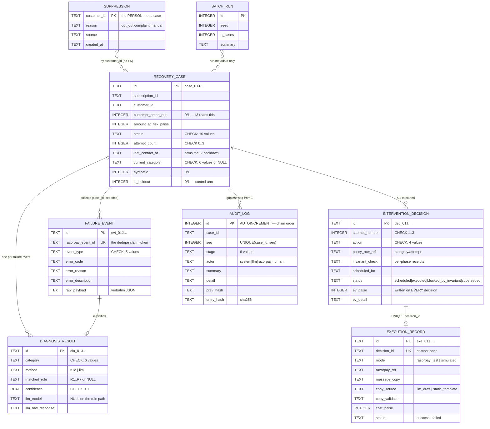
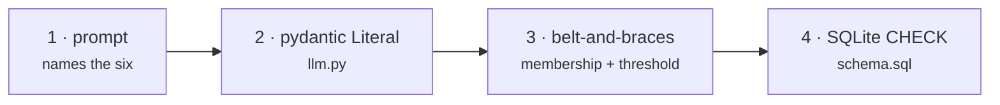
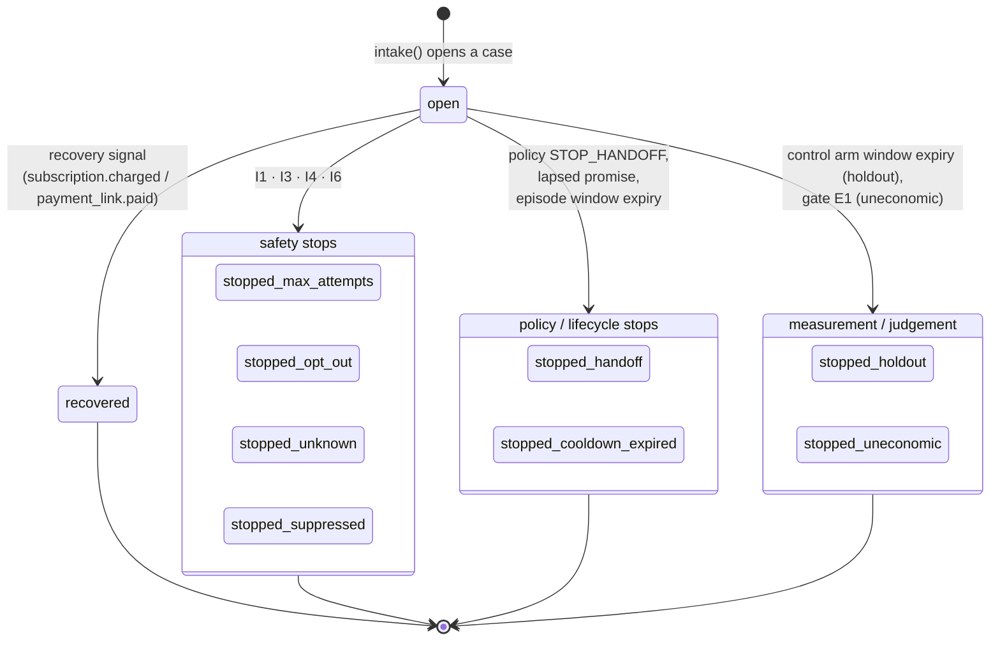
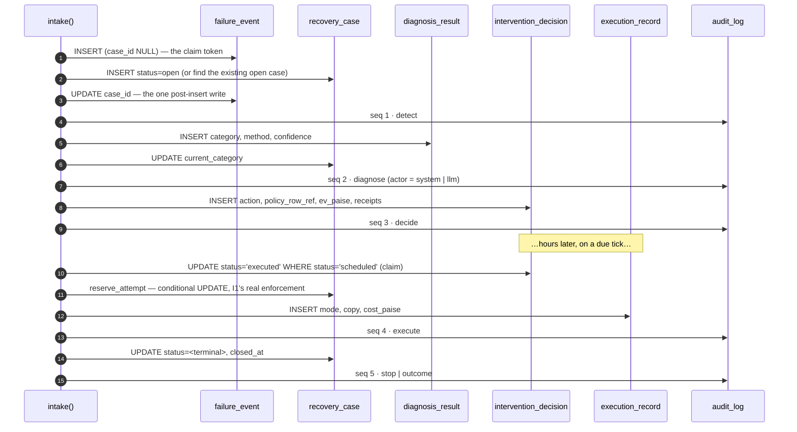

# 03 · Data model

Source of truth: [`schema.sql`](../schema.sql), applied idempotently at startup by
`db.init()`. Eight tables, hand-written SQL, no ORM, no migration framework.

## 1. Entity relationships



## 2. The CHECK constraints are the enum backstop

They are not decoration. `category` and `action` are constrained **at the schema level**,
so even a buggy caller — or a model output that somehow escaped every client-side
validator — cannot insert a value outside the fixed enums. This is the last of four
layers guarding the six-value category enum:



## 3. Case status state machine

`open` is the only non-terminal status. Every terminal status is reachable **from
`open` and nowhere else**; `cases.transition()` rejects every other edge and writes the
closing audit entry itself, so a closed case can never be reopened or silently
re-labelled.



### Every status, and what it means

| Status | Set by | Meaning |
|---|---|---|
| `open` | `cases.create()` | The episode is live |
| `recovered` | `webhooks.outcome_recovered()` | A real recovery signal arrived. **Only** this counts as recovery — sending a link recovers nothing |
| `stopped_max_attempts` | I1 (gate, or `reserve_attempt` refusal) | The 3-attempt cap bound |
| `stopped_cooldown_expired` | any timing gate | The next permitted contact falls outside the 14-day episode window; also the terminal state for an expired treated episode |
| `stopped_opt_out` | I3 | The customer opted out (per-case flag) |
| `stopped_unknown` | I4 | The failure cause is unknown; the agent does not guess |
| `stopped_handoff` | policy `STOP_HANDOFF`, or a lapsed promise-to-pay | Handed to the human queue **with a complete case file** — a deliverable, charged ₹40 |
| `stopped_uneconomic` | gate E1 | The next intervention's expected value was negative |
| `stopped_suppressed` | I6 | The customer is on the suppression list, on *any* of their subscriptions |
| `stopped_holdout` | `executor._close_expired_episodes` | A control-arm case observed for the full window without intervention, which did not self-recover |

## 4. Table-by-table

### `recovery_case` — the aggregate root

The only entity with a status. Everything else hangs off it.

| Column | Notes |
|---|---|
| `attempt_count` | `CHECK BETWEEN 0 AND 3`. Incremented **by SQLite**, never in Python — see [17 § 3](17-concurrency-and-failure.md) |
| `last_contact_at` | Written in the same statement as the increment, guarded by a flag, so a contact can never bump the counter without arming the I2 cooldown |
| `customer_opted_out` | Per-**case** consent — what I3 reads |
| `current_category` | Denormalised from the latest `DiagnosisResult`, purely so the policy lookup is a single read |
| `is_holdout` | Randomised arm assignment. Decided once, by whoever generated the batch, travelling on the event payload — never re-rolled inside the pipeline |
| `synthetic` | Provenance. Every metric reports the synthetic/live split rather than blending them |

### `failure_event` — immutable after insert

Exactly one column is ever written after the insert: `case_id`, set once from `NULL`,
inside the same claim region. Everything else is frozen, including `raw_payload`, which
stores the delivery verbatim.

`razorpay_event_id UNIQUE` is the whole idempotency story. The row is inserted **first**,
before any case exists, because it is the *claim token*: opening a case first would mean
a lost race leaves an empty case behind — a second attempt budget against a customer who
only ever failed once.

Five accepted `event_type` values, split into two roles:

| Role | Types | Handling |
|---|---|---|
| Failure | `payment.failed`, `subscription.pending`, `subscription.halted` | Open or join a case, diagnose, decide |
| Recovery | `subscription.charged`, `payment_link.paid` | Close the case as `recovered`, supersede pending decisions |

`subscription.halted` is **not** terminal on its own: it means Razorpay's own retries are
exhausted, which is precisely when this agent matters.

### `diagnosis_result`

One row per classification. `method` is `rule` or `llm`; `llm_model` is `NULL` on the
rule path, which is what makes the boundary claim checkable on a live delivery
([01 § the live case](../README.md)). `llm_raw_response` keeps the model's exact output —
including its errors, truncated at 2,000 chars — so a wrong classification can be read
back rather than guessed at.

### `intervention_decision`

| Column | Notes |
|---|---|
| `policy_row_ref` | `"card_expired/2"` — the exact table cell this came from, so a decision cites its own justification |
| `invariant_check` | JSON of the per-phase receipts: `{"pre_decision": {...}, "pre_execution": {...}}`. `not_applicable` is recorded distinctly from `pass` — see [07 § 5](07-guardrails.md) |
| `ev_paise` / `ev_detail` | The economics, written on **every** decision including ones that proceeded. The stop is the backstop; the record is the point |
| `status` | `scheduled` → `executed` (the claim token) \| `blocked_by_invariant` \| `superseded` |

### `execution_record`

`decision_id UNIQUE` is what makes at-most-once a schema property, not a hope.

`cost_paise` is booked whether the execution **succeeded or failed** — a message that
went out and did not work still cost what it cost, and a cost ledger that only counts
successes flatters itself.

`mode` is `razorpay_test` (a real test-mode Payment Link was created) or `simulated`,
recorded honestly. `retry_charge` is always `simulated`: test mode exposes no stable API
for forcing a subscription charge retry, and inventing a "live" record would be a lie in
an audit-trail project.

### `audit_log` — append only

There is no `UPDATE` or `DELETE` against this table anywhere in `app/`, and a test greps
for one. `id` is `AUTOINCREMENT` and defines **chain order**; `seq` is per-case and
`UNIQUE(case_id, seq)`, allocated as `MAX(seq)+1` inside the insert's transaction, so
each case's trail is gapless from 1. Full treatment in [10](10-audit-trail.md).

### `suppression` — the person, not the case

`recovery_case.customer_opted_out` is per-case and is what **I3** reads. This table is
what **I6** reads, and the difference is scope: someone who asks to be left alone about
one failing subscription has not asked to be left alone about only that one.

Writes are `INSERT OR IGNORE`, deliberately **not** upsert: the *first* reason a customer
was suppressed is the one that matters, and a later, weaker reason must never overwrite a
complaint. There is intentionally no API to remove a row — un-suppressing someone is
re-consenting on their behalf, which should not be one HTTP call away.

### `batch_run`

One row per batch, so the dashboard banner can state the seed honestly rather than
asserting reproducibility without evidence.

## 5. Identifiers

`db.new_id(prefix)` produces `prefix_<ULID>`: a 48-bit millisecond timestamp plus 80 bits
of randomness in Crockford base32, 26 characters, lexicographically sortable.

| Prefix | Table |
|---|---|
| `case_` | `recovery_case` |
| `evt_` | `failure_event` |
| `dia_` | `diagnosis_result` |
| `dec_` | `intervention_decision` |
| `exe_` | `execution_record` |

Implemented in `db.py` rather than pulling `python-ulid`, which is ~30 lines against a
dependency.

**Consequence for reproducibility:** ids carry a random tail, so two clean-room runs of
the same seed produce identical *numbers* and different *ids and hashes*. The seeded
metrics are what reproduce; the audit chain head is what detects tampering. Batch
ordering is therefore always by `rowid`, never by `id`.

## 6. Indexes

```sql
idx_case_status              recovery_case(status)
idx_case_subscription        recovery_case(subscription_id, status)   -- find_open_by_subscription
idx_case_customer            recovery_case(customer_id)               -- I6 / I7 per-customer scans
idx_event_case               failure_event(case_id)
idx_diagnosis_case           diagnosis_result(case_id)
idx_decision_case            intervention_decision(case_id)
idx_decision_due             intervention_decision(status, scheduled_for)  -- the tick scan
idx_execution_case           execution_record(case_id)
idx_execution_executed_at    execution_record(executed_at)            -- I7 daily windows
idx_audit_case_seq           UNIQUE audit_log(case_id, seq)           -- gapless trail
```

`idx_decision_due` is the one that matters at scale: `tick()` runs
`WHERE status='scheduled' AND scheduled_for <= ?` on every iteration.

## 7. Migrations

`CREATE TABLE IF NOT EXISTS` is a no-op on an existing table, so a column added to
`schema.sql` never reaches a database someone already has. `db._migrate()` closes that
gap with idempotent, additive `ALTER TABLE ADD COLUMN` steps:

| Added | Why nullable / defaulted |
|---|---|
| `recovery_case.is_holdout` | Default 0 — pre-existing cases were all treated |
| `intervention_decision.ev_paise`, `.ev_detail` | NULL — decisions made before gate E1 existed have no arithmetic to show |
| `execution_record.cost_paise` | Default 0 |
| `audit_log.prev_hash`, `.entry_hash` | NULL on purpose — rows written before the chain existed **cannot be retro-hashed without inventing history**, so they stay NULL and `verify()` counts them as `unchained` rather than quietly declaring them valid |

Known limit, documented rather than hidden: the `status` CHECK constraint cannot be
widened in place without rebuilding the table, so an older database accepts the new
columns but rejects the statuses added alongside them (`stopped_holdout`,
`stopped_uneconomic`, `stopped_suppressed`). That is the correct failure — a database
written before those states existed has no case that could legitimately be in one. A
fresh run gets the full constraint.

## 8. Data lifecycle of one case



Every closed case ends on a `stop` or `outcome` entry — asserted by an acceptance check
in `run_batch.py`.
