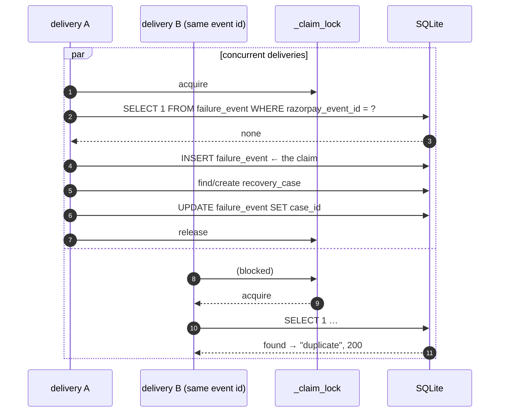
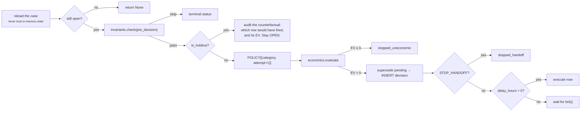
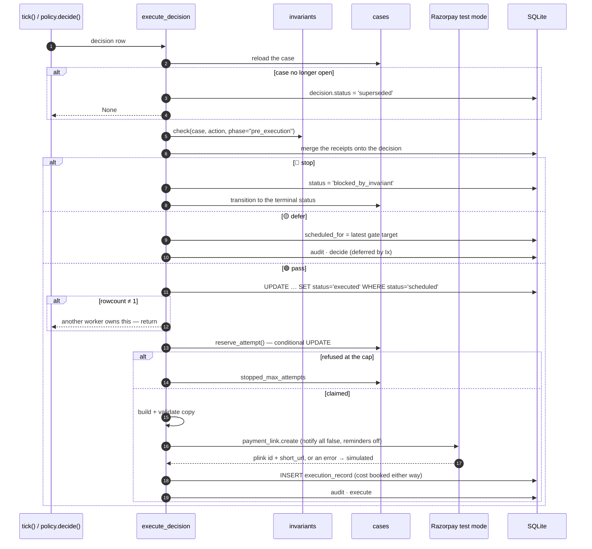
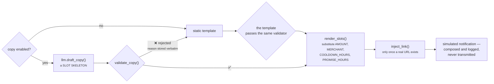

# 04 · The pipeline

Five stages, in order, over one `RecoveryCase`. Each has exactly one owning module and
exactly one audit stage.

| Stage | Module | Audit stage | Can it stop a case? |
|---|---|---|---|
| **Detect** | `webhooks.py` | `detect` | No — but it rejects unverified bodies before any row exists |
| **Diagnose** | `diagnosis.py` (+ `llm.py`) | `diagnose` | Indirectly: `unknown` triggers I4 at the next gate |
| **Decide** | `policy.py` | `decide` | Yes — via the pre-decision gate and gate E1 |
| **Execute** | `executor.py` | `execute` | Yes — via the pre-execution gate |
| **Outcome** | `webhooks.outcome_recovered` / `executor.tick` | `outcome` / `stop` | Yes — it is where cases close |

## 1. The whole loop

```mermaid
flowchart TD
    START(["webhook body,<br/>or a synthetic payload"]) --> SIG{"signature<br/>verified?"}
    SIG -->|no| REJ["400 · no row written"]
    SIG -->|yes| DEDUPE{"razorpay_event_id<br/>already stored?"}
    DEDUPE -->|yes| DUP["200 duplicate"]
    DEDUPE -->|no| TYPE{"event type"}

    TYPE -->|"unrecognised"| IGN["200 ignored"]
    TYPE -->|"recovery signal"| RECSIG["find open case →<br/>status = recovered,<br/>supersede pending decisions"]
    TYPE -->|"failure signal"| INS["INSERT failure_event<br/><small>claim token</small>"]

    INS --> CASE{"open case for<br/>this subscription?"}
    CASE -->|yes| JOIN["join it"]
    CASE -->|no| NEW["cases.create()"]
    JOIN --> AUD1["audit · detect"]
    NEW --> AUD1

    AUD1 --> DIAG["diagnosis.diagnose()"]
    DIAG --> RULES{"R1–R6 hit?"}
    RULES -->|yes| CAT["category, confidence 1.0"]
    RULES -->|"no, and error fields empty"| R7["R7 → unknown<br/><small>no model consulted</small>"]
    RULES -->|"no, but there is text"| LLM["llm.classify()"]
    LLM --> VALID{"valid enum AND<br/>confidence ≥ 0.8?"}
    VALID -->|no| UNK["unknown"]
    VALID -->|yes| CAT
    R7 --> UNK

    CAT --> DEC["policy.decide()"]
    UNK --> DEC

    DEC --> G1{"invariants.check<br/>phase = pre_decision"}
    G1 -->|"🔴 stop"| CLOSE1["transition to terminal status<br/>audit · stop"]
    G1 -->|"🟢 pass"| ARM{"is_holdout?"}
    ARM -->|yes| CTRL["audit the withheld action<br/>+ its EV. Case stays OPEN."]
    ARM -->|no| LOOKUP["POLICY[(category, attempt)]<br/>→ (action, delay_hours)"]

    LOOKUP --> E1{"economics.evaluate<br/>EV > 0?"}
    E1 -->|"🔴 no"| CLOSE2["stopped_uneconomic"]
    E1 -->|"🟢 yes"| WRITE["supersede pending ·<br/>INSERT intervention_decision<br/>with ev_paise + receipts"]

    WRITE --> ISSTOP{"action = STOP_HANDOFF?"}
    ISSTOP -->|yes| HAND["stopped_handoff<br/><small>no ExecutionRecord,<br/>no attempt consumed</small>"]
    ISSTOP -->|no| DELAY{"delay_hours = 0?"}
    DELAY -->|yes| EXEC["executor.execute_decision()"]
    DELAY -->|no| SCHED["wait for tick()"]
    SCHED --> EXEC

    EXEC --> G2{"invariants.check<br/>phase = pre_execution"}
    G2 -->|"🔴 stop"| CLOSE3["blocked_by_invariant<br/>+ terminal status"]
    G2 -->|"🟡 defer"| RESCHED["scheduled_for = latest target<br/>audit · decide"]
    RESCHED -.-> EXEC
    G2 -->|"🟢 pass"| CLAIM{"UPDATE … WHERE status='scheduled'<br/>rowcount = 1?"}
    CLAIM -->|no| LOST["another worker owns it — return"]
    CLAIM -->|yes| RES{"reserve_attempt()<br/>succeeded?"}
    RES -->|no| CLOSE4["stopped_max_attempts<br/><small>slot lost to a race</small>"]
    RES -->|yes| ACT["run the handler:<br/>retry_charge · send_update_link ·<br/>send_promise_offer"]
    ACT --> REC2["INSERT execution_record<br/>cost_paise booked<br/>audit · execute"]

    REC2 --> WAITOUT(["wait for the next event"])
    WAITOUT -.->|"recovery signal"| RECSIG
    WAITOUT -.->|"next failure"| DEDUPE
    WAITOUT -.->|"promise lapses / 14 days pass"| TICKCLOSE["tick() closes it"]

    classDef gate fill:#fff4e5,stroke:#d68000,color:#663d00
    classDef term fill:#eef7ee,stroke:#3a8a3a,color:#1d4d1d
    classDef bad fill:#ffecec,stroke:#c33,color:#600
    class SIG,DEDUPE,TYPE,RULES,VALID,G1,E1,G2,CLAIM,RES,ARM,ISSTOP,DELAY gate
    class CLOSE1,CLOSE2,CLOSE3,CLOSE4,HAND,RECSIG,TICKCLOSE term
    class REJ,DUP,LOST bad
```



## 2. Detect — `webhooks.py`

### 2.1 Signature verification

HMAC-SHA256 over the **raw request body**, via `razorpay.Utility.verify_webhook_signature`.
The raw bytes matter: re-serialising parsed JSON changes whitespace and key order, and
the signature will not match.

A rejected body produces a `400` and **touches nothing** — no row of any kind is created
for an unverified delivery.

```python
# app/main.py
raw = await request.body()
if not webhooks.verify_signature(raw, request.headers.get("X-Razorpay-Signature")):
    return JSONResponse({"status": "rejected", ...}, status_code=400)
```

Verified against the real webhook secret on a live `rzp_test_*` account — see the four
probes in [18 § 1](18-limits-and-roadmap.md).

### 2.2 `intake()` — the single ingestion path

> **A real Razorpay delivery and a synthetic payload differ only in `source`.**
> Everything from diagnosis down is byte-identical code.

That is what makes the batch numbers a claim about the real pipeline rather than about a
parallel test harness. `scripts/run_batch.py` talks to the system through exactly two
functions — `intake()` and `tick()` — and never writes an application table directly.

### 2.3 Dedupe, and the claim-token ordering



Across processes the in-process lock is not enough, so `razorpay_event_id UNIQUE` is the
real guarantee: the loser gets an `IntegrityError`, which is caught and answered as a
**duplicate with 200** — not a 500, which would make Razorpay redeliver forever.

> **This ordering came from a real bug.** `intake()` originally checked for a duplicate
> and *then* inserted, so two concurrent deliveries of one event both passed the check
> and the loser raised `IntegrityError` — a 500. The event row is now written first, as
> the claim token. `tests/test_concurrency.py::test_ten_identical_webhooks_land_as_one_case`
> pins the fix.

### 2.4 Case routing

| Situation | Result |
|---|---|
| No open case for this subscription | Open one |
| An open case exists | Join it — every event on one subscription is **one recovery episode**. Two open cases would mean two independent attempt budgets aimed at one customer |
| The payload carries `customer_opted_out` and the case does not | Flip the case flag |
| The customer has *any* prior opted-out case | The new case is created already opted out — consent is per person, not per episode |

### 2.5 Defensive extraction

`extract()` pulls fields from `payload.payment.entity`, falling back through
`subscription`, `payment_link` and `notes`, and never raises. A malformed payload must
produce a **diagnosable event**, not an exception — synthetic edge case `SYNTH-E-07` is a
`payment.failed` with no error object at all, and it must reach R7 rather than crash the
receiver.

## 3. Diagnose — `diagnosis.py`

Rules first; the model only for what the rules cannot reach; `unknown` when even that
fails. Full detail in [05 Diagnosis](05-diagnosis.md).

The verdict is persisted as a `DiagnosisResult`, denormalised onto
`recovery_case.current_category`, and audited with `actor = "llm"` whenever the model
contributed — so **every** model contribution is visibly labelled in the trail.

## 4. Decide — `policy.py`



Three things worth noting:

- **The lookup is total.** `POLICY` covers all 6 categories × 3 attempts, so it cannot
  raise and cannot fall through to a default. `tests/test_policy_matrix.py` iterates every cell.
- **A new failure supersedes any pending decision.** One case never holds two pending
  interventions.
- **`STOP_HANDOFF` never reaches the executor.** It moves no money, contacts nobody, and
  **does not consume an attempt** — the policy closes the case directly.
- **The control arm branch sits *after* the invariant gate on purpose.** A holdout case
  that opt-out or an unknown cause would have stopped is recorded under *that* reason,
  because the same stop would have happened in the treated arm. Keeping the reasons
  intact is what keeps the arms comparable.

## 5. Execute — `executor.py`



### 5.1 The three handlers

| Action | What actually happens | Mode | Cost |
|---|---|---|---|
| `RETRY_LATER` | A silent re-charge of the existing mandate. Contacts nobody | always `simulated` — test mode exposes no stable retry API | ₹0 |
| `SEND_UPDATE_LINK` | Creates a real test-mode Payment Link (within the live-link budget), composes copy, logs a simulated notification | `razorpay_test` or `simulated` | ₹12 |
| `PROMISE_TO_PAY` | The same, plus a 72-hour grace window recorded on the payload | `razorpay_test` or `simulated` | ₹12 |

`STOP_HANDOFF` has no handler — reaching the executor with it raises.

### 5.2 The live-link budget

`LIVE_LINKS_MAX` (default 5) caps real Payment Links per process. The budget is **spent
before the call and never refunded on failure** — deliberately fail-closed. A
refund-on-error would let a persistently failing endpoint be retried without bound,
which is exactly the rate limit the budget exists to respect. Over-counting a link costs
a demo; under-counting costs the account.

Real Payment Links are created with `notify: {sms: false, email: false}`,
`whatsapp: false` and `reminder_enable: false`. **Razorpay never contacts anyone in this
project.**

### 5.3 Copy: draft → validate → render → inject



**The central rule: the draft may contain no digit at all.** Numbers arrive only by slot
substitution afterwards, so an invented figure — the one hallucination that would move
real money if it reached a customer — is not merely detected, it is **unrepresentable**.

`validate_copy()` checks, in order:

| # | Rule | Why |
|---|---|---|
| 1 | Contains `[SYNTHETIC DEMO]` | Nothing may be mistaken for a real merchant message |
| 2 | Exactly one `{LINK}` | Zero means no way to pay; two means an ambiguous message |
| 3 | No literal `http://` or `https://` | Links are injected by code only; the model never sees or invents a URL |
| 4 | No unknown slots | Only the five in `COPY_SLOTS` |
| 5 | **No digits outside slots** | Counted on the skeleton with slots removed, so `{AMOUNT}` is fine and a typed `499` is not — *even when it is the correct amount* |
| 6 | No forbidden words | `refund`, `guarantee`, `legal`, `penalty`, `last chance` |
| 7 | Rendered length ≤ 320 | Measured on what would actually be sent, not on the shorter skeleton |

Static templates take the **identical** validate-then-render path, so the fallback is
held to the same rules as the LLM. A static template that fails its own validator raises
an `AssertionError` — that is a build error, not a runtime condition.
`tests/test_copy_validation.py` is this validator's contract, rule by rule.

> **Why slot skeletons replaced literal drafting.** An earlier design let the model write
> the amount as digits and then checked it matched. That rejected every otherwise-good
> sentence mentioning any other number ("within 24 hours", "attempt 2 of 3"). Slots are
> strictly safer *and* let copy cite the bounds the system actually enforces.

## 6. Outcome

A case counts as **recovered only on a real recovery signal** — `subscription.charged`
or `payment_link.paid`. Sending a link recovers nothing.
Pinned by `tests/test_detect_and_outcome.py::test_sending_a_link_recovers_nothing_on_its_own`.

On recovery: the case transitions to `recovered` with an `outcome` audit entry, and every
decision still `scheduled` becomes `superseded` — once the money has arrived, a pending
intervention is moot.

### The three ways a case closes without recovering

| Path | Where | Terminal status |
|---|---|---|
| A gate says stop | `invariants.check` at either phase, or gate E1 | the gate's own status |
| A promise-to-pay lapses | `executor._close_lapsed_promises` after 72 h | `stopped_handoff` — never retried, because attempt 3 was the last one |
| The episode window expires | `executor._close_expired_episodes` after 14 days | `stopped_holdout` (control arm) or `stopped_cooldown_expired` (treated) |

**No case is left a zombie.** An open case that outlives its window closes honestly
rather than waiting for a webhook that may never arrive.

## 7. `tick()` — the loop, in full

```python
def tick(include_synthetic: bool = True) -> dict:
    for decision in due_decisions(include_synthetic=include_synthetic):
        execute_decision(decision)          # re-gate, claim, reserve, act, record
    _close_lapsed_promises(include_synthetic)
    _close_expired_episodes(include_synthetic)
```

Due decisions are ordered `scheduled_for ASC, decided_at ASC, rowid ASC` — `rowid`, not
`id`, because ULIDs carry a random tail and ties would otherwise order arbitrarily,
making a seeded batch non-reproducible.

Called every 30 s by the background loop with `include_synthetic=False`, and directly by
the batch runner (and the control room's **Tick** button) with the default. See
[02 § 4](02-architecture.md#4-the-two-clocks) for why that flag exists.
