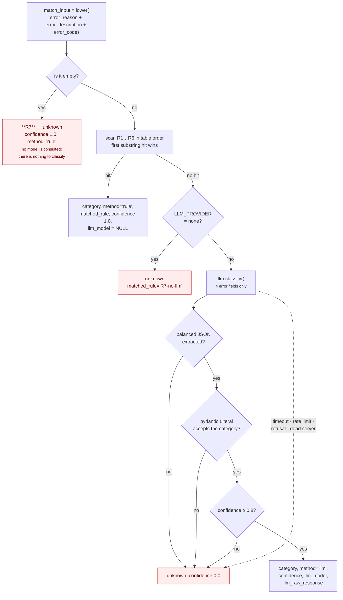

# 05 · Diagnosis

**Question this stage answers:** *why did this charge fail?*
**Output:** exactly one of six categories, plus how it was reached and how confident.

Module: `app/diagnosis.py`. Rule table: `config.RULES`. Model path: `app/llm.py`.

## 1. The six categories

The enum is fixed and closed. Nothing in the system — not a rule, not a model, not an
API caller — can introduce a seventh.

| Category | Means | Instrument still usable? |
|---|---|---|
| `card_expired` | The stored card is past its expiry date | No — needs a new instrument |
| `insufficient_funds` | Balance or credit limit was not enough | Yes — later, probably |
| `issuer_declined` | The bank refused for an opaque or generic reason, including `do_not_honour`, generic declines, and transient gateway/bank errors | Maybe — often transient |
| `authentication_failed` | 3-D Secure, OTP or mandate authentication failed or expired | Yes — with a fresh auth |
| `invalid_payment_method` | The instrument itself is unusable: blocked, lost, stolen, closed account, cancelled mandate, invalid card or VPA | No |
| `unknown` | The evidence does not clearly support any of the above | **Never acted on (I4)** |

That third column is what the policy table is really keyed on — see [06](06-policy.md).

## 2. Decision flow



Every path in that diagram that ends at `unknown` also ends the case, because **I4 never
acts on an unknown cause**. That is the whole design: the guardrail is the boundary plus
the invariant, not model quality.

## 3. The rule table R1–R7

Checked first, **in order**, first hit wins. Patterns are plain lowercase substrings —
no regex — so the table stays readable and cannot surprise anyone with backtracking
behaviour.

| Rule | Patterns (abridged) | → Category |
|---|---|---|
| **R1** | `card_expired`, `expired card`, `card expired`, `card has expired`, `card is expired`, `expired_card`, `card expiry`, `expiry date` | `card_expired` |
| **R2** | `insufficient`, `low balance`, `exceeds limit`, `exceeds the limit`, `insufficient_funds`, `not enough balance` | `insufficient_funds` |
| **R3** | `authentication`, `3dsecure`, `3d secure`, `3ds`, `otp`, `mandate authentication`, `authentication_failed` | `authentication_failed` |
| **R4** | `invalid card`, `card blocked`, `blocked card`, `card lost`, `card stolen`, `invalid_vpa`, `account closed`, `mandate cancelled`, `mandate revoked`, `invalid_payment_method` | `invalid_payment_method` |
| **R5** | `do_not_honour`, `do not honour`, `issuer declined`, `declined by`, `transaction declined`, `was declined`, `payment_declined_by_bank` | `issuer_declined` |
| **R6** | `payment timed out`, `gateway technical error`, `gateway_error`, `timed out`, `technical error` | `issuer_declined` |
| **R7** | *(no patterns)* — fires when all error fields are empty | `unknown` |

### Three deliberate details

**R1 is narrow on purpose.** A bare `expired` also appears in *"OTP expired"*, which
belongs to R3. Every R1 pattern names the card explicitly.
`tests/test_diagnosis_rules.py::test_expired_otp_is_authentication_not_card_expired` pins it.

**R6 shares R5's category.** Transient bank/gateway problems have retry-once semantics,
which is exactly `issuer_declined`'s policy row. Giving them a seventh category would
have added an enum value that behaves identically to an existing one.

**Table order is part of the contract.** `match_input` concatenates reason + description
+ code, so a string carrying two rule keywords — "card expired" inside an issuer-decline
message, say — resolves by the order of `config.RULES`, not by specificity. That is
deterministic and reproducible, but it means *adding a rule in the wrong position
silently reclassifies traffic*.
`tests/test_diagnosis_rules.py::test_rule_order_decides_an_ambiguous_string` pins the
current order so a reorder cannot happen by accident.

### R7 vs `R7-no-llm`

Two different situations, recorded distinctly:

| `matched_rule` | Meaning |
|---|---|
| `R7` | The error fields were **empty**. There was nothing to classify, so no model was troubled. |
| `R7-no-llm` | The rules missed, there *was* text, but `LLM_PROVIDER=none`, so no model existed to ask. |

`run_batch.classification_accuracy()` counts `R7-no-llm` cases on the **model path**,
even though no model ran — otherwise `LLM_PROVIDER=none` would flatter the rules by
crediting them with cases they never reached. That is why the frozen batch reports
"25% (1/4) model path, with no model configured".

## 4. When the model is consulted

Only when **all of** these hold:

1. R1–R6 all missed, **and**
2. `match_input` is non-empty (otherwise R7 short-circuits), **and**
3. `LLM_PROVIDER != none`.

What is sent is exactly four fields:

```
error_code, error_reason, error_description, error_step
```

**No customer name, phone number, email, amount or subscription id ever reaches the
model.** The prompt names the six categories, instructs `unknown` when unsure, and
demands one JSON object.

The response must survive four gates before it is believed — see
[09 § 4](09-llm-boundary.md#4-every-failure-mode-and-where-it-lands).

## 5. The recorded verdict

```json
{
  "id": "dia_01J…",
  "case_id": "case_01J…",
  "failure_event_id": "evt_01J…",
  "category": "insufficient_funds",
  "method": "rule",
  "matched_rule": "R2",
  "confidence": 1.0,
  "llm_model": null,
  "llm_raw_response": null
}
```

And the audit entry beside it:

| Path | `actor` | Summary |
|---|---|---|
| Rule | `system` | `Diagnosed insufficient_funds by rule R2 (matched 'insufficient')` |
| Model | **`llm`** | `Diagnosed issuer_declined by model <id> at confidence 0.91` |
| Model, collapsed | **`llm`** | `… at confidence 0.62 — below threshold or unparseable, forced to unknown` |

`actor = "llm"` on every model contribution means the trail can be filtered to *exactly*
what the model touched. The `detail` blob carries `llm_raw_response`, the rationale, the
classified text, and the confidence threshold in force — so a disputed classification can
be re-read rather than re-argued.

## 6. Denormalisation onto the case

`cases.set_category()` writes the verdict to `recovery_case.current_category`, validating
membership in the enum before it does. The policy lookup then reads one column instead of
joining the latest diagnosis — and the SQLite `CHECK` constraint on that column is the
schema-level backstop.

A second failure event on the same open case produces a **second** `DiagnosisResult` and
overwrites `current_category`: the cause of the most recent failure is what the next
decision is keyed on.

## 7. Accuracy on the frozen batch

| Path | Accuracy | Note |
|---|---|---|
| Rules (R1–R6, R7) | **100% — 84/84** | Against the generator's ground truth |
| Model path | **25% — 1/4** | Run with `LLM_PROVIDER=none`, so all four collapsed to `unknown` and stopped. One of them genuinely *was* unknown, hence 1/4 |

The four model-path cases are the ones the rules could not reach — synthetic flavours
written deliberately to miss every pattern ("The customer's bank did not permit this
standing instruction at this time"). **With a model configured, those are the cases it
earns its place on; without one, they stop instead of being guessed. Both behaviours are
correct, which is the whole argument.**

`scripts/check_llm.py` reached a hosted provider and classified 4/4 of those probes
correctly — but the frozen batch stands as reported, with no model.

## 8. Changing the rules safely

1. Add the pattern to the correct rule in `config.RULES`, **minding table order**.
2. Add a case to the parametrised list in `tests/test_diagnosis_rules.py::test_rule_matches`.
3. If it could collide with an existing rule, extend
   `test_rule_order_decides_an_ambiguous_string`.
4. Run `pytest tests/test_diagnosis_rules.py -v`.
5. Re-run the frozen batch and confirm the reported classification accuracy did not move.

Adding a **category** is a much larger change: it needs a new enum member in
`config.CATEGORIES`, three new `POLICY` cells, a `CHECK` constraint widening in
`schema.sql` (which requires a table rebuild), two new `STATIC_TEMPLATES` entries, a new
`P_RECOVER_PRIOR` row, and a line in the LLM system prompt. `test_policy_matrix.py` and
`test_copy_validation.py` will both fail until every one of those is done — by design.
