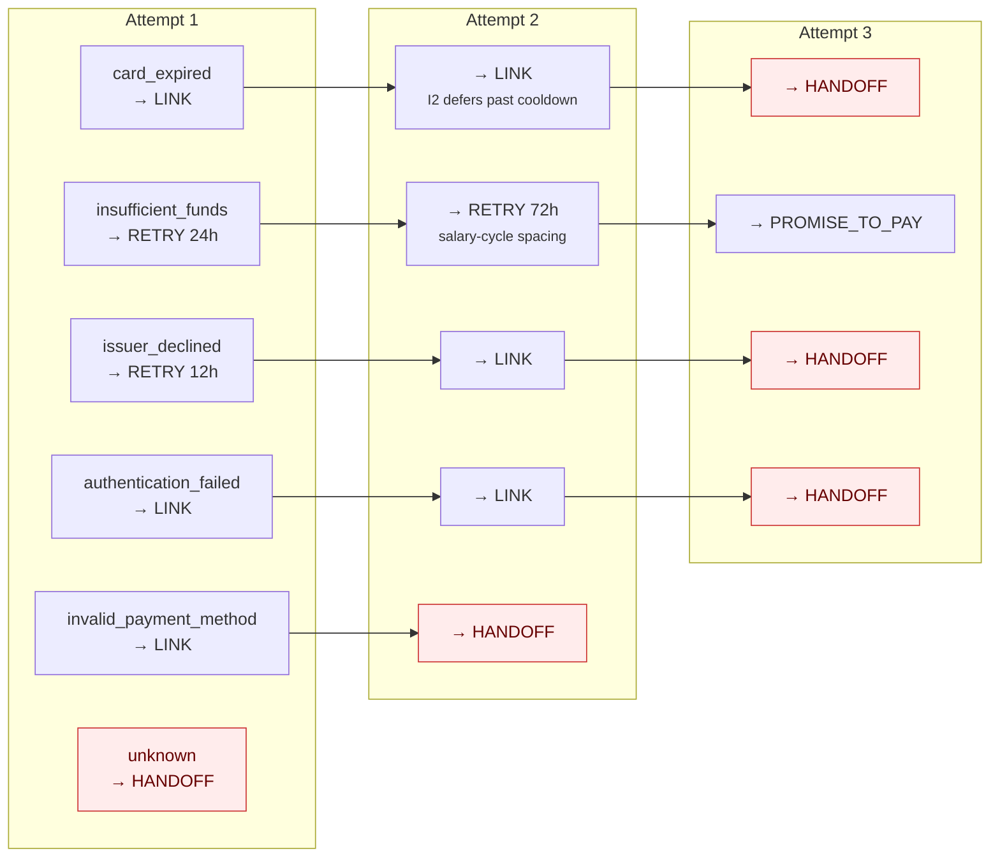

# 06 · Decision policy

**Question this stage answers:** *given the cause and how many attempts have already
been spent, what is the one thing to do next?*

Module: `app/policy.py`. Table: `config.POLICY`. **There is no model in this call path.**

## 1. The four actions

| Action | What it does | Contacts a human? | Consumes an attempt? | Cost |
|---|---|---|---|---|
| `RETRY_LATER` | Silent re-charge of the existing mandate after a delay | **No** | Yes | ₹0 |
| `SEND_UPDATE_LINK` | Payment Link + a message asking them to pay or re-instrument | Yes | Yes | ₹12 |
| `PROMISE_TO_PAY` | Link + a 72 h grace window before handoff | Yes | Yes | ₹12 |
| `STOP_HANDOFF` | Close the case with a complete file for a person | No | **No** | ₹40 |

`CONTACT_ACTIONS = {SEND_UPDATE_LINK, PROMISE_TO_PAY}` — the set the contact-hygiene
invariants I2, I5 and I7 gate. `RETRY_LATER` is deliberately *not* in it: a silent
re-charge of a mandate the customer already authorised is not a contact. That is a
compliance distinction, made explicitly and defended in [07 § 4](07-guardrails.md).

## 2. The table

`(category, attempt_number) → (action, delay_hours)`. Total over 6 × 3 = 18 cells.

| Category | Attempt 1 | Attempt 2 | Attempt 3 |
|---|---|---|---|
| `card_expired` | `SEND_UPDATE_LINK` · 0 h | `SEND_UPDATE_LINK` · 0 h | `STOP_HANDOFF` |
| `insufficient_funds` | `RETRY_LATER` · **24 h** | `RETRY_LATER` · **72 h** | `PROMISE_TO_PAY` · 0 h |
| `issuer_declined` | `RETRY_LATER` · **12 h** | `SEND_UPDATE_LINK` · 0 h | `STOP_HANDOFF` |
| `authentication_failed` | `SEND_UPDATE_LINK` · 0 h | `SEND_UPDATE_LINK` · 0 h | `STOP_HANDOFF` |
| `invalid_payment_method` | `SEND_UPDATE_LINK` · 0 h | `STOP_HANDOFF` | `STOP_HANDOFF` † |
| `unknown` | `STOP_HANDOFF` | `STOP_HANDOFF` | `STOP_HANDOFF` ‡ |

† Unreachable — attempt 2 already closes the case. Present to keep the table **total**.
‡ Unreachable — I4 stops an `unknown` case before the policy is consulted. Defence in depth.



## 3. Why each row is what it is

### `card_expired` — link, link, stop. Never a retry.

An expired card does not un-expire. Retrying it burns one of three attempts, annoys the
issuer, and cannot succeed. The only fix is a new instrument, which means a link. The
second link is a *reminder*, not a second strategy — and it is invariant I2, not the
policy table, that spaces it 24 h out.

Pinned by `tests/test_policy_matrix.py::test_dead_instruments_are_never_retried`.

### `insufficient_funds` — retry, retry, then ask.

The instrument works; the account was empty. This is the one cause where *waiting* is
genuinely the highest-EV action, and it is free (₹0, contacts nobody, no churn hazard).

- **24 h** for the first retry — enough for a transfer to land.
- **72 h** for the second — deliberate salary-cycle spacing.
- **`PROMISE_TO_PAY`** on attempt 3 — after two silent failures, the situation is not
  "the money is arriving on its own", so the agent asks, once, with a grace window. The
  prior for a promise is flat across attempts (0.46, 0.46, 0.46) because it is *agreed*
  with the customer rather than pushed at them.

### `issuer_declined` — one retry for the transient case, then a link.

Generic declines and gateway timeouts frequently clear on their own within hours, so the
12 h retry is cheap and often sufficient. If it does not clear, the decline was probably
structural, and the customer needs a different instrument — hence the link on attempt 2.

### `authentication_failed` — a fresh auth link, twice, then stop.

A failed 3DS/OTP flow needs a *new* link; the old one is spent. Retrying a mandate whose
authentication failed simply re-fails.

### `invalid_payment_method` — one link, then out.

Blocked, lost, stolen, closed, cancelled mandate. One chance to re-instrument, then a
person. Repeating messages to someone whose payment method is structurally dead is
exactly the behaviour the annoyance cost exists to price out.

### `unknown` — never acts.

Three `STOP_HANDOFF` cells that should be unreachable. I4 stops an unknown case at the
pre-decision gate, before the lookup happens. This row is defence in depth: if the gate
were ever removed by mistake, the table still refuses to act.
Pinned by `tests/test_policy_matrix.py::test_unknown_never_acts`.

## 4. Contact actions carry delay 0 — and that is a design claim

Look at the table again: every `SEND_UPDATE_LINK` and `PROMISE_TO_PAY` cell has
`delay_hours = 0`.

> The 24 h spacing between two contacts is **not** a policy delay. It is invariant I2,
> enforced in `invariants.py`, which *defers* the execution.

The consequence is the point: **spacing holds even if this table is wrong.** Someone who
edits a delay to 0 by accident, or adds a new row and forgets the gap, cannot cause two
messages in an hour — the gate reschedules the second one. Policy chooses *what*; the
invariants own *when*.

Pinned by `tests/test_policy_matrix.py::test_contact_actions_carry_no_policy_delay`.

## 5. Totality, and why it is tested

```python
def is_total() -> bool:
    return all((c, a) in config.POLICY
               for c in config.CATEGORIES
               for a in range(1, config.MAX_ATTEMPTS + 1))
```

`lookup()` is a bare dict subscript. It cannot raise, and it cannot fall through to a
default — because a default is a silent policy that nobody reviewed.
`tests/test_policy_matrix.py` asserts totality *and* that there are no extra cells,
so adding a category without adding its three rows fails the build.

## 6. What a decision records

```json
{
  "id": "dec_01J…",
  "case_id": "case_01J…",
  "attempt_number": 2,
  "category": "card_expired",
  "action": "SEND_UPDATE_LINK",
  "policy_row_ref": "card_expired/2",
  "invariant_check": {
    "pre_decision":  {"I1":"pass","I2":"not_applicable","I3":"pass","I4":"pass",
                      "I5":"not_applicable","I6":"pass","I7":"not_applicable","phase":"pre_decision"},
    "pre_execution": {"I1":"pass","I2":"deferred to 2026-03-04T11:00:00Z", …}
  },
  "decided_at": "2026-03-03T11:00:00Z",
  "scheduled_for": "2026-03-03T11:00:00Z",
  "status": "executed",
  "ev_paise": 13940,
  "ev_detail": { "p_recover": 0.22, "expected_gross_paise": 10978, … }
}
```

Three things a reader can do with that row alone:

1. **Check the choice** — `policy_row_ref` names the exact table cell.
2. **Check the gates ran** — `invariant_check` carries per-phase receipts, with
   `not_applicable` distinguished from `pass`.
3. **Check the arithmetic** — `ev_detail` shows what the agent expected to gain, *even
   though this decision proceeded*. See [08](08-economics.md).

## 7. Superseding

A new failure event on an open case marks every `scheduled` decision `superseded`
before writing the new one. One case never holds two pending interventions — two would
mean two independent interventions aimed at one customer.

The control room's **Webhook storm** demonstrates this live: *n* distinct failures on
one subscription produce *n* stored events, one case, and exactly **one** live decision.

## 8. The control arm bypass

If `is_holdout = 1`, `decide()` does the lookup and the EV arithmetic, **audits what it
would have done**, and returns without writing a decision:

```json
{
  "arm": "control",
  "policy_row_ref": "insufficient_funds/1",
  "withheld_action": "RETRY_LATER",
  "withheld_delay_hours": 24,
  "withheld_ev": { "ev_paise": 20958, … }
}
```

The case stays **open**, because that is what a holdout is: a case you watch without
touching. It can still recover on its own — and that self-recovery is exactly the
quantity being measured. See [11](11-measurement.md).

## 9. Changing the table safely

1. Edit the cell in `config.POLICY`.
2. Add or update the matching `P_RECOVER_PRIOR` row in `config.py` — an unlisted
   `(category, action)` pair falls back to the deliberately pessimistic default.
3. Ensure a `STATIC_TEMPLATES` entry exists if you introduced a new
   (category, contact-action) pair — `test_copy_validation.py::test_a_template_exists_for_every_category_and_contact_action` will fail otherwise.
4. Run `pytest tests/test_policy_matrix.py tests/test_copy_validation.py -v`.
5. Re-run the frozen batch; every acceptance check must stay green, including
   *"E1: every executed intervention had a positive expected value"*.
