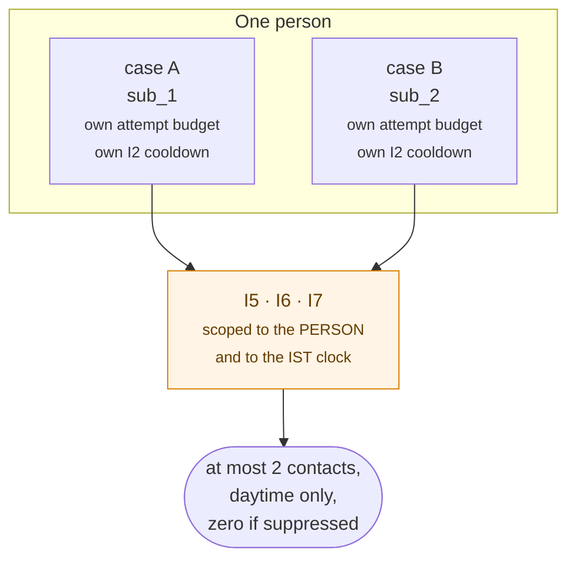
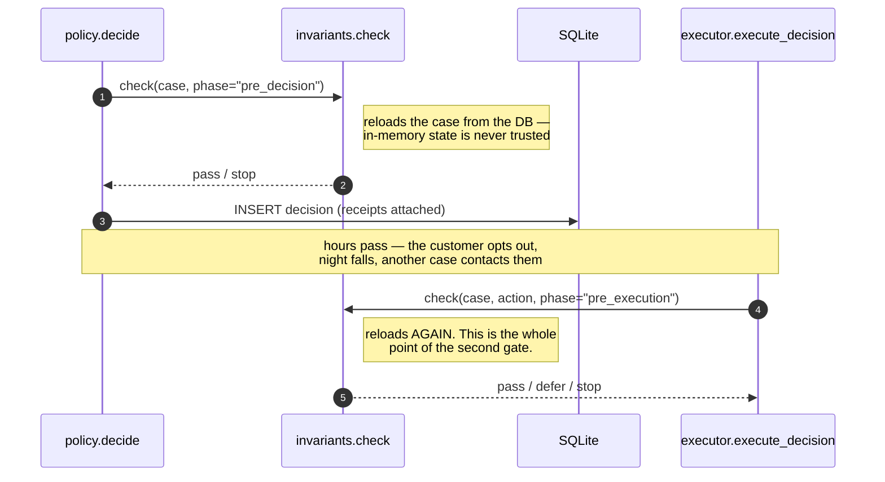
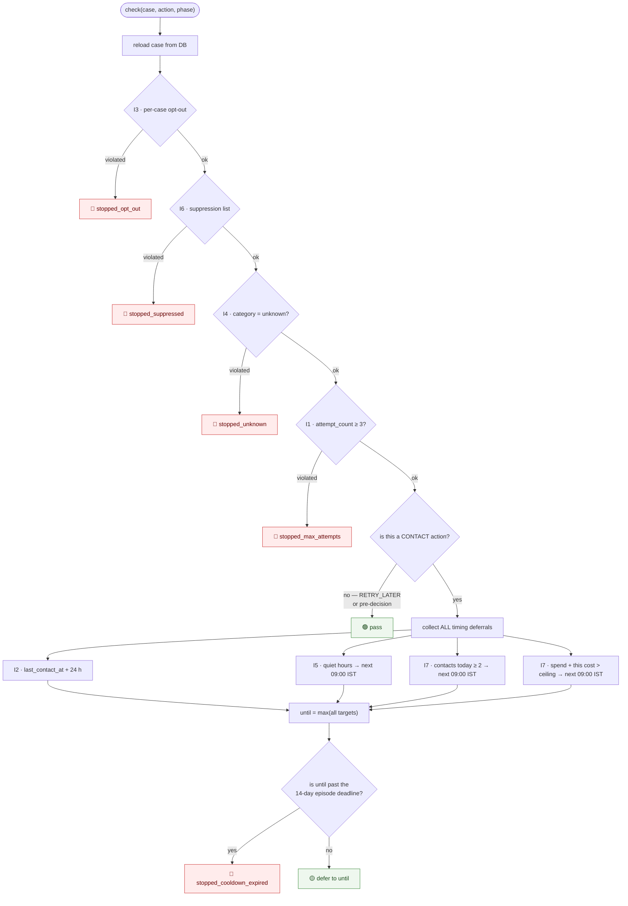
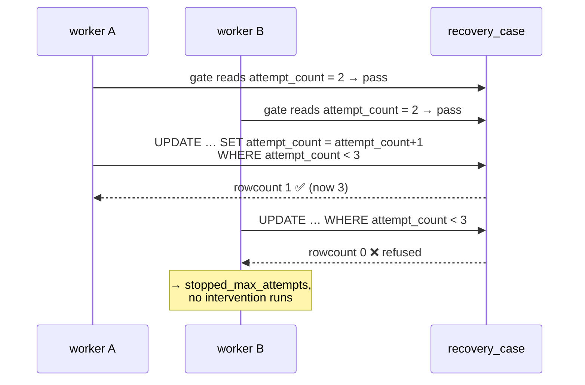

# 07 · Guardrails — what the agent refuses to do

Seven invariants and one economics gate. They are split into **three kinds on purpose**,
because "the agent stopped" means something different in each, and a panel that shows
them as one undifferentiated list is hiding that.

Modules: `app/invariants.py` (I1–I7) and `app/economics.py` (E1).

## 1. The rules

| | Rule | On violation | Terminal status |
|---|---|---|---|
| **Safety** — non-negotiable | | | |
| **I1** | at most 3 executed attempts per case | stop | `stopped_max_attempts` |
| **I2** | at least 24 h between two contacts on one case | **defer** | `stopped_cooldown_expired` if the target falls outside the window |
| **I3** | an opted-out customer is never contacted or charged | stop | `stopped_opt_out` |
| **I4** | an unknown failure cause is never acted on | stop | `stopped_unknown` |
| **Contact hygiene** — the person, not the case | | | |
| **I5** | nothing sent between 21:00 and 09:00 IST | **defer** to 09:00 IST | `stopped_cooldown_expired` if outside the window |
| **I6** | a suppressed customer is silent on *every* subscription they hold | stop | `stopped_suppressed` |
| **I7** | ≤ 2 contacts per customer per IST day; ≤ ₹5,000/day outreach system-wide | **defer** | `stopped_cooldown_expired` if outside the window |
| **Economics** — a judgement, not a rule | | | |
| **E1** | an intervention whose expected value is negative is never executed | stop | `stopped_uneconomic` |

## 2. Why I5–I7 exist at all

> I1–I4 bound the agent **per case**, and a customer is not a case.

One person with two failing subscriptions has two cases, two attempt budgets and two
independent 24 h cooldowns — and **nothing in the original four would have stopped both
of them messaging at 2 a.m. on the same night.**



**I6 is the same gap for consent.** An opt-out recorded on one subscription now silences
the others — including cases that do not exist yet — and it gates the **silent mandate
re-charge** too. *Someone who asked to be left alone was not asking to be left alone
noisily.*

## 3. Where the gates run

Every gate runs **twice per action**, at two phases.



**Every gate reloads the case from the database first.** In-memory case state is never
trusted, because the entire purpose of the pre-execution re-check is to catch state that
changed *after* the decision was made — an opt-out arriving between a scheduled decision
and its execution, for example. Pinned by
`tests/test_invariants.py::test_gate_reloads_state_and_never_trusts_the_caller` and
`::test_mid_flight_opt_out_is_caught_at_the_pre_execution_gate`.

## 4. Evaluation order — and why it is that order



**Consent first (I3, then I6)** — a per-case opt-out and a per-person suppression are the
same answer at different scopes. **Then the refusal to act on an unknown cause (I4).**
**Then the attempt cap (I1).** Only after all four hard stops do the timing gates run.

Pinned by `tests/test_invariants.py::test_ordering_consent_beats_unknown_beats_attempts`.

### The latest target wins

> When several timing gates apply to one contact, the verdict is the **latest** of their
> targets, not whichever ran first.

Returning on the first deferral would schedule a contact for a moment a later gate also
forbids — **and that bug only shows up at 3 a.m.** So deferrals are *collected*, not
returned on, and `max()` decides. Every gate that contributed is marked
`deferred to <iso>` in the receipts, not just the winner.

Pinned by
`tests/test_contact_hygiene.py::test_i5_and_i2_together_pick_the_later_target_not_the_first_one`.

### Every deferral shares one ending

If the next permitted moment falls outside the 14-day episode window, there is no later
attempt to make, so the case closes as `stopped_cooldown_expired` **now** rather than
holding a contact that can never legally go out.

## 5. Receipts — `pass` vs `not_applicable`

I1, I3, I4 and I6 depend only on case and customer state, so **both** phases evaluate
them. I2, I5 and I7 depend on the *proposed action*, because they gate customer contact
and not a silent mandate re-charge. At the pre-decision gate the action has not been
chosen yet, so those three are genuinely unevaluable and their receipts say
`not_applicable`.

> Recording a check that did not run as one that **passed** would make the audit trail
> claim more than it can support.

```json
{
  "pre_decision":  {"I1":"pass","I2":"not_applicable","I3":"pass","I4":"pass",
                    "I5":"not_applicable","I6":"pass","I7":"not_applicable"},
  "pre_execution": {"I1":"pass","I2":"pass","I3":"pass","I4":"pass",
                    "I5":"deferred to 2026-03-04T03:30:00Z","I6":"pass",
                    "I7":"deferred to 2026-03-04T03:30:00Z"}
}
```

Pinned by `tests/test_invariants.py::test_i2_receipt_says_not_applicable_when_it_could_not_be_evaluated`.

## 6. I1 is reported here but enforced elsewhere

`invariants.check` only **reads** `attempt_count`, and a read cannot hold a cap against a
concurrent execution: between the read and the execution, another thread can execute and
increment.



`cases.reserve_attempt()` is one atomic conditional `UPDATE`; SQLite applies it
atomically, so exactly one caller can win. The gate is the *early, explanatory* stop; the
conditional UPDATE is the one that cannot be raced.

The slot is claimed **before** the intervention runs, not after — which is also the honest
ordering: a failed execution has still spent an attempt.

Pinned by `tests/test_concurrency.py::test_i1_holds_when_every_attempt_is_claimed_at_once`
(twenty threads, three slots, exactly three winners) and
`tests/test_invariants.py::test_i1_holds_when_two_executions_race_for_the_last_attempt`.

> **This was a real bug.** The previous implementation incremented in Python, so two
> concurrent paths both read 2 and both wrote 3 — a **lost update**. `attempt_count`
> under-counted, I1 under-fired, and two interventions shipped. Recorded in
> `.claude/FIXES.md` item 1.

## 7. I7's two independent ceilings

Both reset at **IST midnight**, both computed via `clock.ist_day_bounds()` as an indexed
range scan over `execution_record.executed_at`.

| Ceiling | Default | Scope | Why it is not a duplicate of I2 |
|---|---|---|---|
| `MAX_CONTACTS_PER_CUSTOMER_PER_DAY` | 2 | One customer, across **all** their cases | I2 spaces contacts *within* one case and cannot see the second subscription |
| `DAILY_OUTREACH_BUDGET_PAISE` | 500000 (₹5,000) | System-wide | Binds no matter how many customers are involved |

The budget is checked against **what this contact would cost**, not against what has
already been spent — so the ceiling is never crossed and then noticed:

```python
if spent + would_cost > config.DAILY_OUTREACH_BUDGET_PAISE:
    defer
```

At demo scale the budget does not bind. Lower `DAILY_OUTREACH_BUDGET_PAISE` to watch it
defer live.

## 8. Why some gates never fired in the batch

Four terminal statuses are **0** in the frozen batch. Each zero is explained, because an
unexplained zero is indistinguishable from a gate that never ran.

### `stopped_max_attempts` = 0

**The policy table makes attempt 3 terminal in every row.** I1 is a backstop against a
*wrong policy table*, not a path the table takes. `tests/test_invariants.py` drives a
case to the cap directly and asserts I1 fires; `SYNTH-E-03` is the batch's version of the
same story — exactly 3 attempts, then a stop, and a fourth attempt is impossible.

### `stopped_uneconomic` = 0 — and the number is worth more than a non-zero one

**Every action the policy table chose also cleared its own economics.** That is a result
*about the policy table*, not a gate that failed to run. The margins are thin where they
should be: a second reminder clears its costs by **₹7** on a ₹199 subscription and by
**₹487** on a ₹4,999 one. `tests/test_economics.py` drives a case the gate does stop.

### `stopped_suppressed` = 0

The batch never suppresses anyone — suppression is an operator action
(`POST /api/suppression/{customer_id}`) or a consequence of an opt-out.
`tests/test_contact_hygiene.py` covers I6 in four tests, including that it reaches a
customer's *other* subscriptions and that it stops a **silent retry** too.

### `stopped_cooldown_expired` = 0

No case in the batch had its next permitted contact pushed past the 14-day window.
`tests/test_contact_hygiene.py::test_a_deferral_past_the_episode_window_closes_the_case_instead`
covers it directly.

## 9. The economics gate is deliberately not an invariant

E1 lives in `app/economics.py`, not `app/invariants.py`.

| | I1–I7 | E1 |
|---|---|---|
| Kind | Safety and consent | A business judgement |
| Made of | Bounds and facts | **Estimates** |
| Negotiable by a business? | **No** | Yes — argue with the priors |
| Worst case if wrong | Someone's consent is violated | Money is left on the table |

> Keeping the two apart means a bad estimate can cost money and **cannot** cost someone
> their consent.

Full treatment in [08 Economics](08-economics.md).

## 10. What a stop looks like in the trail

```
stage:   stop
actor:   system
summary: "Attempt 2 blocked at execution by I3: customer has opted out of recovery contact"
detail:  {
  "invariant": "I3",
  "invariant_rule": "an opted-out customer is never contacted or charged again",
  "phase": "pre_execution",
  "decision_id": "dec_01J…",
  "blocked_action": "SEND_UPDATE_LINK",
  "checks": {"I1":"pass","I2":"pass","I3":"violated", …}
}
```

**A stop names the invariant, never the policy.** Pinned by
`tests/test_audit_and_metrics.py::test_a_stop_names_the_invariant_not_the_policy`.

The dashboard's `/api/mechanism` endpoint renders the invariant list *as data*, with
`INVARIANT_TEXT` (machine rule) beside a plain-English gloss and live stop/defer counts
— so a gate described in one place and enforced in another cannot drift.

## 11. Checking them independently

The acceptance checks in `run_batch.py` re-derive each invariant **from the rows**,
rather than trusting what the gate believes about itself:

| Check | How it is derived |
|---|---|
| I1 | `SELECT … WHERE attempt_count > 3` must be empty |
| I2 | Walk every contact per case in time order; any gap < 24 h − 1 s is a violation |
| I3 | Any execution with `executed_at > closed_at` on an opt-out case |
| I4 | Any contact execution on a `stopped_unknown` case |
| I5 | **Convert every contact's `executed_at` to IST in the checker** and assert it is outside quiet hours |
| I6 | Any execution later than the customer's suppression row |
| I7 | `GROUP BY customer_id, substr(executed_at,1,10) HAVING n > 2` |
| E1 | Any executed decision with `ev_paise IS NULL OR ev_paise <= 0` |

> I5's check is written that way on purpose: it is an assertion **that the gate ran**,
> not a restatement of what the gate believes about itself.
