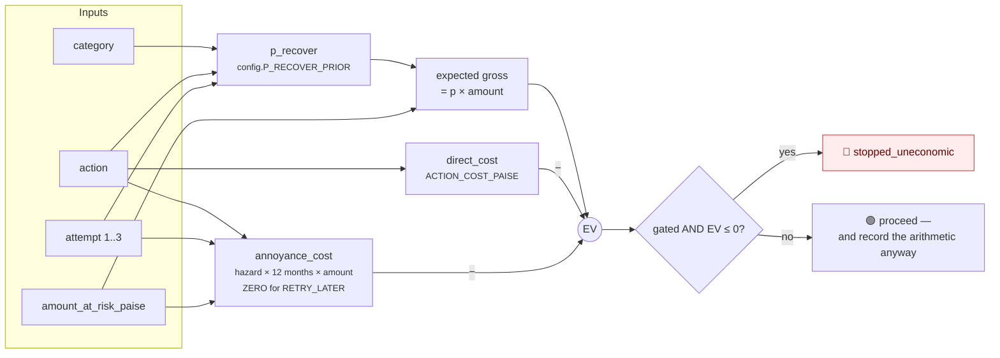
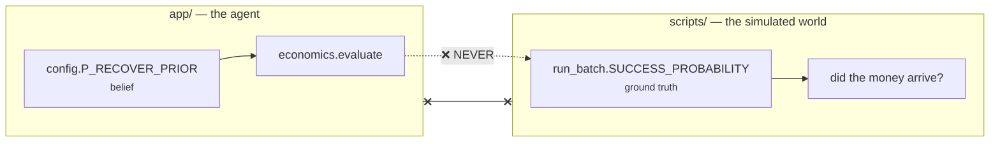

# 08 · Economics — pricing an intervention before taking it

Module: `app/economics.py`. Constants: `app/config.py`. Cost ledger: `metrics.costs()`.

## 1. Why this exists

> Gross recovery is the number every dunning tool reports, and the one number that
> **cannot go down by sending more messages**.

That is precisely what makes it the wrong headline. A system optimising gross recovery
will always send one more message, because on a gross ledger the marginal message is
free. It is not free: it costs a fraction of a rupee to deliver, some chance of an
inbound support contact, and some chance the customer cancels rather than pays.

So every decision is priced **before** it is taken.

## 2. The formula

```
EV = p_recover × amount_at_risk  −  direct_cost  −  annoyance_cost

where  annoyance_cost = hazard(attempt) × LTV_HORIZON_MONTHS × amount_at_risk
```



`evaluate()` is **pure arithmetic over config and the case** — no database, no clock, no
model — so it is trivially testable and cannot have a side effect on the case it is
judging.

## 3. The stop is the backstop; the record is the point

`ev_paise` and the full `ev_detail` breakdown are written onto **every** decision,
including the ones that went ahead.

> A reader can audit the arithmetic behind an action the agent **took**, not only one it
> declined — and disagree with the priors, because the priors are in `app/config.py`
> where they can be read and argued with.

Pinned by `tests/test_economics.py::test_every_decision_carries_its_own_arithmetic`.

## 4. The cost model

Every constant below is an **assumption with a stated rationale and no measurement behind
it**, exactly like the batch's outcome model — written down here rather than buried,
because a cost model presented as fact is worse than no cost model.

### Direct costs — `config.ACTION_COST_PAISE`

| Action | Paise | Rupees | Rationale |
|---|---:|---:|---|
| `RETRY_LATER` | 0 | ₹0 | A silent re-charge of an existing mandate. It contacts nobody and costs nothing to attempt — which is exactly why the policy table reaches for it first wherever the instrument might still work |
| `SEND_UPDATE_LINK` | 1200 | ₹12 | Fully loaded, not the wire cost of an SMS: **₹0.25 to send, plus ~4% chance of provoking an inbound support contact worth ~₹300** of somebody's time. ₹0.25 + 0.04 × ₹300 = ₹12.25, rounded |
| `PROMISE_TO_PAY` | 1200 | ₹12 | Same channel, same load |
| `STOP_HANDOFF` | 4000 | ₹40 | Moves no money and sends nothing, but it is not free — it puts a case in a human queue. **Counting it is what stops "hand it off" from looking like a costless way to make a hard case disappear** |

### Annoyance — `config.CONTACT_CHURN_HAZARD` and `LTV_HORIZON_MONTHS`

The cost that does not appear on any invoice: each successive unsolicited payment
message in one episode carries a chance the customer cancels rather than pays.

| Attempt | Hazard | Reasoning |
|---|---:|---|
| 1 | 0.4% | A first, well-timed message about a real failure is close to a service notification |
| 2 | 1.0% | A reminder is more irritating than the first message |
| 3 | 2.0% | Escalating, not equal — the third message is not as welcome as the first |

`LTV_HORIZON_MONTHS = 12`. One charge cycle is what the case is worth today; the
subscription behind it is worth more. **Twelve is deliberately modest** — a longer
horizon would inflate the annoyance term and make the agent look *more restrained than
its evidence supports*.

`annoyance_cost = 0` for `RETRY_LATER`: a silent re-charge of a mandate the customer
already authorised cannot irritate them.
Pinned by `tests/test_economics.py::test_a_silent_retry_carries_no_annoyance_cost` and
`::test_annoyance_escalates_with_the_attempt_number`.

### The agent's priors — `config.P_RECOVER_PRIOR`

`(category, action) → (p@1, p@2, p@3)`

| Category | Action | @1 | @2 | @3 |
|---|---|---:|---:|---:|
| `card_expired` | `SEND_UPDATE_LINK` | 0.36 | 0.22 | 0.14 |
| `insufficient_funds` | `RETRY_LATER` | 0.42 | 0.32 | 0.24 |
| `insufficient_funds` | `PROMISE_TO_PAY` | 0.46 | 0.46 | 0.46 |
| `insufficient_funds` | `SEND_UPDATE_LINK` | 0.32 | 0.18 | 0.12 |
| `issuer_declined` | `RETRY_LATER` | 0.28 | 0.22 | 0.16 |
| `issuer_declined` | `SEND_UPDATE_LINK` | 0.30 | 0.22 | 0.14 |
| `authentication_failed` | `SEND_UPDATE_LINK` | 0.42 | 0.24 | 0.16 |
| `invalid_payment_method` | `SEND_UPDATE_LINK` | 0.26 | 0.16 | 0.10 |
| *(anything unlisted)* | — | 0.20 | 0.12 | 0.08 |

> **The ordering is the defensible part, not the exact values.** A first touch converts
> best, reminders decay, and a promise-to-pay holds its rate because it is *agreed* with
> the customer rather than pushed at them.

An unlisted pair falls back to a deliberately **pessimistic** default: an unlisted pair
is a pair nobody reasoned about, and the safe reading of a cell nobody reasoned about is
a pessimistic one.

## 5. The circularity firewall

> `config.P_RECOVER_PRIOR` is what the agent **believes** before acting.
> `run_batch.SUCCESS_PROBABILITY` is what **actually happens** in the simulated world.



If they were the same table, the agent would be scoring its own decisions with the answer
key, every EV would be correct by construction, and the whole measurement would be
circular.

Two tests enforce this, and the second is the load-bearing one:

| Test | What it catches |
|---|---|
| `test_the_agents_priors_are_not_the_simulators_outcome_model` | Someone reconciling the two tables' values |
| `test_nothing_in_app_imports_the_batch_simulator` | Someone wiring them together |

> A **value** test can be satisfied by nudging a number. An **import grep** cannot.

## 6. Worked examples

**A second reminder on a ₹199 subscription** — the thinnest margin in the batch:

```
category = card_expired, action = SEND_UPDATE_LINK, attempt = 2, amount = 19,900 paise

expected gross  = 0.22 × 19,900        =  4,378 paise
direct cost     =                        −1,200 paise
annoyance       = 0.010 × 12 × 19,900  = −2,388 paise
                                          ─────────
EV                                     =    790 paise  =  ₹7.90   🟢 proceed
```

**The same decision on a ₹4,999 subscription:**

```
expected gross  = 0.22 × 499,900       = 109,978 paise
direct cost     =                        −1,200 paise
annoyance       = 0.010 × 12 × 499,900 = −59,988 paise
                                          ──────────
EV                                     =  48,790 paise = ₹487.90  🟢 proceed
```

**A third message on a small ticket where the prior has decayed** — the shape the gate
stops (`tests/test_economics.py::test_the_gate_stops_a_case_whose_next_contact_cannot_pay_for_itself`):
once `hazard(3) × 12 = 24%` of the amount exceeds `p@3 × amount` minus ₹12, the EV turns
negative and the case closes as `stopped_uneconomic` before anything is sent.

Notice the structure: because both the gross term and the annoyance term scale with the
amount, **the gate is really comparing `p_recover` against `hazard × 12`**, with the flat
₹12 mattering only on small tickets. That is the intended behaviour — a message is worth
sending when the chance it works beats the chance it costs you the customer.

## 7. `STOP_HANDOFF` is priced but never gated

`NON_INTERVENTION_ACTIONS = {STOP_HANDOFF}`. A handoff is a decision to *stop*, not an
intervention to run, so there is no alternative to weigh it against and the EV gate has
nothing to say about it. Its EV is still computed and recorded, with `"gated": false`, so
**a `STOP_HANDOFF` carrying a negative EV cannot be misread as a gate that failed to
fire.**

Pinned by `tests/test_economics.py::test_a_stop_handoff_is_priced_but_never_gated`.

## 8. The annoyance term prices decisions but is never booked

> It is a **modelled risk**; no rupee leaves the account for it.

`economics.execution_cost_paise()` returns only the direct cost, and that is what lands
on `execution_record.cost_paise`. `metrics.costs()` sums only money that actually moved,
so the net ledger is made of **rupees rather than opinions**.

## 9. The cost ledger — `metrics.costs()`

Two components, kept apart because they are spent on different things:

| Component | Query | Meaning |
|---|---|---|
| **Outreach** | `SUM(execution_record.cost_paise)` | Every message the agent sent, **successful or not** — a message that went out and did not work still cost what it cost |
| **Handoff** | `COUNT(cases in HANDOFF_STATUSES) × ₹40` | The human queue |

### Which terminal states are charged a handoff

`config.HANDOFF_STATUSES = (stopped_handoff, stopped_max_attempts, stopped_cooldown_expired, stopped_unknown)`

Deliberately **not** "everything that did not recover":

| Excluded status | Why it is not charged |
|---|---|
| `stopped_opt_out`, `stopped_suppressed` | The customer's decision. There is nothing for a human to work on — acting further is precisely what was forbidden |
| `stopped_holdout` | A control case was never worked by anyone, by construction |
| `stopped_uneconomic` | It was closed because pursuing it costs more than it returns; charging it a human's time would contradict the decision that closed it |

### The frozen batch's ledger

| Line | Value |
|---|---|
| Outreach — 40 contacts × ₹12 | ₹480 |
| Human queue — 20 cases × ₹40 | ₹800 |
| **Total cost** | **₹1,280** |
| Gross recovered | ₹25,161 |
| Cost per ₹100 recovered | **₹5.09** |

## 10. Net and net-incremental

`metrics.net_recovery()` reports both, and only ever stands behind the second:

```
net_recovered      = gross_recovered      − total_cost
net_incremental    = incremental_recovery − total_cost        ← the number claimed
```

> **Every rupee of cost was spent on the treated arm** — a control case is never
> executed against — so the whole cost is subtracted from the incremental figure rather
> than apportioned between the arms.

The CI is shifted with it: `net_incremental_paise_ci95 = [lo − cost, hi − cost]`.

Frozen batch: **₹7,762 net incremental, 95% CI [−₹9,473, +₹20,460]**. See
[11 § 7](11-measurement.md#7-interpreting-the-result) for what that interval does and
does not license you to claim.

## 11. Everything in this document is an assumption

| Assumption | Value | Confidence |
|---|---|---|
| Contact cost | ₹12 | Order-of-magnitude; the ₹300 support-contact figure is the softest input |
| Retry cost | ₹0 | High — a mandate re-charge genuinely contacts nobody |
| Handoff cost | ₹40 | Order-of-magnitude |
| Churn hazard | 0.4 / 1.0 / 2.0 % | **The ordering is defensible; the levels are not measured** |
| LTV horizon | 12 months | A deliberate under-estimate |
| `P_RECOVER_PRIOR` | see § 4 | Ordering defensible; levels are judgement |

Change any of them in `config.py`, re-run the batch, and see what moves. That is the
intended way to disagree with this model — and the reason the priors are in one readable
file rather than scattered through the code.
