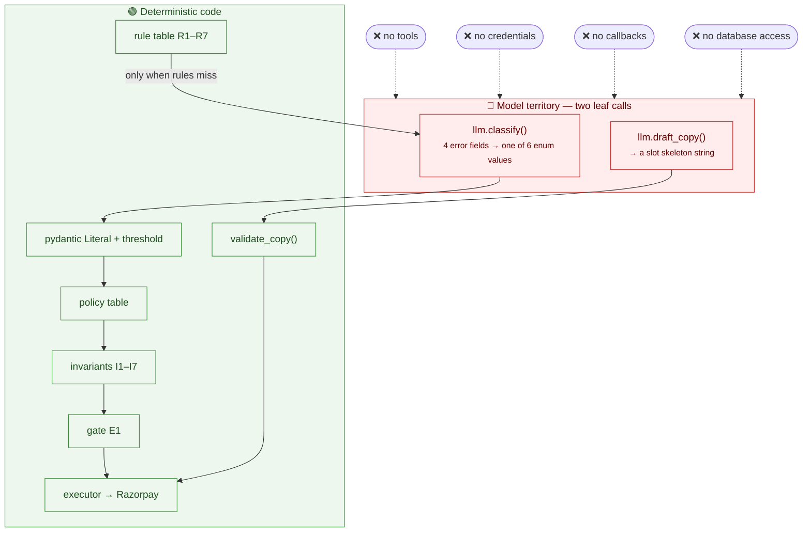
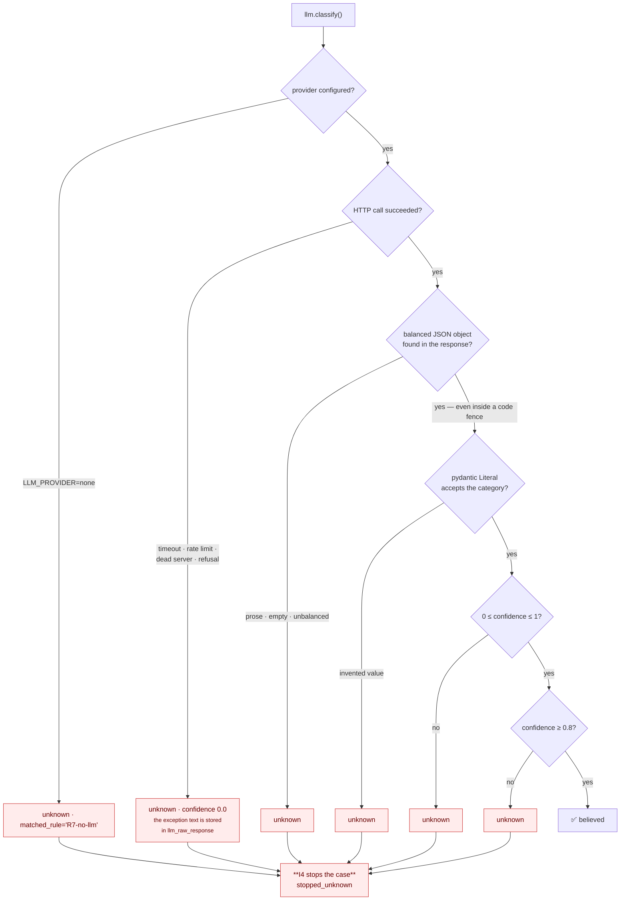

# 09 · The LLM boundary

Module: `app/llm.py` — **the only module in `app/` that talks to a language model.**

## 1. What the model does, and what it cannot touch

The LLM does exactly two things, and both **return data**; neither triggers an action.

| Capability | Owner |
|---|---|
| Failure classification, clear cases | Rule table R1–R7 on Razorpay error fields |
| Failure classification, ambiguous cases | **LLM**, output forced into the enum; `< 0.8` confidence → `unknown` |
| Intervention choice | Static `(category, attempt) → action` table |
| Retry timing | Hardcoded delays per policy row |
| Stopping rules I1–I7 | Independent module, run before every decision *and* every execution |
| Whether an intervention is worth its cost | Deterministic EV arithmetic over stated priors (gate E1) |
| Message copy | **LLM** drafts; deterministic validator; static template on rejection |
| Money-moving execution | Deterministic executor calling Razorpay test-mode APIs |



**The model never chooses interventions, never sets retry timing, never touches stopping
rules, and has no API credentials or tool access.** Retry timing, the policy table, the
seven stop invariants, gate E1, and all money-moving calls are deterministic code with
hardcoded bounds.

## 2. Checkable claims, not assertions

```bash
grep -rlE '^\s*(from|import)\s+openai' app/     # → app/llm.py, and nothing else
grep -rn 'UPDATE audit_log|DELETE FROM audit_log' app/   # → no matches, ever
pytest tests/test_llm_boundary.py               # asserts both of the above
```

> `app/config.py` contains the *string* `openai_compat` as a provider name, so a bare
> `grep -rl openai app/` also matches that file. The **import** grep above is the real
> check, and `test_only_llm_py_imports_the_model_client` enforces it.

Three structural tests in `tests/test_llm_boundary.py`:

| Test | Asserts |
|---|---|
| `test_only_llm_py_imports_the_model_client` | No second module imports `openai` |
| `test_the_model_module_never_touches_razorpay_or_the_database` | `llm.py` imports neither `razorpay` nor `db` |
| `test_invariants_module_is_independent_of_policy_and_the_model` | `invariants.py` imports neither `policy` nor `llm` |

The `openai` import itself is **lazy**, confined to `llm._client()`, so
`LLM_PROVIDER=none` needs no LLM package installed at all.

## 3. What crosses the boundary

### Into the model — call #1, `classify()`

Exactly four fields:

```
error_code, error_reason, error_description, error_step
```

**No customer name, phone, email, amount, subscription id or case id ever reaches the
model.** The system prompt names the six categories, instructs `unknown` when unsure, and
demands one JSON object.

### Into the model — call #2, `draft_copy()`

The category, the intent, and the *names of the slots* — never their values:

```
Failure category: card_expired
Intent: ask them to update their payment method or pay the amount directly
- Begin with the literal text [SYNTHETIC DEMO]
- Include the literal slot {LINK} exactly once, at the end. Never write a URL.
- Refer to the amount due ONLY as the literal slot {AMOUNT}. Never type an amount.
- Write NO digits anywhere.
```

`amount_rupees` and `merchant_name` are in `draft_copy`'s **signature but are not sent**:
the caller holds them, deterministic code substitutes them afterwards, and the boundary
test asserts what does and does not cross.

### Out of the model

| Call | Returns | Then what |
|---|---|---|
| `classify()` | `{category, confidence, rationale}` | pydantic `Literal` → membership re-check → confidence threshold → enum or `unknown` |
| `draft_copy()` | A string | `validate_copy()`, then slot rendering, then link injection |

## 4. Every failure mode, and where it lands



| Failure mode | Handling | Test |
|---|---|---|
| No provider configured | `unknown`, no client is even constructed | `test_provider_none_produces_unknown_without_any_client` |
| Confidence below 0.8 | `unknown` | `test_low_confidence_collapses_to_unknown` |
| Invented category (`"card_stolen"`) | Rejected by the pydantic `Literal` → `unknown` | `test_an_invented_category_is_rejected_by_the_schema` |
| Prose instead of JSON | No balanced object → `unknown` | `test_prose_instead_of_json_collapses_to_unknown` |
| JSON inside a ` ```json ` fence | **Extracted and used** — small local models do this constantly | `test_json_wrapped_in_a_code_fence_is_still_extracted` |
| Provider raises (timeout, 429, connection refused) | `unknown`, exception text preserved | `test_a_provider_exception_collapses_to_unknown` |
| A *plausible but wrong* category | Believed — and still capped at 3 bounded, audited attempts | `test_a_hallucinated_but_valid_category_is_still_capped_by_the_policy` |

### `extract_json()`

Scans for the first **balanced** `{…}` object, tracking string state and escapes, so a
brace inside a quoted rationale does not confuse it. If it fails, validation fails, and
the case becomes `unknown` — which is the correct outcome.

### `_chat()` and the `response_format` retry

Hosted free tiers vary in whether a given model accepts `response_format:
{"type":"json_object"}`. If a provider rejects it, the call is retried **once** without
it. That is safe because **the enum is enforced by our own validator, never by the
provider**.

## 5. Worst-case analysis

> Worst-case hallucination = a **wrong-but-valid enum value**, still capped at 3 bounded
> attempts and fully audited — or an invalid output, which stops the case.

Walk it through. Suppose the model classifies a genuinely-expired card as
`insufficient_funds`:

1. The policy table picks `RETRY_LATER` (24 h) instead of a link.
2. The retry fails, because the card really is expired.
3. Attempt 2: `RETRY_LATER` (72 h). Fails again.
4. Attempt 3: `PROMISE_TO_PAY` — one contact, gated by I2, I5, I7 and E1.
5. The promise lapses after 72 h → `stopped_handoff`, with a complete case file.

**Cost of the worst case: one delayed contact and a slower handoff.** Not a fourth
attempt, not a night-time message, not a charge against an opted-out customer, and not
an invented rupee figure in the copy — those are all structurally unreachable.

**Proof, not argument:** the frozen 88-case batch ran with `LLM_PROVIDER=none` and every
case still completed, audited and bounded. `none` is not a degraded mode to hide — *it is
the proof that the guardrails do not depend on model quality.*

## 6. Copy: why a model cannot invent a number

The one hallucination that would move real money is an invented amount in a customer
message. `validate_copy()` makes it **unrepresentable** rather than merely detected:

```python
skeleton = _SLOT_RE.sub("", text)          # strip {AMOUNT}, {LINK}, {MERCHANT}, …
literals = _NUMBER_RE.findall(skeleton)    # any digit that survives
if literals:  reject
```

A draft may contain **no digit at all**. Numbers arrive only by slot substitution
afterwards, from authoritative values held by deterministic code. Even the *correct*
amount, typed as digits, is rejected —
`tests/test_copy_validation.py::test_even_the_correct_amount_is_rejected_when_typed_as_digits`.

Links are the same story: a literal `http://` or `https://` in a draft is a rejection, and
`inject_link()` runs **after** validation, only once a real URL exists.

A rejected draft falls back to a static template, and the rejection is stored verbatim on
`execution_record.copy_validation` — so a reader can see *what the model tried to say*
and why it was refused.

## 7. The three provider modes

All three are free and all three go through the same `openai` client — only
`LLM_BASE_URL` and `LLM_MODEL` change, because `llm.py` is the only module that knows a
model exists.

| `LLM_PROVIDER` | What runs | Needs | Cost |
|---|---|---|---|
| `openai_compat` | A hosted OpenAI-compatible free tier (Groq / OpenRouter / Google AI Studio) — **nothing runs on your machine** | free signup + key | ₹0 within free-tier limits |
| `ollama` | A local open-weights model (`ollama serve && ollama pull qwen2.5:7b-instruct`) | ~5 GB disk, 8 GB+ RAM | ₹0, offline, no rate limit |
| `none` | No model at all: ambiguous cases become `unknown` and stop, copy uses static templates | nothing | ₹0, no setup |

`LLM_COPY_ENABLED=false` is an independent kill switch: classification still runs, copy
forces static templates.

**There is no paid API anywhere in this project.**

## 8. The silent-misconfiguration trap

Because of how the boundary is built, an unreachable provider produces:

- every classification collapsing to `unknown`,
- every ambiguous case stopping,
- and the batch **still exiting 0 with all acceptance checks green**.

That is the *correct* behaviour — but it is indistinguishable from a forgotten API key.

`llm.misconfiguration()` catches the specific mistake that fails silently:

```python
if LLM_PROVIDER == "openai_compat" and ("localhost" in LLM_BASE_URL or "127.0.0.1" in LLM_BASE_URL):
    return "…LLM_BASE_URL is still the local Ollama default…"
if LLM_PROVIDER == "openai_compat" and LLM_API_KEY in ("", "ollama"):
    return "…LLM_API_KEY is still the local placeholder…"
```

It is called at **uvicorn startup** (logged as a warning) and at the **top of
`run_batch.py`** (printed before the run). `scripts/check_llm.py` is the positive check:
it calls the provider with rule-proof probes and reports what came back.

> **Coding agents are not providers.** opencode, Claude Code, Cursor and Aider are
> terminal/IDE agents that help you *write* this project. They are not inference
> endpoints the app can call, they each still need a model provider behind them, and they
> must never appear in `requirements.txt`.

## 9. Observability of the model

Everything the model touched is queryable:

```sql
-- every model classification, with its raw response
SELECT case_id, category, confidence, llm_model, llm_raw_response
FROM diagnosis_result WHERE method = 'llm';

-- every audit entry the model is the actor of
SELECT case_id, seq, summary FROM audit_log WHERE actor = 'llm';

-- accepted vs rejected drafts
SELECT copy_source, COUNT(*) FROM execution_record GROUP BY copy_source;
```

`metrics.llm_involvement()` surfaces the same as five counters on `/api/summary`:
`classified`, `classified_to_unknown`, `rule_classified`, `drafted`,
`fallback_to_template`. The dashboard's **Model boundary** view renders them next to the
list of things the model *cannot* do.
