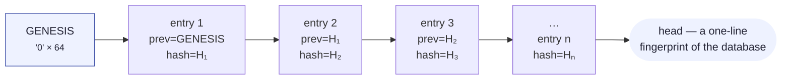
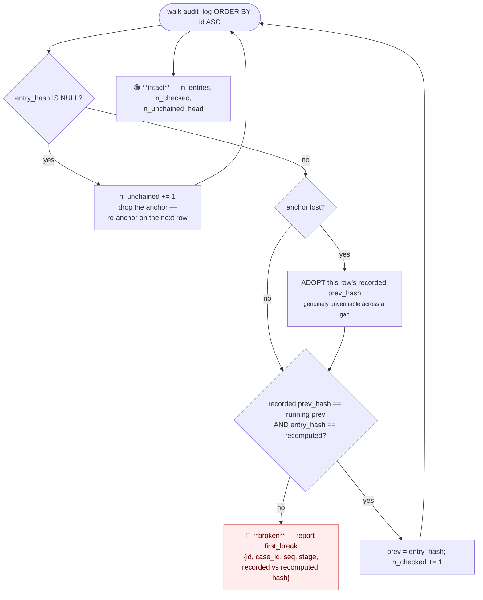

# 10 · The audit trail

Module: `app/audit.py`. Table: `audit_log`. Endpoint: `GET /api/audit/verify`.

## 1. Two different promises

| Property | What it is a promise about | How it is kept |
|---|---|---|
| **Append-only** | The **code** | Exactly one writer, `audit()`. No `UPDATE` or `DELETE` against `audit_log` anywhere in `app/` — and a test greps for one |
| **Tamper-evident** | The **data** | Every entry carries a SHA-256 over its own contents *together with the previous entry's hash* |

> Append-only is a promise about the code, enforced by a grep. The chain is a property of
> the data: editing one word of one summary — or deleting one row — invalidates every
> hash after it.

## 2. The chain

```
entry_hash = sha256( prev_hash ‖ canonical_json(
                 case_id, seq, stage, actor, summary, detail, created_at, synthetic ) )
```



### Design details that matter

**`id` is excluded from the hash.** SQLite assigns it and it is positional, not content.
Everything a reader would care about having been altered is included.

**Canonical JSON** — sorted keys, no incidental whitespace (`separators=(",", ":")`) — so
the same entry hashes identically on any machine and in any Python version.

**The genesis constant.** Nothing precedes the first entry, so it hashes against
`"0" * 64` rather than against nothing — otherwise **a log truncated to its first entry
would verify perfectly.**

**The chain spans the whole log in insertion order, not per case.**

> A per-case chain catches an edit inside a trail and misses the deletion of an *entire*
> trail — which is the more attractive thing to delete, because it removes the
> inconvenient number from the metrics **as well as its explanation**.

## 3. The writer

```python
with db._lock:                                     # one transaction
    seq       = MAX(seq) + 1 for this case_id      # allocated inside it
    prev_hash = last entry's entry_hash, or GENESIS
    INSERT (…, prev_hash, entry_hash(entry, prev_hash))
    commit
```

Reading the chain head, allocating `seq` and inserting all happen **under the same lock,
in the same transaction**. That is what stops two concurrent writers from reading the
same predecessor and **forking the chain**.

`UNIQUE(case_id, seq)` plus `MAX(seq)+1` makes each case's trail gapless from 1 and
unable to interleave incorrectly. Asserted by `run_batch.py`'s acceptance check
*"audit seq is gapless from 1 on every case"* and by
`tests/test_audit_and_metrics.py::test_audit_seq_is_gapless_and_starts_at_one`.

## 4. The vocabulary

| Field | Values |
|---|---|
| `stage` | `detect` · `diagnose` · `decide` · `execute` · `stop` · `outcome` |
| `actor` | `system` · **`llm`** · `razorpay` · `human` |

Invalid values raise before any write. `actor = "llm"` on every model contribution means
the trail can be filtered to exactly what the model touched — see [09 § 9](09-llm-boundary.md).

A complete trail for a case that recovered on attempt 2:

| seq | stage | actor | summary |
|---|---|---|---|
| 1 | `detect` | `razorpay` | `payment.failed received, Rs 499.0 at risk (new case opened)` |
| 2 | `diagnose` | `system` | `Diagnosed card_expired by rule R1 (matched 'card expired')` |
| 3 | `decide` | `system` | `Attempt 1: SEND_UPDATE_LINK per policy row card_expired/1, immediately` |
| 4 | `execute` | `system` | `Attempt 1: SEND_UPDATE_LINK executed via razorpay_test (success)` |
| 5 | `detect` | `razorpay` | `subscription.pending received, Rs 499.0 at risk (existing open case)` |
| 6 | `diagnose` | `system` | `Diagnosed card_expired by rule R1 …` |
| 7 | `decide` | `system` | `Attempt 2 deferred by I2: cooldown of 24h since last contact has not elapsed; rescheduled for …` |
| 8 | `execute` | `system` | `Attempt 2: SEND_UPDATE_LINK executed via razorpay_test (success)` |
| 9 | `outcome` | `razorpay` | `Recovered: payment_link.paid confirms Rs 499.0 collected after 2 attempt(s)` |

**Every closed case ends on a `stop` or `outcome` entry** — an acceptance check in
`run_batch.py`. And `tests/test_audit_and_metrics.py::test_every_stage_of_a_full_lifecycle_is_audited`
pins that all five stages appear.

## 5. `verify()` — three outcomes, and the difference matters



| Outcome | Means |
|---|---|
| `intact` | Every chained entry hashes to what it claims |
| `broken` | An entry's contents no longer produce its recorded hash, **or** its recorded predecessor is not the entry that actually precedes it. `first_break` names the row. Everything after a break is untrustworthy by construction, so only the first is reported |
| `n_unchained` > 0 | Rows written before the `entry_hash` column existed. **Counted and reported separately rather than skipped** — an unverifiable entry silently folded into a passing result is exactly the thing this function exists to stop |

### The gap-adoption rule

A run of unchained rows **breaks the anchor**: there is no hash on the far side of the gap
to link across. So the next chained row's recorded predecessor is **adopted** rather than
checked, and verification resumes from there.

That link is genuinely unverifiable, and pretending otherwise — by expecting the genesis
constant on the other side of a gap — would **report a break where there is only missing
evidence.** The gap itself is never hidden: it is `n_unchained`.

Pinned by `tests/test_audit_chain.py::test_unchained_rows_are_reported_rather_than_passed_silently`.

## 6. `head` — a fingerprint, not a reproducibility check

```python
head()  # the entry_hash of the most recent entry, or GENESIS on an empty log
```

Copy it before handing the database file to someone, and you can tell afterwards whether
anything in it moved.

> It is deliberately **not** a reproducibility check. Case ids carry a random ULID tail,
> so two clean-room runs of the same seed produce identical **numbers** and different
> **hashes**. The seeded metrics are what reproduce; the hash is what detects tampering.

## 7. Verify it as a sceptic

Someone who does not trust the code can check the trail with `sqlite3` and `curl`:

```bash
curl -s localhost:8000/api/audit/verify        # → {"status":"intact","n_entries":511,…}

# Edit one word of one entry, behind the writer's back
sqlite3 recovery.db "UPDATE audit_log SET summary = 'nothing to see here'
                     WHERE id = (SELECT MIN(id) FROM audit_log);"

curl -s localhost:8000/api/audit/verify        # → {"status":"broken","first_break":{…}}
```

`tests/test_audit_chain.py` covers **the interesting attack, not only the naive one**:

| Test | The attack |
|---|---|
| `test_editing_one_word_of_one_summary_breaks_the_chain` | Naive edit |
| `test_deleting_an_entry_breaks_the_chain` | Removing an inconvenient row |
| `test_rewriting_an_entry_and_its_own_hash_still_breaks_the_chain` | **Someone who read `audit.py` and recomputed the hash of the row they edited** — they still fail, because every *later* row was hashed against the old value |
| `test_the_first_entry_hashes_against_the_genesis_constant` | Truncate-to-first-entry |
| `test_head_is_a_fingerprint_that_moves_with_every_entry` | Fingerprint stability |

## 8. Why the trail is the deliverable, not a by-product

Three separate claims rest on it:

1. **Traceability of money.** `GET /api/metrics/trace/recovered` returns the exact case
   ids behind the headline; each of those ids drills down to an `outcome` entry in its
   trail. See [11](11-measurement.md).
2. **Provability of restraint.** A stop names the invariant, the phase, and the full
   check receipts — so *"the agent refused"* is a readable record, not a claim.
3. **The handoff artifact.** `GET /api/cases/{id}` returns the case, its events, its
   diagnoses, its decisions with their executions, and the whole trail. **That response
   *is* the artifact a human picks up** — which is why a handoff is charged ₹40 rather
   than being free.

## 9. Reading the trail

```bash
# one case, in order
sqlite3 recovery.db "SELECT seq, stage, actor, summary FROM audit_log
                     WHERE case_id = 'case_01J…' ORDER BY seq;"

# everything the model touched
sqlite3 recovery.db "SELECT case_id, seq, summary FROM audit_log WHERE actor = 'llm';"

# every stop, by invariant
sqlite3 recovery.db "SELECT summary FROM audit_log WHERE stage = 'stop';"
```

Or via the API: `GET /api/cases/{case_id}` returns `audit_trail` with each entry's
`detail` already parsed from JSON.
