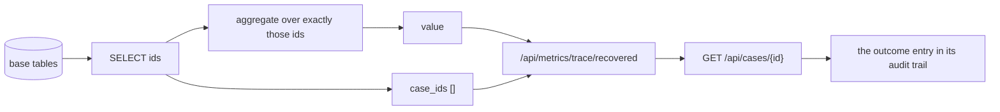
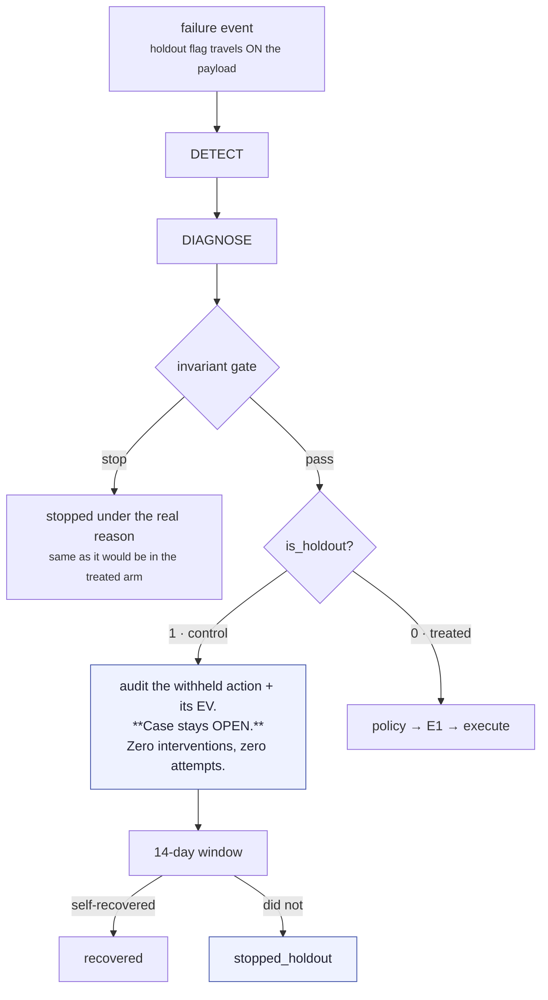

# 11 · Measurement — metrics, traceability, and the control arm

Module: `app/metrics.py`. Endpoints: `/api/summary`, `/api/metrics/trace/{metric}`.

## 1. The discipline

> **Never report a number you cannot trace to specific case ids.**

Every metric is implemented as *select the ids, then aggregate*, and returns both:

```python
Traced = tuple[Any, list[str]]

def recovered() -> Traced:
    ids = _ids("SELECT id FROM recovery_case WHERE status = 'recovered' ORDER BY created_at")
    return _sum_amount(ids), ids
```

There is **structurally no way** to compute the headline number without materialising its
member set — which is exactly what `GET /api/metrics/trace/{metric}` serves.

**Nothing is a counter.** Every value is a query over the base tables, so the database is
the single source of truth and the dashboard cannot drift from it.



### The `_sum_amount` detail

Ids are staged in a temp table and **joined**, not expanded into `IN (?, ?, …)`. Each id
would be one bind parameter, and SQLite caps a statement's parameters (999 on older
builds) — so the obvious version works silently at demo scale and then fails on the first
merchant with a thousand open cases. A join has no such ceiling, and every metric is
defined as *"the total behind this id list"*, so the traceability contract is unchanged.

## 2. Metric definitions

| Metric | Definition | The trap it avoids |
|---|---|---|
| `at_risk` | Σ `amount_at_risk_paise` over **all** cases | **One charge cycle per case, frozen at creation.** We do *not* multiply by the remaining subscription term — that would be projection, not measurement |
| `recovered` | Σ amount over cases with `status='recovered'` | Only a **real recovery signal** counts. Sending a link recovers nothing |
| `recovery_rate` | `recovered / closed` | Denominator is **closed** cases, so still-open cases cannot inflate the rate |
| `strict_rate` | `recovered / all` | Reported **alongside** it, which preempts the denominator question rather than waiting for it |
| `avg_time_to_recovery_hours` | mean(`closed_at − created_at`) over recovered cases | Labelled `simulated clock` or `wall clock` via `time_basis` |
| `stopped_by_status` | Count per terminal status, all ten always present | A missing key is not the same as a zero |
| `costs` | See [08 § 9](08-economics.md#9-the-cost-ledger--metricscosts) | Counts only **money that actually moved** — the annoyance term is never booked |
| `net_recovery` | gross − cost, **and** incremental − cost | Gross cannot go down by sending more messages |
| `incremental_recovery` | Treated minus control, with a bootstrap CI | § 4 below |
| `synthetic_split` | `n_synthetic` / `n_live` + the seed | The two are **never silently blended** |
| `reconciliation` | `recovered + stopped + open == n_cases` | An identity that must hold, checked live and at batch end |

## 3. Provenance is never blended

`/api/summary` always reports the split:

```json
{ "n_cases": 89, "n_synthetic": 88, "n_live": 1, "synthetic_share": 0.9888, "seed": 42 }
```

and gives **both** a synthetic-denominator `rate` and an all-cases `strict_rate`. Every
row in every table carries a `synthetic` flag, and an acceptance check asserts
*"synthetic = 1 on 100% of batch-derived rows"*.

## 4. The randomised control arm

### Why gross recovery is not an answer

> Gross recovery answers *"how much came back?"*. It cannot answer **"how much came back
> *because of us*?"** — some failed charges recover on their own when the customer tops up
> or the issuer stops declining. Without a control arm those rupees are silently credited
> to the agent.

### What the control arm actually models — and it is not silence

The obvious objection is *"are you beating Razorpay, or beating nothing?"* The answer is
in `scripts/run_batch.py`, at the definition of `BASELINE_RECOVERY_PROBABILITY`:

> the chance a failed charge comes back **without any intervention from us**, inside the
> episode window — the customer tops up, or the issuer stops declining, and **Razorpay's
> own retry then succeeds.**

So the control arm is **the platform default**, not an empty room. A control case is
detected, diagnosed, and then left to the same world every merchant already lives in:
Razorpay's native retry schedule plus organic self-cure. What it never receives is one
of *our* interventions.

This matters for how the headline reads. The lift is not "agent versus doing nothing";
it is **agent versus what the merchant would have got by changing nothing at all**. That
is the harder comparison and the only one worth making — a third "platform-default" arm
was considered and cancelled, because it would have been a second copy of this one.

Two honest limits on the claim:

* Razorpay's real retry schedule is modelled as a per-category probability, not
  replayed charge by charge. The **ordering** of those probabilities is the defensible
  part (an expired card does not un-expire; an empty account often refills by payday),
  not the third decimal place.
* Self-cure is rolled for **every case in both arms**, from one distribution, because it
  is a property of the world rather than of the policy. It was once rolled for the
  control arm only — see §4.1 — and that defect biased every lift number computed
  before it was fixed.

### 4.1 Arm balance, and the defect that made it necessary

`roll_self_cure()` has carried two bugs of the same shape, both caught by an acceptance
check rather than by reading the code:

| Defect | Effect |
|---|---|
| Self-cure rolled for **control cases only** | The treated arm recovered through interventions and the control arm through self-cure — two generative processes, not one world under two policies. Every lift number computed from them was biased. |
| Self-cure rolled once per **subscription** | A subscription whose first episode recovers can fail again and open a second case; that second episode was never rolled. 2 of 2,010 cases at n=2,000 — small, and still wrong: the unit of self-cure is the episode, because it is the episode that has a category and a start date. |

Two acceptance checks now stand against both:

* **`arm balance: self-cure rolled in both arms, rates within 3 SE`** — a two-proportion
  z test over the *roll counts*, not the outcomes. An arm that is never rolled has no
  denominator, so the statistic is **undefined**, and undefined is reported as a failure.
  A missing measurement is not a measurement of zero.
* **`arm balance: every diagnosed case had self-cure rolled exactly once`** — a case
  whose coin was never flipped contributes to neither count and is invisible to the rate
  comparison above. This is the check that sees it.

`tests/test_arm_balance.py` drives both red on purpose.

### 4.2 Organic recovery, reported per arm

`incremental_recovery()` publishes `organic` for each arm: cases that recovered on a
**self-cure** signal rather than after an intervention. The simulator stamps
`simulated_origin` on every recovery event it emits, and that stamp lands in
`failure_event.raw_payload`, which is immutable after insert — so the provenance survives
into the metrics without the metrics ever importing the simulator. On a live database no
event carries the stamp, and the field reports as **unavailable rather than zero**.

**Read the organic counts with care.** They are *censored by treatment*: a treated case
that would have self-cured on day 9 often recovers through an intervention on day 2
first, so its organic recovery never happens. The treated arm's observed organic rate is
therefore lower than the control arm's, and that is competing risks, not imbalance. **The
balance evidence is the roll, not the outcome** — which is why the acceptance check tests
the coin flip and the batch summary prints both.

### How the arm works



Four properties, each with a test in `tests/test_holdout.py`:

1. **Assignment is decided once**, by whoever generated the batch, and travels with the
   event — never re-rolled inside the pipeline. Drawn from the same seeded RNG stream as
   everything else, so an arm split is reproducible like anything else.
2. **A control case is detected and diagnosed exactly like any other.** Its category on
   the case file is real.
3. **The branch sits *after* the invariant gate.** A holdout case that opt-out or an
   unknown cause would have stopped is recorded under **that** reason, because the same
   stop would have happened in the treated arm. Keeping the reasons intact is what keeps
   the arms comparable.
4. **The counterfactual is audited.** `withheld_action`, `withheld_delay_hours` and
   `withheld_ev` are recorded, so the control arm's cost is measurable too — *a holdout is
   not free, it is the price of knowing whether the treated arm did anything.*

Acceptance checks assert **"control arm received zero interventions"** and **"control arm
consumed zero attempts"**.

### The arithmetic

```python
rate(arm)           = recovered / assigned
lift                = rate(treated) − rate(control)

money_per_case(arm) = Σ amount over recovered ÷ **assigned**   # not ÷ recovered
money_lift          = money_per_case(treated) − money_per_case(control)
incremental_total   = money_lift × n_treated
```

> Per-**assigned**-case is what makes the two arms subtractable, and it keeps the money
> figure bounded by gross: the control arm can only ever *reduce* what the agent is
> credited with. Pinned by `test_incremental_never_exceeds_gross`.

### The confidence interval

A percentile bootstrap over cases, 10,000 resamples, seeded (default 42) so it is
deterministic:

```python
for _ in range(bootstrap):
    rt = resample(treated); rc = resample(control)
    rate_diffs.append(rate(rt) - rate(rc))
    money_diffs.append(money_per_case(rt) - money_per_case(rc))
```

> **One resample drives both statistics**, so the rate interval and the money interval
> describe the same simulated batches rather than two unrelated ones.

`significant` is true only when the interval **excludes zero** — i.e. the sign of the
effect is not in doubt at this sample size.

### Intention-to-treat

> Every case counts in the arm it was **assigned** to, whatever status it reached. A
> treated case stopped by an invariant stays in the treated arm.

Dropping the ones the agent refused to act on would flatter the result by exactly the
cases it handled most conservatively. Pinned by
`test_intention_to_treat_keeps_refused_cases_in_the_treated_arm`.

## 5. The frozen batch's numbers

| | Treated | Control |
|---|---|---|
| Assigned | 52 | 36 |
| Recovered | 33 | 6 |
| Rate | **63.5%** | **16.7%** |

| Result | Value |
|---|---|
| Lift | **+46.8 pp**, 95% CI **[+28.8, +63.9] pp** — excludes zero |
| Incremental (gross) | ₹9,042 of ₹18,567 gross recovered in the treated arm |
| Total cost | ₹1,280 |
| **Net incremental** | **₹7,762**, 95% CI [−₹9,473, +₹20,460] |

## 6. Reconciliation

An identity asserted at the end of every batch run and checkable live:

```
n_recovered + Σ stopped_by_status + n_open == n_cases
recovered_paise <= at_risk_paise
```

`GET /api/summary` carries it under `reconciliation`, with `counts_balance` and
`amounts_balance` booleans. Two of the nine acceptance checks are these.

## 7. Interpreting the result

Four things a careful reader should hold onto:

### The lift is the claim; the money interval is not.

The **rate lift excludes zero by a wide margin**. The **rupee interval does not**, because
ticket sizes span ₹199 to ₹4,999 and 88 cases is too few for a per-case-money estimate to
settle. Both are reported. *Quoting only the first would be the easy dishonesty here.*

### The interval is sampling uncertainty only.

It quantifies how much of the gap could be chance given this many cases. It says **nothing
about whether the underlying outcome model is right**; on a synthetic batch that model is
an assumption.

### What is measured is the mechanism, not the market.

Outcome probabilities (`run_batch.SUCCESS_PROBABILITY`,
`BASELINE_RECOVERY_PROBABILITY`), costs and the agent's own priors are all stated
assumptions. What the batch *measures* is that synthetic cases traverse the identical
code path as live webhooks, entering only through `intake()` and advancing only through
`tick()`.

`incremental_recovery()` says so in its own output:

```json
"basis": "outcome probabilities are modelling assumptions, not measured market data;
          this measures the mechanism, not the market"
```

### The single most consequential assumption is the baseline.

`BASELINE_RECOVERY_PROBABILITY` is the counterfactual the control arm exists to measure —
**set it to zero and the agent appears to earn every rupee it touches.** Its *ordering* is
the defensible part: an expired card does not un-expire (0.02), an empty account often
refills by payday (0.22).

## 8. Verifying the numbers three ways

The README, the dashboard and raw SQL must agree **to the paisa** — all three are derived
from the same rows, so any disagreement is a bug, not a rounding artifact.

```bash
curl -s localhost:8000/api/summary | python -m json.tool
sqlite3 recovery.db "SELECT status, COUNT(*), SUM(amount_at_risk_paise)
                     FROM recovery_case GROUP BY status;"
curl -s localhost:8000/api/metrics/trace/recovered
curl -s localhost:8000/api/audit/verify        # → {"status":"intact", …}
```

Money is **paise integers everywhere**; conversion to rupees happens only at the
presentation edge. Pinned by
`tests/test_audit_and_metrics.py::test_money_is_paise_integers_everywhere`.

## 9. Traceable metrics

`metrics.TRACEABLE` currently exposes `recovered`, `at_risk` and `stopped`:

```bash
curl -s localhost:8000/api/metrics/trace/recovered
```

```json
{
  "metric": "recovered",
  "value": 2516100,
  "value_rupees": 25161.0,
  "n_cases": 39,
  "case_ids": ["case_01J…", "case_01J…", …]
}
```

An unknown metric returns **404 naming the valid ones** rather than an empty result.
`tests/test_api.py::test_trace_endpoint_round_trips_to_case_files` asserts every returned
id resolves to a real case file.
