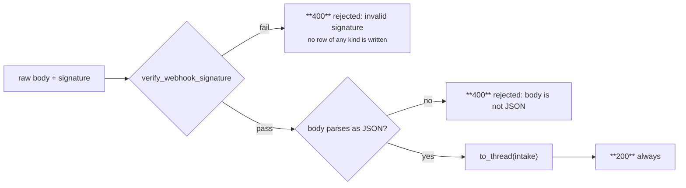

# 12 · API reference

One FastAPI process serves four surfaces:

| Prefix | Router | Purpose |
|---|---|---|
| `/webhooks/razorpay` | `app/main.py` | The Razorpay receiver — the only authenticated surface (HMAC) |
| `/api/*` | `app/api.py` | Dashboard JSON. All GET and read-only, except two demo helpers |
| `/api/control/*` | `app/control.py` | Control room. Removable with `CONTROL_API_ENABLED=false` |
| `/` | `StaticFiles` | The dashboard |

> **Everything except the webhook is unauthenticated.** This is a single-operator
> localhost demo. Do not bind it to anything but localhost. See
> [16 § Security posture](16-operations.md#9-security-posture).

Interactive docs are available at `/docs` (FastAPI's generated OpenAPI UI).

---

## Webhook

### `POST /webhooks/razorpay`

| | |
|---|---|
| Headers | `X-Razorpay-Signature` — HMAC-SHA256 over the **raw** body |
| Body | A Razorpay event body |



> **Always 2xx once the signature is verified.** A non-2xx makes Razorpay redeliver, and
> `intake()` is already idempotent on the event id.

Response `status` is one of:

| `status` | Meaning |
|---|---|
| `processed` | A case was opened or joined; diagnosed and decided |
| `duplicate` | This `razorpay_event_id` was already stored |
| `ignored` | The event type is not one of the five handled |
| `recovered` | A recovery signal closed an open case |
| `no_open_case` | A recovery signal arrived with no open case to close |
| `rejected` | No event id in the payload or headers |

---

## Dashboard API — `/api`

### `GET /api/health`

```json
{ "status": "ok", "llm_provider": "none", "llm_copy_enabled": true,
  "razorpay_configured": false, "db_path": "recovery.db" }
```

### `GET /api/summary`

The whole picture in one document — everything the Overview view renders.

```json
{
  "n_cases": 89, "n_synthetic": 88, "n_live": 1, "synthetic_share": 0.9888, "seed": 42,
  "total_at_risk_paise": 7241100, "total_at_risk_rupees": 72411.0,
  "total_recovered_paise": 2516100, "total_recovered_rupees": 25161.0,
  "recovery_rate": { "numerator": 39, "denominator": 88, "rate": 0.4432,
                     "strict_denominator": 89, "strict_rate": 0.4382, "n_open": 1 },
  "avg_time_to_recovery_hours": 64.2,
  "time_basis": "simulated clock",
  "stopped": { "total": 49, "by_status": { "stopped_holdout": 28, "stopped_handoff": 12, … } },
  "llm": { "classified": 4, "classified_to_unknown": 4, "rule_classified": 84,
           "drafted": 0, "fallback_to_template": 40 },
  "execution_modes": { "razorpay_test": 0, "simulated": 52 },
  "reconciliation": { "counts_balance": true, "amounts_balance": true, … },
  "incremental": { "available": true, "treated": {…}, "control": {…},
                   "lift": 0.4679, "lift_ci95": [0.2877, 0.6389], "significant": true, … },
  "costs": { "outreach_paise": 48000, "handoff_paise": 80000, "total_paise": 128000, … },
  "net": { "gross_recovered_paise": …, "net_incremental_paise": 776200,
           "net_incremental_paise_ci95": [-947300, 2046000], … },
  "audit_chain": { "status": "intact", "n_entries": 511, "n_unchained": 0, "head": "…" },
  "bounds": { "max_attempts": 3, "cooldown_hours": 24, "episode_window_days": 14,
              "quiet_hours_ist": [21, 9], "max_contacts_per_customer_per_day": 2,
              "daily_outreach_budget_paise": 500000,
              "llm_confidence_threshold": 0.8, "llm_provider": "none", "llm_model": null }
}
```

### `GET /api/categories`

Per-category breakdown, ordered by the enum (not alphabetically):

```json
[{ "category": "insufficient_funds", "n_cases": 31, "n_recovered": 18, "n_stopped": 13,
   "n_open": 0, "recovery_rate": 0.5806, "at_risk_paise": …, "recovered_paise": … }]
```

### `GET /api/mechanism`

**What the agent is, as data.** The dashboard renders this instead of hardcoding a copy of
the rules —

> a gate that is described in one place and enforced in another eventually describes
> something the code no longer does.

| Key | Contents |
|---|---|
| `funnel` | events → cases → diagnoses → decisions → blocked → executions → contacts → recovered |
| `invariants` | I1–I7 **and E1**, each with `code`, `title`, machine `rule` text, plain-English gloss, `kind` (`safety` / `contact_hygiene` / `economics`) and live `stops` / `defers` counts |
| `policy` | All 18 cells as `{category, attempt, action, delay_hours}` |
| `rules` | R1–R7 with their patterns and how many diagnoses each actually matched |
| `copy` | Slots, max chars, forbidden words, the disclosure string |
| `bounds` | Every numeric bound |
| `economics` | Unit costs, churn hazards, LTV horizon, the full `P_RECOVER_PRIOR` table, and its `basis` disclaimer |

Deferral counts for I2/I5/I7 are derived from audit summaries (`… deferred by I5: …`)
rather than from a counter, so they cannot drift from the trail.

### `GET /api/cases`

Query parameters: `status`, `category`. Ordered by `updated_at DESC`.

```json
[{ "case_id": "case_01J…", "category": "card_expired", "amount_at_risk_paise": 49900,
   "amount_rupees": 499.0, "attempt_count": 2, "status": "recovered",
   "synthetic": 1, "is_holdout": 0, "customer_opted_out": 0,
   "subscription_id": "SYNTH-sub-0007", "created_at": "…", "updated_at": "…", "closed_at": "…" }]
```

### `GET /api/cases/{case_id}`

> **The handoff artifact: this response *is* the case file a human picks up.**

| Key | Contents |
|---|---|
| `case` | The row, plus `amount_rupees` |
| `events` | Every `failure_event`, with `raw_payload` parsed back to JSON |
| `diagnoses` | Every `diagnosis_result`, including `llm_raw_response` |
| `decisions` | Every decision with `invariant_check` parsed, and its `execution` nested underneath |
| `audit_trail` | The complete trail, `detail` parsed |
| `bounds` | `max_attempts`, `cooldown_hours`, `episode_window_days` |

`404` with `unknown case {id}` if it does not exist.

### `GET /api/metrics/trace/{metric}`

Valid metrics: `recovered`, `at_risk`, `stopped`.

```json
{ "metric": "recovered", "value": 2516100, "value_rupees": 25161.0,
  "n_cases": 39, "case_ids": ["case_01J…", …] }
```

`404` naming the valid metrics if the name is unknown.

### `GET /api/audit/verify`

Recomputes the whole hash chain. See [10 § 5](10-audit-trail.md#5-verify--three-outcomes-and-the-difference-matters).

```json
{ "status": "intact", "n_entries": 511, "n_checked": 511, "n_unchained": 0,
  "first_break": null, "head": "3f2a…" }
```

### `GET /api/suppression`

```json
{ "n": 1, "rule": "a suppressed customer is never contacted, on any of their subscriptions",
  "customers": [{ "customer_id": "cust_…", "reason": "opt_out", "source": "…", "created_at": "…" }] }
```

### `POST /api/suppression/{customer_id}?reason=manual`

`reason` ∈ `opt_out` | `complaint` | `manual`. Idempotent (`INSERT OR IGNORE` — the
**first** reason wins).

> **There is deliberately no counterpart that removes one.** Un-suppressing someone is
> re-consenting on their behalf, which is not an operation this system should make one
> HTTP call away; it belongs in the database, deliberately, with a person accountable
> for it.

### `POST /api/cases/{case_id}/opt-out`

Demo helper for invariant I3. It does **three** things, because an opt-out is a statement
by a person, not about a subscription:

1. Sets `customer_opted_out = 1` on the case (what **I3** reads).
2. Adds the customer to the suppression list (what **I6** reads — reaching their *other*
   subscriptions, including cases that do not exist yet).
3. Writes an audit entry with `actor = "human"`.

The next gate — pre-decision or pre-execution, whichever comes first — stops the case.

---

## Control room — `/api/control`

Removed entirely when `CONTROL_API_ENABLED=false`. Every endpoint calls `_guard()` first,
which returns `403` when disabled.

> **Nothing here is a new code path into the pipeline.** The storm and the injector both
> enter through `webhooks.intake()`, exactly like a live Razorpay delivery. The test and
> batch runners shell out to the *same* commands the README documents and stream their
> real output.

**One job at a time.** The batch resets the database file underneath a running server, so
a second concurrent job would read a database being deleted. A `409` is returned while one
is running, and the server's connection is re-opened after any job that touches the file.

### `POST /api/control/tests`

```json
{ "path": "tests/test_invariants.py" }   // or null for the whole suite
```

Runs `python -m pytest <target> -v --no-header -p no:cacheprovider --color=no` with
`LLM_PROVIDER=none` **pinned**.

> `conftest.py` uses `os.environ.setdefault`, which wins over `.env` in a developer's
> shell but not here — this server process has already loaded `.env`, so the child would
> inherit a real provider, hit a live model, and fail the assertions that check the
> no-model path. Pinning makes a browser-started run identical to a terminal-started one.

`path` must start with `tests/` and contain no `..` — the argument is constrained to a
known directory rather than trusted, because this endpoint spawns a subprocess.

### `POST /api/control/batch`

```json
{ "n": 80, "seed": 42, "holdout": 0.35, "live_links": 0 }
```

Runs the README's reproduce command **verbatim**, in two steps, into a fresh database,
then re-opens the server's connection. Bounds: `n` 10–400, `holdout` 0.0–0.6,
`live_links` 0–5.

### `GET /api/control/jobs` · `GET /api/control/jobs/{job_id}?after=N`

Poll for streamed output. `after` is the `next` cursor from the previous poll, so a long
run streams without re-sending what the client already has. The last twelve jobs are kept;
output is capped at 4,000 lines so a runaway subprocess cannot grow the process without
bound.

### `POST /api/control/tick`

Runs one iteration of the loop by hand instead of waiting out the 30 s timer. Uses the
default `include_synthetic=True`, so it *does* advance batch rows.

### `POST /api/control/storm`

```json
{ "n": 10, "distinct": false }
```

`tests/test_concurrency.py` run against the **running server**: the same barrier, the same
`intake()`.

| `distinct` | Expectation |
|---|---|
| `false` — *n* identical deliveries | 1 case, **1** event, 1 live decision |
| `true` — *n* distinct events, one subscription | 1 case, ***n*** events, **1** live decision |

Response carries `observed`, `expected`, `held` (the boolean verdict) and `explains` (the
reasoning in prose). "Live decisions" counts `scheduled` + `executed` only — a fresh
failure legitimately supersedes a scheduled decision; what must never happen is two
standing at once.

### `POST /api/control/inject`

```json
{ "category": "card_expired", "amount_rupees": 499.0 }
```

Pushes one Razorpay-shaped `payment.failed` through `intake()` and returns the case it
opened. `category` must be one of the six.

### `GET /api/control/state`

What the control room is allowed to do and what it is doing right now: `enabled`,
`db_path`, `llm_provider`, `razorpay_configured`, `live_link_budget`, the clock
(`now` + `simulated`), the `active_job`, the category list, and the discovered
`test_files`.

---

## `GET /healthz`

```json
{ "status": "ok", "time": "2026-09-02T10:15:00Z" }
```

## Error conventions

| Code | When |
|---|---|
| `400` | Invalid webhook signature, unparseable body, bad suppression reason, a test path outside `tests/` |
| `403` | Control room disabled |
| `404` | Unknown case, unknown metric, unknown job, missing test file |
| `409` | A control-room job is already running |
| `200` | Everything else — including webhook duplicates and ignored event types |
