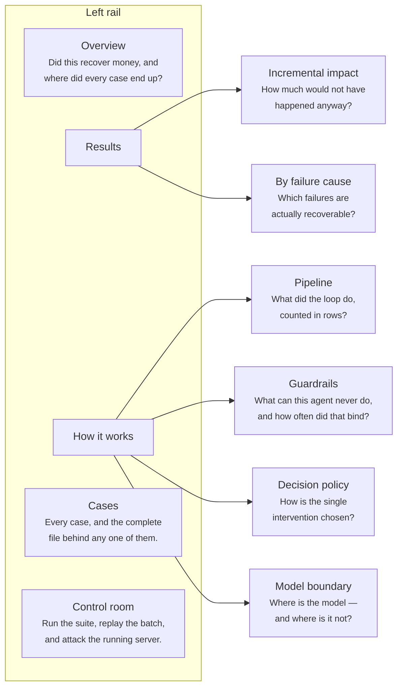
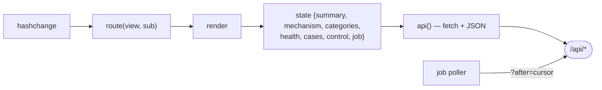

# 13 · The dashboard

`dashboard/` — three files, **no build step**: `index.html`, `app.js` (vanilla JS,
hash-routed), `style.css`. Served by `StaticFiles` mounted at `/` from the same process
that serves the API.

Open it at **http://localhost:8000/**.

## 1. Structure

Five top-level views, two of them with sub-views. Every view is framed by a **question**
rather than a noun — the header renders the question under the title.

Routes are hash-based: `#/overview`, `#/results:impact`, `#/mechanism:guardrails`,
`#/cases`, `#/control`. A bare `#/results` lands on its first sub-view.

## 2. Where each view's data comes from

| View | Endpoint(s) | Renders |
|---|---|---|
| **Overview** | `/api/summary`, `/api/mechanism` | ₹ at risk, ₹ recovered, recovery rate, terminal-state breakdown, a compact effect panel, and the loop as row counts |
| **Results → Incremental impact** | `/api/summary` (`incremental`, `net`) | Treated vs control arms, lift with its 95% CI, incremental and **net incremental** rupees, and the standing caveat that this measures the mechanism, not the market |
| **Results → By failure cause** | `/api/categories` | Per-category cases, recoveries, rate and rupees. Clicking a cause filters the case list |
| **Mechanism → Pipeline** | `/api/mechanism` (`funnel`) | events → cases → diagnoses → decisions → blocked → executions → contacts → recovered |
| **Mechanism → Guardrails** | `/api/mechanism` (`invariants`) | I1–I7 **and E1**, grouped by `kind`, each with its machine rule, plain-English gloss, and live stop/defer counts |
| **Mechanism → Decision policy** | `/api/mechanism` (`policy`, `rules`) | The full 6×3 matrix and the rule table with per-rule match counts |
| **Mechanism → Model boundary** | `/api/summary` (`llm`), `/api/mechanism` (`copy`) | What the model did, what it is structurally unable to do, and the copy-validator contract |
| **Cases** | `/api/cases`, `/api/cases/{id}` | Sortable, filterable table; a row opens the full case file in a drawer |
| **Control room** | `/api/control/*` | Four actions with streamed subprocess output |

## 3. The rules are rendered, never re-typed

The dashboard does **not** hardcode the invariants, the policy table or the bounds. It
renders `/api/mechanism`, which builds them from `config.py` and `invariants.INVARIANT_TEXT`.

> A gate that is described in one place and enforced in another eventually describes
> something the code no longer does.

The plain-English gloss for each invariant lives in `api._INVARIANT_PLAIN`, deliberately
*next to* the machine rule text rather than in the front end — so the words a judge reads
and the rule the code enforces cannot drift apart.

**E1 is shown in the same panel but labelled a different `kind`** (`economics`, not
`safety` or `contact_hygiene`), because it is a business judgement made of estimates and
the wording says so.

## 4. Cases view

| Control | Behaviour |
|---|---|
| Filters | Status · Cause · **Arm** (treated / control) · free-text search on case or subscription id |
| Sorting | Every column, click or keyboard, with `aria-sort` maintained |
| Row click / Enter | Opens the case file drawer |

### The case drawer

Renders `GET /api/cases/{id}` in full: the case header, its events, its diagnoses (with
`llm_raw_response` when the model was involved), each decision with its invariant receipts
and its nested execution, and the complete audit trail.

> A stopped case is a **deliverable, not a failure** — the case file is the artifact a
> human picks up.

Focus is trapped inside the drawer while it is open; `Escape` closes it.

## 5. Control room

Four actions. Each shells out to the *same* command a terminal would run and streams its
real output — nothing on the page is a replay of a result produced elsewhere.

| Action | What it actually runs | Notes |
|---|---|---|
| **Test suite** | `python -m pytest tests -v --no-header -p no:cacheprovider --color=no` | `LLM_PROVIDER=none` is pinned so a browser-started run is identical to a terminal one. A dropdown narrows it to one file |
| **Replay the batch** | `generate_synthetic.py` then `run_batch.py --holdout …` into a fresh `recovery.db`, then re-opens the server's connection | The README's reproduce command verbatim, seed included |
| **Webhook storm** | Fires *n* simultaneous deliveries through `intake()` and checks the result | Duplicate delivery must collapse to one case; a burst of distinct failures must still leave exactly **one live decision** |
| **Inject one failure** | Pushes one signed-shape `payment.failed` through `intake()` and opens the case file it produced | Chooses the category and amount |

The **Tick** button in the top bar runs one iteration of the loop instead of waiting out
the 30 s timer.

Each action shows the exact command it will run, updated live as its inputs change, so a
viewer can copy it into their own terminal and get the same output.

`CONTROL_API_ENABLED=false` removes the whole router; the dashboard detects the `403` and
disables the view rather than showing broken buttons.

## 6. Honesty affordances built into the UI

| Affordance | Why |
|---|---|
| **Provenance banner** | States the seed, and the synthetic/live split, from `batch_run` and `synthetic_split` — never asserts reproducibility without evidence |
| **Both denominators** | `rate` (closed cases) and `strict_rate` (all cases) are shown together |
| **Arm column** | Every case row is labelled `treated` or `control`, so the control arm is visible in the raw data, not only in the summary statistic |
| **`[SYNTHETIC DEMO]` in every message** | Rendered as-is in the case drawer; nothing can be mistaken for a real merchant message |
| **Audit chain status chip** | `intact` / `broken` straight from `/api/audit/verify` |
| **Trace links** | A headline number links to `/api/metrics/trace/{metric}`, which resolves to case ids, which resolve to case files |
| **Time basis label** | "simulated clock" vs "wall clock", so a 64-hour average is never mistaken for a wall-clock measurement |
| **The caveat travels with the number** | The incremental panel carries the "mechanism, not the market" note beside the figure, not in a footnote |

## 7. Interaction details

| Key | Action |
|---|---|
| `r` | Refresh every panel |
| `/` | Focus the case search |
| `Enter` | Open the focused case row |
| `Escape` | Close the drawer |

Other niceties: a skip link to the main content, `aria-label` on every landmark and
control, `aria-sort` on sortable headers, a light/dark theme toggle, and toasts that
appear once per condition rather than on every poll.

## 8. Client architecture

`state` is a single plain object; every render function reads from it and writes DOM. All
values are escaped through `esc()` before interpolation. Money is formatted with
`Intl.NumberFormat("en-IN")` from **paise integers** supplied by the API — the front end
never does its own money arithmetic.

Job output is polled with an `after` cursor so a long `pytest` run streams incrementally
rather than re-sending its whole buffer.
