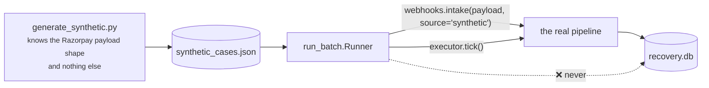
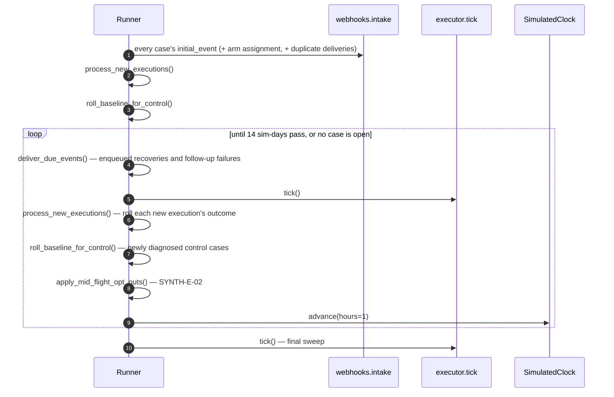

# 14 · Batch mode & synthetic data

Two scripts: `scripts/generate_synthetic.py` writes Razorpay-shaped **payloads**;
`scripts/run_batch.py` replays them through the real pipeline on a simulated clock.

```bash
python scripts/generate_synthetic.py --n 80 --seed 42 --out synthetic_cases.json
LLM_PROVIDER=none python scripts/run_batch.py --cases synthetic_cases.json \
    --db recovery.db --holdout 0.35
```

## 1. The load-bearing constraint

> The generator emits **webhook payloads, not application rows**. It does not know the
> database schema; it only knows the payload shape.
>
> The runner talks to the pipeline through exactly **two functions — `intake()` and
> `tick()`**. It never writes an application table directly.



That is why the batch numbers are a claim about the **real pipeline** rather than about a
parallel test harness. A synthetic payload and a live Razorpay delivery differ only in
`source`.

## 2. The generator

### Category mix — `CATEGORY_WEIGHTS`

| Category | Share |
|---|---:|
| `insufficient_funds` | 35% |
| `card_expired` | 25% |
| `issuer_declined` | 15% |
| `authentication_failed` | 10% |
| `invalid_payment_method` | 8% |
| `unknown` | 7% |

Counts are computed **exactly** (`round(n × weight / 100)`, with drift absorbed into the
largest bucket) rather than sampled per case, so the distribution matches the table even
at n = 60 and does not wander with the seed.

### Amounts

`[₹199, ₹499, ₹999, ₹1999, ₹4999]` weighted `[30, 35, 20, 10, 5]`. This spread is why the
*rupee* confidence interval is wide while the *rate* interval is tight — see
[11 § 7](11-measurement.md#7-interpreting-the-result).

### Error text — `ERROR_FLAVOURS`

Real-shaped strings per category, chosen to feed rules R1–R6 the way real payloads do
("Your card has insufficient funds to complete this payment",
"Transaction declined by the issuing bank (do_not_honour)").

### The LLM fallback flavours

Half the `unknown` bucket is genuinely empty (R7, no model involved). The other half is
**odd-but-classifiable text that deliberately misses every rule**, so the model path is
actually exercised in the batch rather than being decorative:

| Text | Truth |
|---|---|
| "The customer's bank did not permit this standing instruction at this time" | `issuer_declined` |
| "Recurring debit rejected: cardholder record is no longer active with the issuer" | `invalid_payment_method` |
| "Bank returned a negative response for the standing instruction" | `issuer_declined` |

These are the four model-path cases in the frozen batch. With `LLM_PROVIDER=none` all
four collapse to `unknown` and stop — which is the correct behaviour, and why the reported
model-path accuracy is 1/4.

### The eight edge cases

Always appended on top of the sampled *n*, with fixed ids, because these are the
graceful-failure demo material — one per stopping rule plus the systemic nasties.

| Ref | Scenario | Proves |
|---|---|---|
| `SYNTH-E-01` | Opted out from the start | I3 at the **pre-decision** gate, `attempt_count = 0`, zero contacts |
| `SYNTH-E-02` | Opts out **between** attempt 1 and attempt 2, while the next decision is already scheduled | I3 at the **pre-execution** gate — the only way to prove the re-check is not theatre |
| `SYNTH-E-03` | Never recovers | Exactly 3 attempts, then a lapsed promise → `stopped_handoff`. A fourth attempt is impossible |
| `SYNTH-E-04` | A second failure 2 h after attempt 1's contact | A **visible I2 deferral** before attempt 2 |
| `SYNTH-E-05` | Garbage error fields (`lorem ipsum…`) | No rule matches, the model has nothing solid → `stopped_unknown` (I4) |
| `SYNTH-E-06` | The exact same event id delivered twice | Dedupe absorbs it: one case, one `failure_event` |
| `SYNTH-E-07` | Malformed payload with **no error object at all** | R7, and the receiver does not crash |
| `SYNTH-E-08` | Recovers via a link only, never via a retry | Recovery attributed to a `SEND_UPDATE_LINK` execution |

### Scripted outcomes

About 10 hand-picked cases get an `outcome_script` (`recover_on_attempt_1`,
`recover_on_attempt_2`, `never`, `recover_via_link`) so the headline numbers are not pure
RNG and the time-to-recovery chart is not degenerate. Labelled as assumptions, not data.

`profile.category_truth` is **ground truth for evaluation only**. The pipeline never reads
it; the runner uses it solely to report classification accuracy.

## 3. The outcome model — assumptions, clearly labelled

### `SUCCESS_PROBABILITY` — did a simulated intervention work?

`(category, action) → [p@1, p@2, p@3]`

| Category | Action | @1 | @2 | @3 |
|---|---|---:|---:|---:|
| `insufficient_funds` | `RETRY_LATER` | 0.45 | 0.35 | 0.35 |
| `insufficient_funds` | `PROMISE_TO_PAY` | 0.50 | 0.50 | 0.50 |
| `insufficient_funds` | `SEND_UPDATE_LINK` | 0.35 | 0.20 | 0.20 |
| `card_expired` | `SEND_UPDATE_LINK` | 0.40 | 0.20 | 0.20 |
| `issuer_declined` | `RETRY_LATER` | 0.30 | 0.30 | 0.30 |
| `issuer_declined` | `SEND_UPDATE_LINK` | 0.35 | 0.25 | 0.25 |
| `authentication_failed` | `SEND_UPDATE_LINK` | 0.45 | 0.25 | 0.25 |
| `invalid_payment_method` | `SEND_UPDATE_LINK` | 0.30 | 0.20 | 0.20 |
| *(unlisted)* | — | 0.25 | 0.15 | 0.15 |

### `BASELINE_RECOVERY_PROBABILITY` — did it come back **anyway**?

The chance a failed charge recovers **without any intervention** inside the episode
window: the customer tops up, or the issuer stops declining, and Razorpay's own retry then
succeeds.

| Category | p | Reasoning |
|---|---:|---|
| `insufficient_funds` | 0.22 | An empty account often refills by payday |
| `issuer_declined` | 0.14 | Transient declines clear |
| `authentication_failed` | 0.09 | |
| `unknown` | 0.06 | |
| `invalid_payment_method` | 0.03 | |
| `card_expired` | 0.02 | **An expired card does not un-expire** |

> This is the **counterfactual the control arm exists to measure**, and it is the single
> most consequential assumption in the whole batch: **set it to zero and the agent appears
> to earn every rupee it touches.** The ordering is the defensible part, not the exact
> values.

**These tables are deliberately not `config.P_RECOVER_PRIOR`** — see the circularity
firewall in [08 § 5](08-economics.md#5-the-circularity-firewall).

## 4. How the runner drives the loop



### `process_new_executions()`

For each execution not yet seen, roll `SUCCESS_PROBABILITY` (or honour the case's
`outcome_script`), then enqueue the consequence as a **webhook payload**, delivered later
through `intake()`:

| Outcome | What is enqueued |
|---|---|
| `RETRY_LATER` succeeded | `subscription.charged` after 1 h |
| `PROMISE_TO_PAY` succeeded | `payment_link.paid` after 12–71 h |
| `SEND_UPDATE_LINK` succeeded | `payment_link.paid` after 2–48 h |
| `RETRY_LATER` failed | The next failure event after 1 h |
| `SEND_UPDATE_LINK` failed | The next dunning-cycle failure after 24 h (or the profile's delay) |
| `PROMISE_TO_PAY` failed | **Nothing** — `tick()` hands it off when the 72 h window lapses |

`_succeeds()` consumes one RNG draw even on a scripted path, **to keep the RNG stream
aligned regardless of script** — otherwise adding a scripted case would shift every
subsequent random draw and change the whole batch.

### `roll_baseline_for_control()`

A control case is never executed against, so `process_new_executions()` never sees it. Its
outcome is drawn here instead, once per case, from `BASELINE_RECOVERY_PROBABILITY`, and
lands as an ordinary recovery webhook at a random point in the window — **the same event
type, through the same `intake()`, as any treated recovery.**

### Arm assignment

Drawn from the same seeded stream as everything else, then attached to the payload:

```python
if self.holdout_fraction > 0 and self.rng.random() < self.holdout_fraction:
    self.control_subs.append(sub_id)
    case["initial_event"]["holdout"] = True
```

`control_subs` is a **list, not a set** — it is iterated while consuming the seeded RNG,
and set iteration order over strings varies per process under hash randomisation, which
would make an identical seed produce different numbers on every run.

## 5. The nine acceptance checks

A batch run that violates any of these **exits non-zero**. Each is derived from the rows,
independently of what the gates believe about themselves.

| # | Check |
|---|---|
| 1 | **I1** — no case exceeds 3 attempts |
| 2 | **I3** — no execution after an opt-out stop |
| 3 | **I4** — unknown cases have zero contact executions |
| 4 | **I2** — contacts on a case are ≥ 24 h apart |
| 5 | **I5** — no contact sent between 21:00 and 09:00 IST *(converted to IST in the checker)* |
| 6 | **I6** — no execution against a suppressed customer |
| 7 | **I7** — no customer received more than 2 contacts in a day |
| 8 | **E1** — every executed intervention had a positive expected value |
| 9 | Audit `seq` is gapless from 1 on every case |
| 10 | Every closed case ends on a `stop`/`outcome` entry |
| 11 | `synthetic = 1` on 100% of batch-derived rows |
| 12 | Control arm received **zero interventions** |
| 13 | Control arm consumed **zero attempts** |
| 14 | Audit hash chain is **intact** with 0 unchained rows |
| 15 | Reconciliation: `recovered + stopped + open == cases` |
| 16 | Reconciliation: `recovered ≤ at risk` |

## 6. CLI reference

### `generate_synthetic.py`

| Flag | Default | Notes |
|---|---|---|
| `--n` | 80 | Sampled cases; must be 60–100. **8 edge cases are added on top** |
| `--seed` | 42 | Drives one `random.Random` for the whole file |
| `--out` | `synthetic_cases.json` | Written with `indent=2, sort_keys=True`, so the same seed produces a byte-identical file |

### `run_batch.py`

| Flag | Default | Notes |
|---|---|---|
| `--cases` | `synthetic_cases.json` | Also tolerates a bare JSON array |
| `--db` | `DB_PATH` | Reset unless `--keep` |
| `--live-links` | 0 | Cap on **real** test-mode Payment Links. 0 keeps the run fully offline |
| `--seed` | from the file's `meta` | Overrides the outcome-model seed |
| `--holdout` | 0.0 | Control-arm fraction, `[0.0, 1.0)`. **0.0 reproduces the frozen batch exactly** |
| `--keep` | off | Append to an existing database instead of resetting |

Exit codes: `0` all checks passed · `1` one or more failed · `2` bad `--holdout`.

## 7. Reproducibility

| Reproduces exactly | Does **not** reproduce |
|---|---|
| The generated JSON file (byte-identical) | Case / event / decision ids — ULIDs carry a random tail |
| Every metric and every count | The audit chain `head` — it hashes those ids |
| The arm assignment | |

Batch ordering is always by **`rowid`**, never by a random id tail, and `to_iso()` gives
fixed-width lexicographically sortable timestamps — so two consecutive clean-room runs on
the same seed produce identical numbers.

`batch_run` records the seed, so the dashboard banner can **state** it rather than assert
reproducibility without evidence.

## 8. `scripts/check_llm.py`

The positive check for the silent-misconfiguration trap in
[09 § 8](09-llm-boundary.md#8-the-silent-misconfiguration-trap): it calls the configured
provider with rule-proof probes and reports what came back — telling apart "the model
answered `unknown`" from "there was no model".
