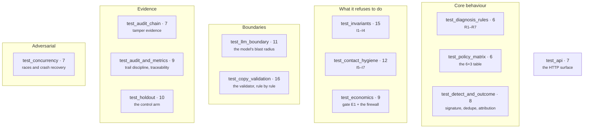
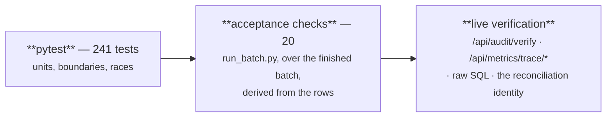

# 15 · Testing

**241 tests across 18 files.** They are the executable specification: where these docs
describe intent, `tests/` describes behaviour, and behaviour wins.

```bash
pytest -q                              # the whole suite
pytest tests/test_invariants.py -v     # one file
pytest -k "opt_out" -v                 # one theme
```

Or press **Run** in the dashboard's control room, which shells out to the same command.

## 1. The map



## 2. Fixtures — `conftest.py`

Every test runs against a **fresh temp database on a simulated clock**, so tests never
touch `recovery.db` and never depend on wall time.

| Fixture | Provides |
|---|---|
| `sim_clock` | A `SimulatedClock` at `T0 = 2026-03-02T09:00:00Z`, restored to the real clock on teardown |
| `fresh_db` | `db.reset(tmp_path/"test.db")`, closed afterwards |
| `no_live_calls` | **autouse** — `executor.set_live_link_budget(0)` |
| `failure_payload()` / `recovery_payload()` | Razorpay-shaped builders, so tests enter through `intake()` like everything else |

Two of those deserve their reasons stated:

> `no_live_calls` is autouse because the live-link budget is **process-global**: a single
> test that forgot would quietly burn the account's rate limit for every run after it.

> `os.environ.setdefault("LLM_PROVIDER", "none")` at import time means tests never call a
> model by default — and `setdefault` lets a deliberate override still work.

## 3. What each file pins

### `test_diagnosis_rules.py` — 16
Parametrised over the rule table; R7's short-circuit; **"OTP expired" resolves to
authentication, not card_expired**; unmatched text falls through to the model; every rule
maps into the fixed enum; **table order decides an ambiguous string** — the test that stops
a reorder from silently reclassifying traffic.

### `test_policy_matrix.py` — 6
Totality over all 18 cells and **no extras**; `unknown` never acts; dead instruments are
never retried; `PROMISE_TO_PAY` is reachable exactly once; **contact actions carry no
policy delay** — the assertion behind "spacing holds even if the table is wrong".

### `test_detect_and_outcome.py` — 8
Duplicate event ids absorbed; malformed payload without an error object does not crash;
no event id → rejected **without writing anything**; unrelated event types ignored; a
second failure joins the same open case; a recovery signal closes the case and is
traceable; **sending a link recovers nothing on its own**; signature verification rejects
a tampered body.

### `test_invariants.py` — 15
I3 beats everything; I4 never guesses; **I1 caps attempts even when the policy table would
continue**; I2 defers inside the cooldown; I2 does **not** apply to a silent retry; I2
stops when the next contact would fall outside the episode; ordering — consent beats
unknown beats attempts; **the gate reloads state and never trusts the caller**; a
mid-flight opt-out is caught at the pre-execution gate; attempts never exceed the cap
across a long-lived case; **I1 holds when two executions race for the last attempt**; one
decision executed twice produces one execution; the I2 receipt says `not_applicable` when
it could not be evaluated.

### `test_contact_hygiene.py` — 12
I5 defers a contact that comes due **at night** and lets a daytime one through, and does
not gate a silent retry; **I5 and I2 together pick the later target, not the first one**;
I6 stops a suppressed customer, **reaches their other subscriptions**, and stops a silent
retry too; suppression keeps the **first** reason; I7 defers once the daily contact count
is reached; **I7's ceilings reset on the IST day, not a rolling window**; I7 defers when
the outreach budget would be exceeded; a deferral past the episode window closes the case
instead.

### `test_economics.py` — 9
EV is expected gross minus **both** costs; a silent retry carries no annoyance cost;
annoyance escalates with the attempt number; `STOP_HANDOFF` is priced but never gated;
**the gate stops a case whose next contact cannot pay for itself**; every decision carries
its own arithmetic; cost is booked on the execution **even when it failed**; and the two
firewall tests:

| Test | Catches |
|---|---|
| `test_the_agents_priors_are_not_the_simulators_outcome_model` | Someone reconciling the two tables' values |
| `test_nothing_in_app_imports_the_batch_simulator` | Someone wiring them together |

### `test_llm_boundary.py` — 11
Three **structural greps** (only `llm.py` imports the client; `llm.py` touches neither
Razorpay nor the database; `invariants.py` is independent of policy and the model), then
every failure mode: no provider, low confidence, an invented category, prose instead of
JSON, code-fenced JSON *(which must still be extracted)*, a provider exception, **a
hallucinated-but-valid category still capped by the policy**, and LLM diagnoses labelled
`actor = "llm"` in the trail.

### `test_copy_validation.py` — 16
The validator's contract, rule by rule. The two that carry the design: **an invented
amount is rejected**, and **even the correct amount is rejected when typed as digits**.
Plus: copy may cite a bound the system actually enforces (`{COOLDOWN_HOURS}`); unknown
slots rejected; slots substituted with authoritative values; a model-written URL rejected;
a duplicated placeholder rejected; forbidden words; overlong copy; **every static template
passes its own validator**; a template exists for every (category, contact-action) pair; a
rejected draft falls back **and keeps the rejection on the record**; link injection happens
after validation.

### `test_audit_chain.py` — 7
A fresh log verifies and every entry is chained; the first entry hashes against the
genesis constant; editing one word breaks the chain; deleting an entry breaks the chain;
**rewriting an entry *and its own hash* still breaks the chain** — the attack by someone
who read `audit.py`; `head` is a fingerprint that moves with every entry; unchained rows
are reported rather than passed silently.

### `test_audit_and_metrics.py` — 9
**No `UPDATE` or `DELETE` against the audit log anywhere in `app/`** (a grep); `seq` is
gapless from 1; every stage of a full lifecycle is audited; every decision cites its
policy cell and carries receipts; **a stop names the invariant, not the policy**; metrics
return the case ids behind every value; the reconciliation identity holds; the recovery-rate
denominator excludes open cases; **money is paise integers everywhere**.

### `test_holdout.py` — 10
A control case is diagnosed but never intervened on; **the withheld action is recorded so
the counterfactual is auditable**; it closes as `stopped_holdout` when the window expires;
it can still recover on its own; a treated case is unaffected; incremental is unavailable
without a control arm; incremental is the difference between the arms; **intention-to-treat
keeps refused cases in the treated arm**; the metric is deterministic for a seed;
incremental never exceeds gross.

### `test_api.py` — 7
Summary exposes the synthetic split and the bounds; categories; case-list filters; the
case file contains the whole story; an unknown case is 404; **the trace endpoint
round-trips to case files**; the opt-out helper marks the customer and audits it.

---

The five files added by the build plan, each pinning something that had no test before:

### `test_arm_balance.py` — 9
The defect that made this file necessary: self-cure was rolled for the **control arm
only**, so the treated arm recovered through interventions and the control arm through
self-cure — two generative processes, not one world under two policies. Every test here
checks the **coin flips**, not the outcomes, because by the time a treated case has
recovered there is no way to tell an organic recovery from an earned one and a test
written against outcomes would pass under the defect. An arm that is never rolled makes
the statistic **undefined**, and undefined is asserted to be a failure — a missing
measurement is not a measurement of zero. A second check catches a case whose coin was
never flipped at all, which is invisible to the rate comparison; it found a live second
instance of the bug (self-cure rolled once per *subscription*, so a subscription's second
episode was never rolled).

### `test_fencing.py` — 22
Look before you leap, and verify after you write. The ledger re-fetch sees a settlement
the case row does not; a mid-flight settlement stops the dispatch and **consumes neither
the claim nor an attempt**; a settlement from *before* the case opened does not fence it;
`RETRY_LATER` is not fenced because a silent re-charge of a settled mandate is a no-op
rather than a message. Then the design rule, twice: **a broken re-fetch degrades to
`unverified` and does not block**, and `unverified` is a recorded row rather than an
absent one — "we did not check" must never be indistinguishable from "we checked and it
was fine". The compensation entry is appended **even when the cancellation fails**. The
fingerprint is proven quiet (notes, timestamps and metadata leave it stable) and proven
sharp (every decision-relevant field moves it). The metric's numerator is driven
**non-zero on purpose**, so it cannot be decoration.

### `test_voice_and_promises.py` — 44
That voice is an *action* and not a channel — membership of `CONTACT_ACTIONS` **is** the
inheritance of I2, I5, I6, I7 and annoyance pricing, and `CONTACT_ACTIONS_SQL` is
asserted to contain every member so the Python set and its SQL cannot drift. Every
registered template in three languages passes the same validator as any other outbound
string, **including against a Devanagari digit** — without that assertion the no-digits
rule would have been an English-only rule. I8 is proven to fail closed on an empty
allowlist, and a synthetic customer is proven undialable *by construction*. Then the
schema: **the inbound reading has no amount field**, an amount-bearing payload is
rejected rather than ignored, and the import-time guard refuses a money-shaped field.
Promises are deadlined to the end of the named day **in IST** (midnight UTC is 05:30 in
Delhi — a bug that could only ever punish the customer), a tracked promise overrides the
fixed grace window, and a case can never close leaving one open.

### `test_reporting.py` — 17
Two tests here are about **method**, not output. A category with an empty arm must
report as *unavailable* rather than as zero lift. And calibration must score **every**
execution on a closed case, not only the last — scoring only the last keeps every success
and discards every failure, which is not an attribution rule but a way of proving
whatever you like. Plus: a stage that raises is still timed and its error still
propagates; timing never breaks the pipeline; latency is wall clock even under a
simulated clock.

### `test_public_demo.py` — 16
Fail closed, or do not start. Every provider credential refuses the boot on **presence,
not validity** — checking whether a key works would mean using it. A populated allowlist
refuses even with the send path off. The refusal names *every* reason rather than the
first, because an operator who fixes one and restarts into the next learns the wrong
lesson about how close they were. And every write is a **404, not a 403**: a 403
announces there is an endpoint here and you may not use it, which is an invitation to
hunt for the misconfigured one.

## 4. The adversarial suite — `test_concurrency.py`

> Idempotency is easy to claim and hard to hold under a real race, so it is tested as one.

**Every test starts its workers on a `threading.Barrier`**, because without it the threads
stagger by their own creation cost and the interleaving under test never happens.

| Test | The window it attacks |
|---|---|
| Ten identical webhooks | Razorpay retries on any non-2xx and can duplicate on its own. Ten simultaneous copies must produce **one event, one case, one decision** |
| Ten distinct events, one subscription | Every event is stored, but they are one recovery episode — two open cases would mean **two independent attempt budgets aimed at one customer** |
| Duplicate executor | The same scheduled decision picked up by ten workers. The conditional `UPDATE` that claims it is the only thing between this and **ten Payment Links** |
| Twenty threads, three attempt slots | `reserve_attempt()` is I1's real enforcement point; it must hand out **exactly three** |
| Crash between the side effect and its record | The intervention has already run against Razorpay and the process dies before the `ExecutionRecord` is written. The posture is deliberately **at-most-once** |
| Orphan detection | An at-most-once system has to be able to **find what it lost**: one query surfaces every decision marked executed with no execution under it |
| Two clocks, one database | The background loop must not advance rows a batch replay wrote under a simulated clock |

> **The first of these found a real bug.** `intake()` checked for a duplicate event id and
> *then* inserted, so two concurrent deliveries both passed the check and the loser raised
> `IntegrityError` — a 500, which makes Razorpay redeliver. The event row is now written
> first, as the claim token, and a lost race is answered as a duplicate with a 200.

Full analysis in [17 Concurrency & failure](17-concurrency-and-failure.md).

## 5. Tests as structural enforcement

Five tests are **greps over the source**, not behavioural assertions. They exist because a
value test can be satisfied by nudging a number, while an import grep cannot:

| Test | Grep |
|---|---|
| `test_only_llm_py_imports_the_model_client` | `^\s*(from\|import)\s+openai` in `app/` → only `llm.py` |
| `test_the_model_module_never_touches_razorpay_or_the_database` | `llm.py` imports neither |
| `test_invariants_module_is_independent_of_policy_and_the_model` | `invariants.py` imports neither `policy` nor `llm` |
| `test_no_update_or_delete_against_the_audit_log_anywhere` | `UPDATE audit_log` / `DELETE FROM audit_log` → no matches |
| `test_nothing_in_app_imports_the_batch_simulator` | Nothing in `app/` imports `run_batch` |

These are architecture constraints with teeth. Breaking one fails the build.

## 6. Three layers of verification



Each layer checks something the previous one cannot:

- **Tests** check code paths in isolation, including ones the batch never takes.
- **Acceptance checks** re-derive each invariant from the finished rows, independently of
  what the gates believe about themselves — I5's check converts timestamps to IST *in the
  checker*.
- **Live verification** is what a sceptic runs against a database they were handed.

## 7. Writing a new test

1. Enter through `intake()` with `failure_payload()` — never write application rows
   directly. A test that writes rows is testing the schema, not the pipeline.
2. Use `sim_clock.advance(hours=…)` rather than sleeping.
3. Assert on **rows and the audit trail**, not on return values alone — the trail is the
   deliverable.
4. For a race, use a `threading.Barrier`. Without it you are testing thread creation cost.
5. If you are adding an architectural constraint, consider a grep test.
