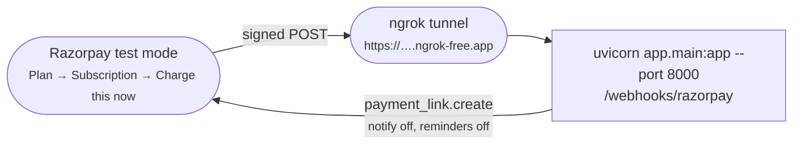

# 16 · Operations

## 1. Requirements

Python 3.11+ is the nominal target. This build was written and verified on **Python
3.9.6**; nothing in it needs a newer runtime.

```bash
python3 -m venv .venv && source .venv/bin/activate
pip install -r requirements.txt
# or, minimally:
# pip install fastapi "uvicorn[standard]" pydantic razorpay openai python-dotenv pytest httpx
cp .env.example .env      # edit only if you want the live or LLM paths
```

`requirements.txt` is frozen from the venv this project was built and verified in. The
version policy is: install with the `pip install` command above, then re-freeze what you
resolve.

## 2. The zero-setup path

No accounts, no API keys, no model download:

```bash
python scripts/generate_synthetic.py --n 80 --seed 42 --out synthetic_cases.json
LLM_PROVIDER=none python scripts/run_batch.py --cases synthetic_cases.json --db recovery.db
LLM_PROVIDER=none uvicorn app.main:app --port 8000
# open http://localhost:8000/
pytest -q
```

Add `--holdout 0.35` to `run_batch.py` for the control arm and the incremental metric.
Without it (`--holdout 0.0`) the run reproduces the frozen batch exactly.

Every one of those commands is also a button in the dashboard's
[control room](13-dashboard.md#5-control-room).

## 3. Environment variables

| Variable | Required for | Default | Where it comes from |
|---|---|---|---|
| `RAZORPAY_KEY_ID` / `RAZORPAY_KEY_SECRET` | Real test-mode API calls (Payment Links) | — | Razorpay Dashboard in **test mode** → Account & Settings → API Keys → Generate Test Key. The secret is shown once |
| `RAZORPAY_WEBHOOK_SECRET` | Webhook signature verification | — | A long random string you choose when creating the webhook |
| `LLM_PROVIDER` | Which model path runs | `ollama` | `openai_compat` \| `ollama` \| `none` |
| `LLM_BASE_URL` | Whichever provider you picked | `http://localhost:11434/v1` | Your provider's docs |
| `LLM_MODEL` | " | `qwen2.5:7b-instruct` | **Your provider's own model page** — see the warning below |
| `LLM_API_KEY` | " | `ollama` | Your provider's keys page |
| `LLM_TIMEOUT_S` | Model call timeout | `20` | |
| `LLM_COPY_ENABLED` | Kill-switch forcing static templates | `true` | |
| `DB_PATH` | Pointing at a scratch database | `recovery.db` | |
| `LIVE_LINKS_MAX` | Cap on real test-mode Payment Links | `5` | |
| `CONTROL_API_ENABLED` | Dashboard control room | `true` | Set `false` for anything not on localhost |
| `DAILY_OUTREACH_BUDGET_PAISE` | The I7 system-wide daily spend ceiling | `500000` (₹5,000) | At demo scale it does not bind; lower it to watch it defer |
| `MERCHANT_NAME` | The `{MERCHANT}` copy slot | `Demo Subscriptions` | |
| `TICK_INTERVAL_SECONDS` | Background loop period | `30` | |

Environment variables are read **once at import**. `.env` is gitignored; `.env.example`
holds placeholders only.

> **Never put live-mode keys anywhere in this project.**

## 4. The three LLM modes

All three are free and all three are reached through the same `openai` client — only
`LLM_BASE_URL` and `LLM_MODEL` change, because `app/llm.py` is the only module that knows
a model exists.

| `LLM_PROVIDER` | What runs | Needs | Cost |
|---|---|---|---|
| `openai_compat` | A hosted OpenAI-compatible free tier (Groq / OpenRouter / Google AI Studio) — **nothing runs on your machine** | free signup + key | ₹0 within free-tier limits |
| `ollama` | A local open-weights model (`ollama serve && ollama pull qwen2.5:7b-instruct`) | ~5 GB disk, 8 GB+ RAM | ₹0, offline, no rate limit |
| `none` | No model at all: ambiguous cases become `unknown` and stop, copy uses static templates | nothing | ₹0, no setup |

**On a laptop that cannot spare the RAM for a local model, use `openai_compat`** — that is
exactly what it is for.

> **Model ids and free-tier limits change often.** Copy a *current* id from your
> provider's own model page — never from any documentation, including these docs.

Then verify it before you trust a batch:

```bash
python scripts/check_llm.py
```

This matters because of how the boundary is built: if the provider is unreachable, every
classification collapses to `unknown`, every ambiguous case stops, and **the batch still
exits 0 with all acceptance checks green.** That is the correct behaviour — but it is
indistinguishable from a forgotten API key. `check_llm.py` tells the two apart, and both
`uvicorn` startup and `run_batch.py` warn if a hosted provider is half-configured.

## 5. Live mode — Razorpay test mode + ngrok



1. **Keys** — test-mode dashboard → Account & Settings → API Keys → Generate Test Key. Put
   `RAZORPAY_KEY_ID` and `RAZORPAY_KEY_SECRET` in `.env`.
2. **Plan and subscription** — Subscriptions → Plans → Create Plan
   (`demo-monthly-499`, monthly, ₹499 = `49900` paise; **every amount in this project is a
   paise integer**). Create a subscription on it, then authenticate it by paying its short
   URL with a success test card. Take card numbers from Razorpay's own
   [test-card page](https://razorpay.com/docs/payments/payments/test-card-details/) *at the
   time you test* — never from documentation, including this one.
3. **Webhook** — run `uvicorn app.main:app --port 8000`, then `ngrok http 8000`. Point a
   webhook at `https://<your-ngrok>.ngrok-free.app/webhooks/razorpay`, give it a long
   random secret (that is `RAZORPAY_WEBHOOK_SECRET`), and subscribe it to:

   | Event | Role |
   |---|---|
   | `payment.failed` | failure |
   | `subscription.pending` | failure — **this is Razorpay's failed-charge signal for subscriptions**; there is no literal `subscription.charged.failed` event |
   | `subscription.halted` | failure — Razorpay's own retries are exhausted, which is precisely when this agent matters |
   | `subscription.charged` | **recovery** |
   | `payment_link.paid` | **recovery** |

   The free-tier ngrok URL changes on every restart — update the webhook each time, or keep
   one session alive.
4. **Force a failure** — open the active subscription and use test mode's "Charge this now"
   against a failure card.

Signature verification uses `razorpay.Utility.verify_webhook_signature` over the **raw**
request body — HMAC-SHA256, never re-serialized JSON. Delivery is deduped on the event id,
because Razorpay retries on any non-2xx and may deliver duplicates.

**Real Payment Links are created with SMS, email and WhatsApp notifications explicitly
disabled, and reminders off — Razorpay never contacts anyone in this project.**

## 6. Runbook

### Start the server
```bash
uvicorn app.main:app --port 8000
# --reload for development; the tick loop restarts with it
```

Startup applies `schema.sql` idempotently, logs the database path and LLM provider, warns
on a half-configured hosted provider, and starts the background tick loop.

### Replay a batch into a scratch database
```bash
DB_PATH=/tmp/scratch.db python scripts/run_batch.py --cases synthetic_cases.json \
    --db /tmp/scratch.db --holdout 0.35
```

### Advance the loop by hand
```bash
curl -X POST localhost:8000/api/control/tick
```

### Inject one failure
```bash
curl -X POST localhost:8000/api/control/inject \
     -H 'content-type: application/json' \
     -d '{"category":"card_expired","amount_rupees":499}'
```

### Suppress a customer
```bash
curl -X POST 'localhost:8000/api/suppression/cust_123?reason=complaint'
```

### Check everything agrees
```bash
curl -s localhost:8000/api/summary | python -m json.tool
sqlite3 recovery.db "SELECT status, COUNT(*), SUM(amount_at_risk_paise)
                     FROM recovery_case GROUP BY status;"
curl -s localhost:8000/api/metrics/trace/recovered
curl -s localhost:8000/api/audit/verify        # → {"status":"intact", …}
```

The README, the dashboard and raw SQL must agree **to the paisa** — all three are derived
from the same rows, so any disagreement is a bug, not a rounding artifact.

## 7. Troubleshooting

| Symptom | Cause | Fix |
|---|---|---|
| Every ambiguous case is `unknown`, batch still green | The provider is unreachable, or `LLM_PROVIDER=none` | `python scripts/check_llm.py` |
| `openai_compat` set but nothing happens | `LLM_BASE_URL` still points at localhost, or `LLM_API_KEY` is still `ollama` | `llm.misconfiguration()` warns at startup and at batch start — read the warning |
| Webhook returns 400 | Signature mismatch — usually the wrong secret, or a proxy that re-serialized the body | Verify over the **raw** bytes; check `RAZORPAY_WEBHOOK_SECRET` matches the dashboard |
| Webhook returns 200 `duplicate` | Razorpay redelivered, or the same event was fired twice | Expected — dedupe is working |
| A batch's cases all close as expired right after it finishes | The background tick loop advanced synthetic rows on the wall clock | Should be impossible: the loop passes `include_synthetic=False`. If you see it, check for a manual `tick()` |
| Control room returns 403 | `CONTROL_API_ENABLED=false` | Intended off-switch |
| Control room returns 409 | Another job is running | Wait, or reload — one job at a time by design |
| `pytest` hits a live model | You set `LLM_PROVIDER` explicitly in the shell; `conftest.py` uses `setdefault` | Unset it, or run through the control room, which pins `none` |
| Startup rejects a status like `stopped_holdout` | An old database whose `CHECK` constraint predates that status | Use a fresh database — see [03 § 7](03-data-model.md#7-migrations) |
| Real Payment Links stop being created | `LIVE_LINKS_MAX` budget exhausted; it is **never refunded on failure**, by design | Restart the process, or raise `LIVE_LINKS_MAX` |

## 8. Backup and inspection

The database is a single SQLite file (plus `-wal` and `-shm` in WAL mode).

```bash
sqlite3 recovery.db ".backup /tmp/recovery-backup.db"
curl -s localhost:8000/api/audit/verify | python -c 'import sys,json; print(json.load(sys.stdin)["head"])'
```

**Record the chain `head` before handing the file to anyone** — it is a one-line
fingerprint that tells you afterwards whether anything in it moved.

## 9. Security posture

State plainly, because it matters more than any mitigation:

| Surface | Posture |
|---|---|
| `/webhooks/razorpay` | HMAC-SHA256 verified over the raw body. **The only authenticated surface** |
| `/api/*` | **Unauthenticated.** Read-only except two demo helpers (`opt-out`, `suppression`) |
| `/api/control/*` | **Unauthenticated, and it spawns subprocesses.** Removable in one place with `CONTROL_API_ENABLED=false` |

> This is a single-operator, localhost demo. **Do not bind it to a public interface.**

Mitigations that *are* in place:

- Control-room test paths are constrained to `tests/` with no `..`, because that endpoint
  spawns a subprocess.
- Subprocess output is capped at 4,000 lines so a runaway job cannot grow the process
  without bound.
- Live Razorpay calls are capped by `LIVE_LINKS_MAX`, spent fail-closed.
- No customer PII is ever sent to the model — only four Razorpay error fields.
- Secrets are read from the environment; `.env` is gitignored.
- Nothing is ever transmitted to a customer: every message carries the literal
  `[SYNTHETIC DEMO]` disclosure and the copy validator rejects any draft without it.

## 10. Extending it

| Change | Read first |
|---|---|
| New error patterns | [05 § 8](05-diagnosis.md#8-changing-the-rules-safely) |
| New policy cell or a changed delay | [06 § 9](06-policy.md#9-changing-the-table-safely) |
| New cost or prior | [08 § 11](08-economics.md#11-everything-in-this-document-is-an-assumption) |
| A new invariant | [07](07-guardrails.md) — add to `INVARIANT_TEXT`, `check()`, `_INVARIANT_PLAIN`, an acceptance check, and a test |
| A new terminal status | [03 § 3](03-data-model.md#3-case-status-state-machine) — `CASE_STATUSES`, the schema `CHECK` (a table rebuild), `HANDOFF_STATUSES` if it costs a person |
| Real outbound messaging | [18 § 3](18-limits-and-roadmap.md#3-out-of-scope-by-choice) — swap the simulated-notification executor behind the same `ExecutionRecord` interface |
