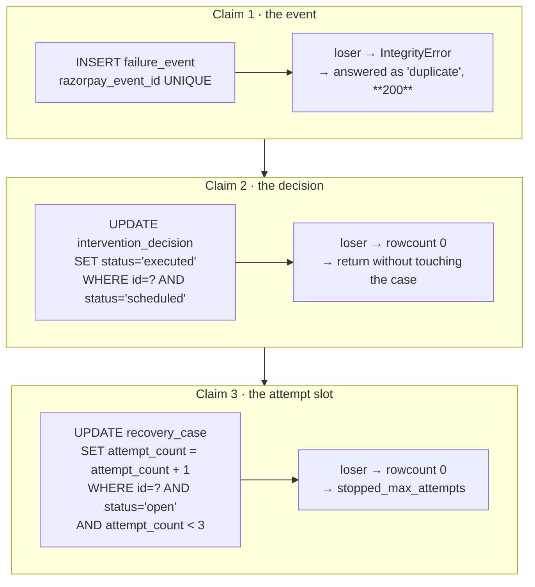
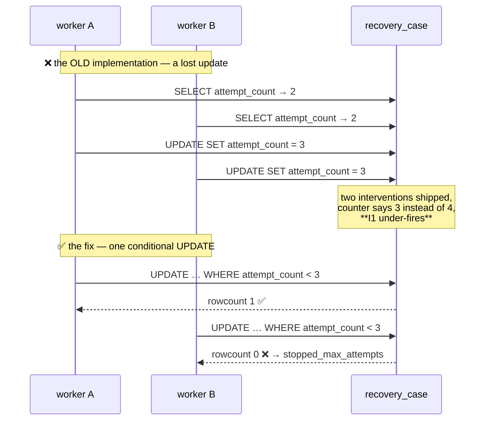
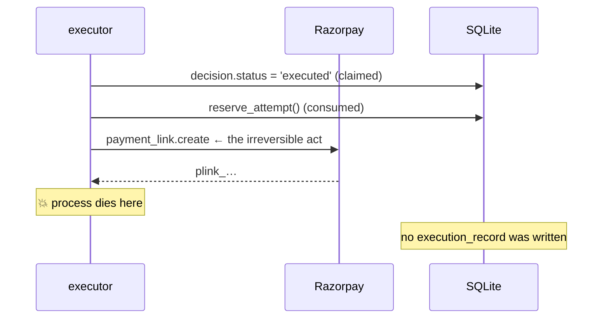

# 17 · Concurrency & failure

> Idempotency is easy to claim and hard to hold under a real race, so it is tested as one.

Two paths run genuinely concurrently in live mode — the webhook route and the tick loop,
both dispatched through `asyncio.to_thread` in `main.py`. Everything below is about the
windows between them.

## 1. The claim-token pattern

Three separate resources are claimed with the same shape: **one conditional statement that
exactly one caller can win**, applied atomically by SQLite.



Each is claimed **before** the irreversible thing it guards, never after.

## 2. Race 1 — duplicate webhook delivery

Razorpay retries on any non-2xx and can duplicate on its own. Ten simultaneous copies of
one event must produce **one event row, one case, one decision.**

### The ordering that makes it work

```python
with _claim_lock:
    try:
        event = _insert_event(event_id, None, ...)   # case_id NULL — the claim
    except sqlite3.IntegrityError:
        return {"status": "duplicate", "event_id": event_id}
    case = find_open_by_subscription(...) or cases.create(...)
    db.update("failure_event", event["id"], {"case_id": case["id"]})
```

> The event row is written **first, with no case attached**, because it is the claim
> token. Opening the case first would mean a lost race leaves an **empty case behind — a
> second attempt budget against a customer who only ever failed once.**

Two layers:

| Layer | Scope | Behaviour on loss |
|---|---|---|
| `webhooks._claim_lock` (RLock) | One process | The loser blocks, then sees the row and returns `duplicate` |
| `razorpay_event_id UNIQUE` | Any process | `IntegrityError`, caught, answered as `duplicate` with **200** |

The 200 matters: a 500 would make Razorpay redeliver, forever.

Diagnosis and the policy decision are deliberately **outside** the lock: those can be slow
(a model call) and are safe to run in parallel once the case exists.

> **This was a real bug.** `intake()` originally checked-then-inserted, so two concurrent
> deliveries of one event both passed the check and the loser raised `IntegrityError` — a
> 500. Found by `test_ten_identical_webhooks_land_as_one_case`.

## 3. Race 2 — the attempt counter (I1)

The gate reads `attempt_count`; a read cannot hold a cap.



```python
_RESERVE_ATTEMPT_SQL = (
    "UPDATE recovery_case"
    " SET attempt_count = attempt_count + 1,"
    "     updated_at = ?,"
    "     last_contact_at = CASE WHEN ? THEN ? ELSE last_contact_at END"
    " WHERE id = ? AND status = 'open' AND attempt_count < ?"
)
```

Three properties in one statement:

1. **The increment is computed by SQLite**, never in Python — no read-modify-write.
2. **`last_contact_at` is written in the same statement**, guarded by a flag, so a contact
   action can never bump the counter without also arming the I2 cooldown.
3. **The cap is in the `WHERE` clause**, so refusal is atomic.

The slot is claimed **before** the intervention runs, which is also the honest ordering: a
failed execution has still spent an attempt.

Tested with twenty threads on a barrier competing for three slots — exactly three win.

## 4. Race 3 — one decision, two executors

Two overlapping ticks, or a tick racing the webhook path, can both pick up the same due
decision. Without a claim that is **two Payment Links to one customer**.

```python
if db.execute(
    "UPDATE intervention_decision SET status = 'executed' WHERE id = ? AND status = 'scheduled'",
    (decision["id"],),
).rowcount != 1:
    return None          # someone else owns this execution
```

Claimed **before** anything irreversible. `execution_record.decision_id UNIQUE` is the
schema-level backstop under it.

## 5. Race 4 — the audit chain

Two concurrent writers reading the same predecessor hash would **fork the chain**.

```python
with db._lock:                                # one transaction, one lock
    seq       = MAX(seq) + 1 for this case
    prev_hash = last entry's entry_hash or GENESIS
    INSERT (…, prev_hash, entry_hash(entry, prev_hash))
    commit
```

Head read, `seq` allocation and insert are all inside it. `UNIQUE(case_id, seq)` is the
backstop.

## 6. Crash consistency — deliberately at-most-once

The dangerous window: the intervention has already run against Razorpay and the process
dies **before** the `ExecutionRecord` is written.



On the next tick the decision is **already claimed**, so it is not picked up again.

| | At-most-once (chosen) | At-least-once |
|---|---|---|
| Cost of a crash | An audit record — **recoverable** | A second message to a customer — **not recoverable** |
| Detectable? | Yes, by an orphan query | — |

> The posture is deliberately at-most-once: the crash costs an audit record, which is
> recoverable, instead of a second message to a customer, which is not.

**An at-most-once system has to be able to find what it lost:**

```sql
SELECT d.id, d.case_id, d.action, d.decided_at
FROM intervention_decision d
LEFT JOIN execution_record e ON e.decision_id = d.id
WHERE d.status = 'executed' AND e.id IS NULL;
```

One query surfaces every decision marked executed with no execution under it. Both the
crash scenario and this query are tested
(`test_crash_between_side_effect_and_record_never_contacts_twice`,
`test_orphaned_executions_are_detectable`).

## 7. Race 5 — two clocks, one database

The background loop runs on the wall clock; a batch replay writes rows under a simulated
one. To the live loop, every batch row looks **weeks old and therefore expired**.

Without a guard, an unfiltered background tick would quietly close a finished experiment
and report a batch that recovered nothing.

```python
result = await asyncio.to_thread(executor.tick, False)   # include_synthetic=False
```

**Synthetic rows advance only under the clock that created them** — the batch runner, or an
operator pressing Tick. Tested by `test_background_tick_leaves_batch_rows_alone`.

## 8. Non-races that look like races

| Situation | Why it is fine |
|---|---|
| A new failure arrives while a decision is scheduled | The new decision **supersedes** the old one. One case never holds two pending interventions |
| A recovery signal arrives while a decision is scheduled | The case closes and every scheduled decision becomes `superseded` — once the money has arrived, a pending intervention is moot |
| The same customer has two failing subscriptions | Two cases, two attempt budgets — **and that is exactly why I5–I7 exist**, scoped to the person rather than the case ([07 § 2](07-guardrails.md#2-why-i5i7-exist-at-all)) |
| A decision is deferred by three gates at once | Deferrals are collected and `max()` decides; every contributing gate is marked in the receipts |

## 9. Failure modes and their handling

| Failure | Handling |
|---|---|
| Model provider unreachable / times out / rate-limits | `unknown`, exception text preserved in `llm_raw_response`, case stops via I4 |
| Model returns prose, an invented category, or low confidence | `unknown` — [09 § 4](09-llm-boundary.md#4-every-failure-mode-and-where-it-lands) |
| Razorpay Payment Link creation fails | Falls back to a simulated link, recorded honestly as `mode='simulated'` with the error in `result_payload`. **The live-link budget is not refunded** |
| Any handler raises | Caught; an `ExecutionRecord` with `status='failed'` is still written, and **the cost is still booked** |
| A tick iteration raises | Logged and swallowed — a tick failure must never kill the loop |
| Malformed webhook payload | `extract()` never raises; the event is stored and diagnoses as `unknown` via R7 |
| Webhook body is not JSON | 400 before anything is written |
| A promise-to-pay is never paid | `_close_lapsed_promises` hands it off after 72 h. Never retried — attempt 3 was the last one |
| A case is never resolved by anything | `_close_expired_episodes` closes it after 14 days. **No case is left a zombie** |
| A static template fails its own validator | `AssertionError` — a build error, not a runtime condition |

## 10. Reproducing the races yourself

Against a running server:

```bash
# 10 identical deliveries — must collapse to one case, one event, one decision
curl -X POST localhost:8000/api/control/storm \
     -H 'content-type: application/json' -d '{"n":10,"distinct":false}'

# 10 distinct events on one subscription — 10 events, one case, ONE live decision
curl -X POST localhost:8000/api/control/storm \
     -H 'content-type: application/json' -d '{"n":10,"distinct":true}'
```

The response carries `observed`, `expected`, a `held` boolean and an `explains` string.
This is `tests/test_concurrency.py` run against the live server: **the same barrier, the
same `intake()`**.

## 11. What would change at scale

Honest limits of the single-process model, and what each would need:

| Limit | Where it binds | The change |
|---|---|---|
| One SQLite writer | Sustained high webhook rate | Postgres; every claim above is already a conditional statement and translates directly |
| In-process `_claim_lock` | Multiple app processes | Already backed by the `UNIQUE` constraint — the lock is an optimisation, not the guarantee |
| The tick scan | Very many scheduled decisions | `idx_decision_due` covers it; beyond that, partition by due-time bucket |
| At-most-once | A crash costs an audit record | An outbox table written in the same transaction as the claim |
| Job state in memory (control room) | Restart loses job history | It is a demo surface; state belongs in the database if it ever stops being one |
