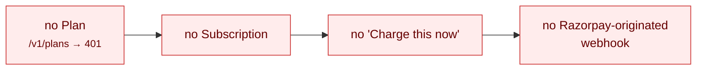
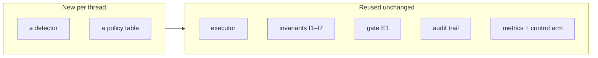

# 18 · Honest limits & roadmap

Everything in this document is stated plainly rather than buried, because a limit
discovered by a reader is worth less than a limit stated by the author.

## 1. The one live case

Case `case_01M0STYHMCZK8CNBR5E2DBJ000` is real: a `payment.failed` body signed with the
real `RAZORPAY_WEBHOOK_SECRET` (HMAC-SHA256 over the raw body, Razorpay's own scheme),
POSTed to a running receiver on a live `rzp_test_*` account. It verified, deduped,
diagnosed and decided:

```
detect ─▶ diagnose  method="rule"  matched_rule="R2"  confidence=1.0  llm_model=null
       ─▶ [I1–I4 gate] ─▶ decide  RETRY_LATER  delay 24 h  attempt 1
```

> `llm_model=null` on a real delivery is **the boundary claim holding in the wild**, not
> just in tests: an unambiguous failure never reaches the model.

Four probes against the same endpoint, all behaving as specified:

| Probe | Result | HTTP |
|---|---|---|
| Valid signature, first delivery | `processed`, one case created | 200 |
| Byte-identical replay | `duplicate`, no second case | 200 |
| One byte flipped (`49900`→`99900`), original signature | `rejected: invalid signature` | 400 |
| No `X-Razorpay-Signature` header | `rejected: invalid signature` | 400 |

A real test-mode Payment Link was also created through `executor._create_payment_link()` —
`plink_TTbOzWvlCm2ufM`, `notify {email, sms, whatsapp} = false`, `reminder_enable=false`.
**That is the executor's actual money-moving call, against Razorpay, contacting nobody.**

### What is not proven

> The delivery was **signed and sent locally** rather than emitted by Razorpay's own
> dispatcher.

Subscriptions is not provisioned on the test account: `/v1/plans` and `/v1/subscriptions`
return `401 Unauthorized` while `payments`, `orders`, `customers`, `items` and
`payment_links` all return `200` — reproduced through `curl`, through Razorpay's own CLI,
and through the dashboard UI (which shows "Something went wrong" on both read and write).



**Everything from signature verification inward is the production path; the unproven span
is the tunnel, not the logic.** Resolution is a Razorpay support request to enable
Subscriptions in test mode, not a code change.

## 2. What is not proven, itemised

| Claim | Status |
|---|---|
| A webhook arrived from Razorpay's own dispatcher | ❌ Not proven — see § 1. The `401` on Plans blocks the whole subscription flow |
| A test card was exercised | ❌ Not proven. The card matrix is reachable only through a subscription authentication flow, which the same `401` blocks. **Category breadth comes from the synthetic set, as designed** |
| A real model was called | ✅ `scripts/check_llm.py` reached a hosted OpenAI-compatible provider and classified **4/4 rule-proof probes correctly**. The frozen 88-case batch was still run with `LLM_PROVIDER=none`, so its `1/4` model-path figure stands as reported |
| A real Payment Link was created | ✅ `plink_TTbOzWvlCm2ufM`, notifications off |
| Signature verification, dedupe and rejection work on a real delivery | ✅ Four probes, § 1 |
| `retry_charge` ran against Razorpay | ❌ Always recorded as `simulated`. Test mode exposes no stable API for forcing a subscription charge retry, and **inventing a "live" record would be a lie in an audit-trail project** |
| The outcome model reflects real recovery rates | ❌ **Modelling assumptions.** What is measured is the mechanism, not the market — [11 § 7](11-measurement.md#7-interpreting-the-result) |
| The cost model reflects real costs | ❌ Stated assumptions with rationales — [08 § 11](08-economics.md#11-everything-in-this-document-is-an-assumption) |

## 3. Out of scope by choice

> One recovery thread done completely beats four done shallowly.

Each of the four below is a **new detector and policy table over the same
Diagnose → Decide → Execute → Stop skeleton** — which is what makes them credible future
work rather than a redesign.



### Checkout abandonment
A different **detection surface** (client-side events, no webhook of record) and a
different **consent posture** (pre-purchase marketing contact vs post-purchase service
contact). New detector and policy table; same executor, invariants and audit trail.

### B2B receivables
A different **cadence** (invoices and dunning ladders over weeks) and an invoice data
model. New `FailureEvent` source and longer-horizon policy rows; same stopping rules and
metrics.

### Real outbound messaging
The **timing and consent half** of the compliance surface is now enforced — I5 quiet
hours, I6 suppression, I7 daily ceilings — and every contact in the batch passed through
it. What remains is the **registration half**: TRAI DLT template and header registration,
DND scrubbing against the national registry, and consent artefacts. That is a project in
itself. The code change is small — swap the simulated-notification executor for a real
provider behind the same `ExecutionRecord` interface.

### Learned retry timing
**A wrong learned policy moves money wrongly.** The deterministic policy table is the
baseline any learned policy would have to beat — and the control arm in [11](11-measurement.md)
is exactly the apparatus that would judge it.

## 4. Known technical limits

| Limit | Consequence | Mitigation / note |
|---|---|---|
| Single SQLite writer | Bounded write throughput | Every claim is a conditional statement that translates directly to Postgres |
| No authentication on `/api` or `/api/control` | Anyone who can reach the port can run the batch | **Localhost only.** `CONTROL_API_ENABLED=false` removes the control router |
| Control-room job state is in memory | A restart loses job history | It is a demo surface |
| The status `CHECK` constraint cannot be widened in place | An old database rejects newly-added statuses | Correct failure — see [03 § 7](03-data-model.md#7-migrations) |
| `LIVE_LINKS_MAX` is per process, never refunded | A failing endpoint exhausts the budget | Deliberately fail-closed: over-counting a link costs a demo, under-counting costs the account |
| Rule table order is significant | Adding a rule in the wrong position silently reclassifies traffic | Pinned by `test_rule_order_decides_an_ambiguous_string` |
| No multi-tenant isolation | One merchant per database | The I7 spend ceiling is system-wide, which is only correct for one merchant |
| At-most-once execution | A crash between the side effect and its record loses an audit row | Detectable by the orphan query — [17 § 6](17-concurrency-and-failure.md#6-crash-consistency--deliberately-at-most-once) |

## 5. Things that are deliberately not features

| Not built | Why |
|---|---|
| An un-suppress endpoint | Un-suppressing someone is **re-consenting on their behalf**. It belongs in the database, with a person accountable for it |
| A migration framework | The schema is eight tables applied idempotently; a framework would be more machinery than schema |
| An ORM | Every query in this project is one a reader should be able to check against the metric it claims to compute |
| A job queue | It would put the strongest correctness claim behind someone else's at-least-once guarantee — [19 · D-02](19-decision-log.md) |
| A "confidence" score on the policy decision | The policy is a table lookup. A confidence score on a deterministic lookup is theatre |
| Retrying a `PROMISE_TO_PAY` | It is always attempt 3. There is no attempt 4 |
| Counting the annoyance term as a cost | No rupee leaves the account for it. **Booking a modelled risk as a realised cost would make the ledger an opinion** |

## 6. If this were taken further

In rough order of value:

1. **Get Subscriptions provisioned in test mode** and close the one unproven span in § 1.
2. **Run a real hosted model over the full batch** and report the model-path accuracy
   beside the `none` run, so both numbers stand side by side.
3. **Replace SQLite with Postgres** — mechanical; the claim statements are already
   portable.
4. **Add an outbox table** written in the same transaction as the decision claim, turning
   at-most-once into exactly-once for the *record* while keeping it at-most-once for the
   *side effect*.
5. **Calibrate the cost model** against real support-contact rates and real cancellation
   hazards, replacing the stated assumptions in `config.py` with measurements — and
   report the before/after, since the whole EV gate moves with them.
6. **Widen the control arm** to a fraction that supports a per-case-money estimate, which
   is what the current rupee interval lacks.
7. **Real outbound messaging**, once the TRAI DLT registration half is done.

## 7. The standing disclosure

Every simulated message carries the literal **`[SYNTHETIC DEMO]`** disclosure, and the copy
validator rejects any draft without it. **Nothing is ever transmitted anywhere.**
